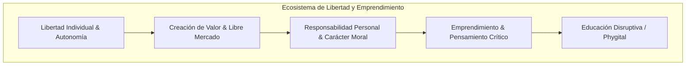

# Repositorio de Investigacion: Valores Organizacionales de FEE y Universidad de la Libertad

Este repositorio esta dedicado exclusivamente a la investigacion, analisis conceptual e ideacion sobre los valores organizacionales y de cultura empresarial de dos instituciones emblemáticas en la promocion de la libertad:

1. **Foundation for Economic Education (FEE)**
2. **Universidad de la Libertad (UL)**

---

## 🎯 Objetivo de la Investigacion
Analizar a profundidad las misiones, visiones, principios rectores y valores corporativos de ambas organizaciones, destacando como conceptualizan la **libertad**, el **emprendimiento**, la **responsabilidad individual** y la **innovacion educativa**, asi como la forma en que traducen estos ideales en su cultura y operacion diaria.

---

## 📂 Estructura de Documentos en este Repositorio

| Archivo | Descripcion |
| :--- | :--- |
| 📄 [`fee-valores-organizacionales.md`](./fee-valores-organizacionales.md) | Analisis exhaustivo de FEE: historia, principios de Leonard Read, valores corporativos y cultura digital. |
| 📄 [`universidad-de-la-libertad-valores.md`](./universidad-de-la-libertad-valores.md) | Analisis detallado de la Universidad de la Libertad: modelo educativo de Ricardo Salinas Pliego, valores empresariales y hub de emprendimiento. |
| 📄 [`comparativa-y-sinergias.md`](./comparativa-y-sinergias.md) | Matriz comparativa, convergencias filosoficas, sinergias y conceptos clave unificados para ambas instituciones. |
| 📄 [`ciberseguridad-finanzas-y-valores.md`](./ciberseguridad-finanzas-y-valores.md) | Analisis y propuesta sobre como la Ciberseguridad y la Seguridad de la Informacion se alinean con la propiedad privada, la privacidad, la resiliencia de negocios y los valores de FEE y la UL. |

---

## 🔑 Conceptos Clave Destacados

### 1. Libertad Individual como Pilar Moral y Practico
La libertad no es solo un concepto politico o economico, sino una filosofia de vida integral basada en el respeto irrestricto al individuo y la eleccion voluntaria.

### 2. Emprendimiento como Agente de Cambio Social
Tanto en FEE como en la UL, el emprendedor es visto como el heroe moderno que resuelve problemas reales, genera prosperidad y desafia las estructuras obsoletas mediante la innovacion.

### 3. Autoperfeccionamiento y Responsabilidad (Self-Ownership)
Rechazo explicito al paternalismo y a la cultura de la victimizacion. Se fomenta la disciplina personal, la etica de trabajo y la asuncion de las consecuencias de las propias decisiones.

### 4. Innovacion Educativa por Persuasion y Experiencia
FEE aporta el modelo de persuasion etica y divulgacion de alto impacto digital, mientras que la Universidad de la Libertad aporta el modelo phygital, interactivo y guiado por empresarios en activo.

---

## 📌 Proximos Pasos (Ideacion)
Este material sirve como base conceptual para posteriores desarrollos de proyectos, estrategias de comunicacion o plataformas tecnologicas orientadas a difundir y potenciar estos valores.
