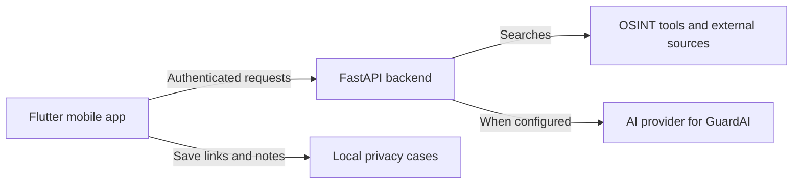

# Osisnt

Osisnt is a mobile app that helps people discover their public digital footprint and make informed choices about their privacy.

Built by **Team Ruaj** for the **FEE Mexico City Hackathon**. This repository is the starting point for understanding the project, finding its source code, and exploring the product research and design.

**[Frontend: Flutter app](https://github.com/Hackaton-FEE/app)** · **[Backend: FastAPI server](https://github.com/Hackaton-FEE/server)** · **[Project documentation](https://github.com/Hackaton-FEE/documentation)**

## Start here

| Repository | What you will find | Where to start |
| --- | --- | --- |
| **[documentation](https://github.com/Hackaton-FEE/documentation)** | Project overview, product vision, design system, and research. | This README, then the [document guide](#document-guide). |
| **[app — frontend](https://github.com/Hackaton-FEE/app)** | Flutter mobile client: sign-in, digital-footprint results, GuardAI interface, and local privacy cases. | [Setup and development](https://github.com/Hackaton-FEE/app#readme), [architecture](https://github.com/Hackaton-FEE/app/blob/main/docs/architecture.md), and [testing access](https://github.com/Hackaton-FEE/app/blob/main/docs/testing-access.md). |
| **[server — backend](https://github.com/Hackaton-FEE/server)** | Python/FastAPI API: authentication, OSINT search orchestration, scan persistence, and the assistant endpoint. | [Integration status](https://github.com/Hackaton-FEE/server/blob/main/docs/backend-consolidation-20260911.md), [authentication contract](https://github.com/Hackaton-FEE/server/blob/main/docs/auth-contract.md), and [API routes](https://github.com/Hackaton-FEE/server/tree/main/src/fee_server/api/v1). |

To run or contribute to the software, use the setup and contribution instructions in the corresponding code repository. Cloning `documentation` gives you the documents and design assets; the frontend and backend are separate repositories.

## What the prototype does

The current implementation focuses on helping a person review their own public information:

- **Discover:** provide your email address, usernames, and phone number to review your digital footprint through the backend.
- **Review:** inspect available findings, source links, scan progress, and coverage information in the mobile app.
- **Organize:** save links and notes as local privacy cases, then edit, search, archive, or restore them.
- **Ask GuardAI:** use the assistant interface when a real backend AI provider is configured. Availability depends on the server configuration.

Android is the current validated mobile target. The codebase also contains iOS configuration, which requires additional platform setup and validation.

A matching account is a lead to review, not proof of ownership. Search results can be incomplete. Automated content removal, platform takedowns, and sending privacy requests are future work; local case status does not indicate that an external organization received or acted on a request.

## How the parts work together

The frontend presents findings and manages local cases. The backend handles authentication, coordinates search tools, stores scan state and findings, and returns results to the app. Search adapters include Blackbird, Maigret, Holehe, and Ignorant; real execution depends on the supplied identifiers and server configuration.

Searches send the supplied identifiers to the server and consult external sources. Local case notes stay in the app's device storage. When GuardAI is enabled, submitted conversation content and the selected report context are processed by the configured AI provider. See the implementation repositories for the detailed data flow and configuration.

## Document guide

Most detailed documents below are in Spanish. They preserve the team's research and design work, including ideas that go beyond the current prototype. **A proposal in these documents is not a claim that a feature has shipped.** For implemented behavior, follow the code and tests in [app](https://github.com/Hackaton-FEE/app) and [server](https://github.com/Hackaton-FEE/server); some early specifications and setup summaries predate the integration.

### Product and presentation

| Document | Purpose |
| --- | --- |
| [Product concept](concepto-central-plataforma.md) | Broader product vision and proposed privacy workflows. |
| [Digital-footprint experience](osisnt-interfaz-huella-digital.md) | Proposed discovery, review, and follow-up experience. |
| [User persona](persona.md) | User needs and a proposed product journey. |
| [Pitch script](pitch.md) | Hackathon presentation draft; wording and roadmap may differ from the current implementation. |

### Design

| Document | Purpose |
| --- | --- |
| [Design system](design-system/README.md) | Visual language, typography, components, and experience guidelines. |
| [Logo and animation assets](design-system/logo/README.md) | Brand assets and the loading animation. |

### Technical design proposals

These files describe intended requirements and architecture, including earlier technology choices. They are design references; use the code repositories for the current API and implementation.

| Document | Purpose |
| --- | --- |
| [Software requirements](especificacion-requisitos-software-srs.md) | Proposed functional requirements and priorities. |
| [Architecture and C4 diagrams](arquitectura-software-sad-c4.md) | Early architecture proposal and design decisions. |
| [API specification](especificacion-api-openapi.md) | Conceptual API contract, including future workflows. |
| [Data model and privacy](modelo-datos-y-privacidad-erd.md) | Proposed data structures, retention, and privacy design. |
| [QA and security plan](plan-pruebas-qa-seguridad.md) | Planned test strategy and review criteria. |
| [Passkeys and biometrics](estrategia-autenticacion-passkeys-biometria.md) | Authentication design research. |

### Research and project foundations

| Document | Purpose |
| --- | --- |
| [Digital-footprint tools](herramientas-huella-digital.md) | Comparison of discovery and privacy tools. |
| [OSINT integration research](investigacion-e-integracion-herramientas-osint.md) | Tool experiments and integration considerations. |
| [OSINT endpoints and headers](analisis-tecnico-endpoints-headers-osint.md) | Technical background on discovery mechanisms. |
| [Counter-OSINT and digital hygiene](defensa-contra-osint-opsec.md) | Research on reducing public exposure. |
| [FEE values](fee-valores-organizacionales.md) | Background on individual liberty and entrepreneurship. |
| [Universidad de la Libertad values](universidad-de-la-libertad-valores.md) | Institutional and educational context. |
| [Shared principles](comparativa-y-sinergias.md) | Connections between the two organizations' values. |
| [Privacy, cybersecurity, and values](ciberseguridad-finanzas-y-valores.md) | How the project relates to personal agency and responsibility. |

## Contribute

- **Documentation or design:** open an [issue](https://github.com/Hackaton-FEE/documentation/issues) or pull request in this repository.
- **Mobile app:** follow the [frontend contribution guide](https://github.com/Hackaton-FEE/app/blob/main/CONTRIBUTING.md).
- **API, authentication, or search engines:** follow the [backend contribution guide](https://github.com/Hackaton-FEE/server/blob/main/CONTRIBUTING.md).

Keep descriptions of implemented behavior, experiments, and future plans distinct so readers can understand what they can use today.
