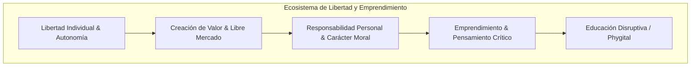

# Repositorio de Investigacion: Valores Organizacionales de FEE y Universidad de la Libertad

Este repositorio esta dedicado exclusivamente a la investigacion, analisis conceptual e ideacion sobre los valores organizacionales y de cultura empresarial de dos instituciones emblemáticas en la promocion de la libertad:

1. **Foundation for Economic Education (FEE)**
2. **Universidad de la Libertad (UL)**

---

## 🎯 Objetivo de la Investigacion
Analizar a profundidad las misiones, visiones, principios rectores y valores corporativos de ambas organizaciones, destacando como conceptualizan la **libertad**, el **emprendimiento**, la **responsabilidad individual** y la **innovacion educativa**, asi como la forma en que traducen estos ideales en su cultura y operacion diaria.

---

## 📂 Estructura de Documentos en este Repositorio

### 🏗️ Estándares de Ingeniería de Software (Documentación Técnica Formal)
| Estándar / Tipo | Archivo | Descripción |
| :--- | :--- | :--- |
| **SRS (ISO/IEC/IEEE 29148)** | 📋 [**`especificacion-requisitos-software-srs.md`**](./especificacion-requisitos-software-srs.md) | **Especificación de Requisitos de Software:** Requisitos funcionales (RF), no funcionales (RNF), historias de usuario BDD (Given/When/Then) y matriz MoSCoW para Osisn't y Panic Button. |
| **SAD (ISO/IEC/IEEE 42010)** | 🏛️ [**`arquitectura-software-sad-c4.md`**](./arquitectura-software-sad-c4.md) | **Documento de Arquitectura de Software:** Diagramas C4 (Contexto, Contenedores, Componentes), ADRs (Decisiones Arquitectónicas) y cadena de custodia forense OpenTimestamps. |
| **API Contract (OpenAPI 3.1)** | 🔌 [**`especificacion-api-openapi.md`**](./especificacion-api-openapi.md) | **Especificación de APIs y Contratos:** Endpoints REST/JSON para escaneos Osisn't, ingesta Share Sheet, firma biométrica LPOA y seguimiento de desindexación Google/Meta. |
| **Data Model & Privacy** | 🗄️ [**`modelo-datos-y-privacidad-erd.md`**](./modelo-datos-y-privacidad-erd.md) | **Modelo de Datos y ERD:** Esquema relacional en PostgreSQL/Supabase, diccionario de datos, retención efímera de 48h y almacenamiento Zero-Knowledge. |
| **QA & Security (ISO 29119)** | 🧪 [**`plan-pruebas-qa-seguridad.md`**](./plan-pruebas-qa-seguridad.md) | **Plan de Pruebas y QA:** Pirámide de pruebas automatizadas, mocks para APIs de OSINT, matriz de seguridad OWASP Mobile & API Top 10 y checklist para el Demo. |

---

### 📱 Propuesta de Producto y Módulos de la Suite
| Archivo | Descripción |
| :--- | :--- |
| ⭐ **[`concepto-central-plataforma.md`](./concepto-central-plataforma.md)** | **[DOCUMENTO CENTRAL DE TRABAJO]** Propuesta y arquitectura conceptual de la **Aplicación Móvil**: defensa de reputación, Share Sheet nativo, desindexación en Google/Meta y modelo de agente autorizado. |
| 🛡️ **[`osisnt-interfaz-huella-digital.md`](./osisnt-interfaz-huella-digital.md)** | **[MÓDULO OSISN'T]** Interfaz amigable y digestible de huella digital: transforma OSINT crudo en un dashboard visual, Exposure Score y remediación asistida en 1 clic (JustDelete.me, Eraser, etc.). |
| 🎨 **[`design-system/`](./design-system/README.md)** | **[SISTEMA DE DISEÑO & TOKENS]** Guía integral de colorimetría semántica, psicología anti-pánico, escala tipográfica, métodos de experiencia de usuario (Calm Security UX) y especificación de componentes para la app Flutter. |
| 👤 [`persona.md`](./persona.md) | Definición de Persona / Arquetipo de usuario (**Luisa Alfonsa Castilleja Peugnet**) y recorrido ante la plataforma. |

---

### 🔬 Investigación Técnica y Ciberdefensa
| Archivo | Descripción |
| :--- | :--- |
| 📄 [`herramientas-huella-digital.md`](./herramientas-huella-digital.md) | Análisis técnico de 5 herramientas open-source para búsqueda (OSINT) y borrado/mitigación (Sherlock, Holehe, Maigret, Eraser, JustDelete.me). |
| 📄 [`analisis-tecnico-endpoints-headers-osint.md`](./analisis-tecnico-endpoints-headers-osint.md) | Análisis técnico profundo sobre el funcionamiento interno de herramientas OSINT, explotación de endpoints web/APIs y extracción de cabeceras HTTP. |
| 📄 [`defensa-contra-osint-opsec.md`](./defensa-contra-osint-opsec.md) | Análisis de estrategias de Counter-OSINT, higiene digital, OPSEC y defensas técnicas contra el perfilado masivo. |

---

### 🏛️ Fundamentos Filosóficos y Valores Organizacionales
| Archivo | Descripción |
| :--- | :--- |
| 📄 [`fee-valores-organizacionales.md`](./fee-valores-organizacionales.md) | Análisis exhaustivo de FEE: historia, principios de Leonard Read, valores corporativos y cultura digital. |
| 📄 [`universidad-de-la-libertad-valores.md`](./universidad-de-la-libertad-valores.md) | Análisis detallado de la Universidad de la Libertad: modelo educativo de Ricardo Salinas Pliego, valores empresariales y hub de emprendimiento. |
| 📄 [`comparativa-y-sinergias.md`](./comparativa-y-sinergias.md) | Matriz comparativa, convergencias filosóficas, sinergias y conceptos clave unificados para ambas instituciones. |
| 📄 [`ciberseguridad-finanzas-y-valores.md`](./ciberseguridad-finanzas-y-valores.md) | Análisis y propuesta sobre cómo la Ciberseguridad y la Privacidad se alinean con la propiedad privada y la resiliencia de negocios. |

---

## 🔑 Conceptos Clave Destacados

### 1. Libertad Individual como Pilar Moral y Practico
La libertad no es solo un concepto politico o economico, sino una filosofia de vida integral basada en el respeto irrestricto al individuo y la eleccion voluntaria.

### 2. Emprendimiento como Agente de Cambio Social
Tanto en FEE como en la UL, el emprendedor es visto como el heroe moderno que resuelve problemas reales, genera prosperidad y desafia las estructuras obsoletas mediante la innovacion.

### 3. Autoperfeccionamiento y Responsabilidad (Self-Ownership)
Rechazo explicito al paternalismo y a la cultura de la victimizacion. Se fomenta la disciplina personal, la etica de trabajo y la asuncion de las consecuencias de las propias decisiones.

### 4. Innovacion Educativa por Persuasion y Experiencia
FEE aporta el modelo de persuasion etica y divulgacion de alto impacto digital, mientras que la Universidad de la Libertad aporta el modelo phygital, interactivo y guiado por empresarios en activo.

---

## 📌 Proximos Pasos (Ideacion)
Este material sirve como base conceptual para posteriores desarrollos de proyectos, estrategias de comunicacion o plataformas tecnologicas orientadas a difundir y potenciar estos valores.
