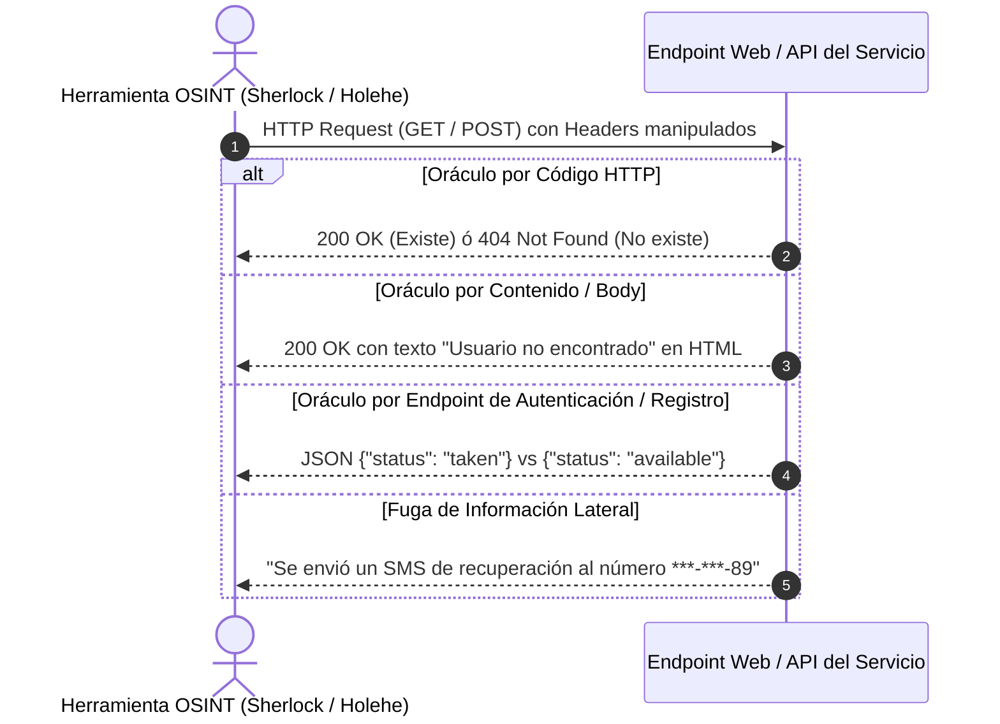
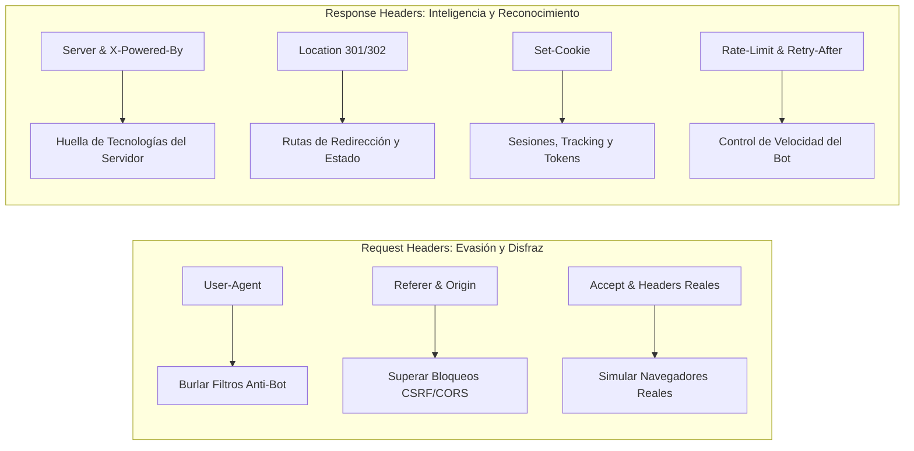

# Analisis Tecnico Profundo: Endpoints, Headers HTTP y Mecanismos Internos de Herramientas OSINT

## 1. ¿Como funcionan realmente estas herramientas bajo el capo?

Las herramientas de rastreo de huella digital (como **Sherlock**, **Holehe** y **Maigret**) no utilizan metodos esotericos ni magia; se basan en la explotacion automatizada de **oraculos de informacion** y en el analisis de la arquitectura web cliente-servidor.

En su nucleo, operan mediante una base de datos declarativa (archivos JSON o modulos Python independientes) donde cada sitio web tiene mapeada su "firma digital de existencia".



---

## 2. ¿Analizan los Endpoints? Clasificacion y Tipos de Endpoints Evaluados

**Si, el analisis y eleccion del endpoint adecuado es el factor determinante del exito de estas herramientas.** Se analizan principalmente cuatro tipos de endpoints:

### A. Endpoints de Perfil Publico (REST / GET)
* **Como opera:** La herramienta realiza una peticion `GET https://target.com/{username}`.
* **Metodo de deteccion:**
  * **Codigo de Estado HTTP puro:** Si devuelve `200 OK`, el usuario existe. Si devuelve `404 Not Found`, no existe.
  * **El reto de las Single Page Applications (SPAs):** Muchas plataformas modernas construidas en React, Angular o Vue devuelven siempre un codigo `200 OK` (cargando el contenedor `index.html`) y luego renderizan un mensaje de "Usuario no encontrado" via JavaScript.
  * **Solucion tecnica:** Las herramientas comparan el cuerpo de la respuesta (*Response Body*) buscando cadenas de texto negativas especificas definidas en su base de datos (p. ej., `"errorType": "user_not_found"`, `"page not found"` o `"This account doesn't exist"`).

### B. Endpoints de Registro y Pre-verificacion (Pre-flight Auth Endpoints)
* **Como opera (Especialidad de Holehe):** Cuando una persona se registra en un sitio web, la interfaz valida en tiempo real si el correo o usuario ya esta ocupado antes de que el usuario termine el formulario.
* **Mecanismo:** La herramienta envia peticiones asincronas a rutas como:
  * `POST /api/v1/auth/check-username`
  * `POST /api/v2/users/validate-email`
* **Respuesta del endpoint:**
  ```json
  {"success": false, "error": "email_already_registered"}
  ```
  Esto confirma de inmediato que la cuenta existe, sin necesidad de autenticarse, sin romper contrasenas y sin generar alertas al dueno legitimo.

### C. Endpoints de Recuperacion de Contrasena (*Forgot Password Oracles*)
* **Como opera:** Se envia una peticion a endpoints del tipo `POST /api/auth/reset-password-request`.
* **Vulnerabilidad de Enumeracion de Usuarios (OWASP):** Si el endpoint responde de manera diferente cuando un correo existe frente a cuando no existe:
  * Correo existente: `"Hemos enviado un codigo de recuperacion a tu email"` (tiempo de respuesta: ~350ms por el envio de correo).
  * Correo inexistente: `"El correo electronico proporcionado no esta registrado"` (tiempo de respuesta: ~50ms).
  * Las herramientas explotan esta asimetria en la respuesta o en el tiempo de procesamiento (*Timing Attacks*).

### D. Endpoints de Fuga Lateral de Datos (*Side-Channel Leaks*)
* Algunos endpoints de recuperacion revelan fragmentos de otros datos de la victima:
  * `"Hemos enviado el codigo a c********z@g****.com"`
  * `"SMS enviado al telefono terminado en 45"`
* Herramientas avanzadas como **Maigret** correlacionan estos datos para conectar un correo con un numero de telefono o con otro nombre de usuario.

---

## 3. ¿Que Informacion Valiosa contienen los Headers HTTP?

Los **Headers HTTP** son el canal de metadatos fundamental en la comunicacion web. En el contexto de ciberseguridad y OSINT, se dividen en dos categorias criticas:



---

### A. Headers de Peticion (*Request Headers*): Como se disfrazan las herramientas

Para no ser bloqueadas de inmediato por sistemas de defensa como **Cloudflare, Akamai o AWS WAF**, las herramientas deben manipular sus cabeceras para parecer un usuario humano legitimo:

1. **`User-Agent`:**
   * *Si envias:* `User-Agent: python-requests/2.31.0` -> El servidor bloquea la peticion al instante (403 Forbidden).
   * *Uso en OSINT:* Se envia una cadena realista de navegador moderno:
     `User-Agent: Mozilla/5.0 (Windows NT 10.0; Win64; x64) AppleWebKit/537.36 (KHTML, like Gecko) Chrome/122.0.0.0 Safari/537.36`.
2. **`Referer` y `Origin`:**
   * Muchos endpoints de API rechazan peticiones si no provienen de su propio dominio. Las herramientas inyectan `Referer: https://target.com/signup` para engañar a los chequeos basicos de CSRF.
3. **`Accept-Language` y `Accept-Encoding`:**
   * Los bots mal configurados a menudo omiten estas cabeceras. Las herramientas bien disenadas las incluyen (`Accept-Language: es-ES,es;q=0.9,en;q=0.8`, `gzip, deflate, br`) para replicar al 100% la firma de red (*JA3 / TLS / HTTP fingerprint*) de un navegador.

---

### B. Headers de Respuesta (*Response Headers*): Informacion valiosa extraida

Cuando el servidor web responde, sus cabeceras contienen informacion critica de inteligencia tecnica:

#### 1. `Location` (Codigos 301 / 302 / 307 / 308)
* Si al consultar `GET /user123` el servidor responde con una redireccion (`302 Found`), el header `Location` revela exactamente el estado de la cuenta:
  * `Location: /login` -> El perfil es privado o requiere autenticacion previa.
  * `Location: /suspended` -> El usuario existio pero fue baneado.
  * `Location: /404` o `/search?q=user123` -> El usuario no existe.

#### 2. `Server` y `X-Powered-By` (Fingerprinting de Infraestructura)
* Revelan que software corre en el backend:
  * `Server: Apache/2.4.51 (Ubuntu)`
  * `X-Powered-By: PHP/8.1.0` ó `Express`
* Permite al analista identificar versiones obsoletas y posibles vulnerabilidades conocidas (CVEs) en la infraestructura de la empresa.

#### 3. `Set-Cookie`
* Revela que sistemas de sesion y rastreo utiliza la plataforma (p. ej., `PHPSESSID`, `__cf_bm` de Cloudflare, `JSESSIONID`, identificadores de publicidad).
* Muestra si la empresa implementa buenas practicas de seguridad en cookies: flags `HttpOnly` (previene robo por XSS), `Secure` (solo via HTTPS) y `SameSite=Strict/Lax` (mitiga CSRF).

#### 4. `Content-Type`
* Permite a la herramienta saber si recibira un objeto serializado limpio (`application/json`) o un documento visual complejo (`text/html`), adaptando su analizador (*parser*) de inmediato.

#### 5. `X-RateLimit-Limit`, `X-RateLimit-Remaining`, `Retry-After`
* Informan cuantas solicitudes puede hacer la herramienta antes de ser bloqueada temporalmente:
  * `X-RateLimit-Remaining: 2`
  * `Retry-After: 60`
* Las herramientas avanzadas leen este header para regular dinamicamente su velocidad (*adaptive throttling*), evitando ser bloqueadas por el firewall.

#### 6. Headers de Seguridad Defensiva
* Informan si el sitio esta bien protegido a nivel de cabeceras:
  * `Strict-Transport-Security (HSTS)`
  * `Content-Security-Policy (CSP)`
  * `X-Content-Type-Options: nosniff`
  * `X-Frame-Options: DENY`

---

## 4. Resumen Conclusivo

Las herramientas open-source de rastreo de huella digital son esencialmente **analizadores automatizados de protocolos HTTP/S y explotadores de oraculos web**:
1. **Analizan endpoints clave:** No navegan por la interfaz grafica, sino que atacan directamente los endpoints REST, GraphQL y de autenticacion que revelan la existencia de cuentas.
2. **Explotan la "Vulnerabilidad de Enumeracion":** Convierten caracteristicas de conveniencia para el usuario (como mensajes de "correo ya registrado") en vectores de inteligencia.
3. **Leen y falsifican Headers HTTP:** Utilizan los headers de peticion para ocultarse y analizan minuciosamente los headers de respuesta para extraer metadatos de infraestructura, redireccion y control de limites.
