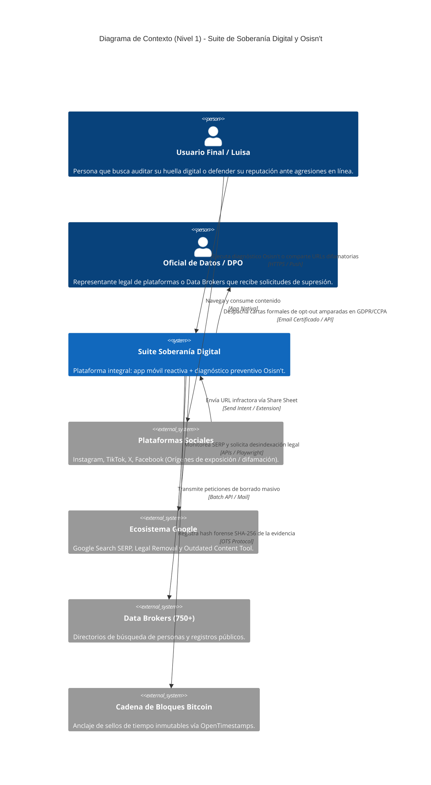
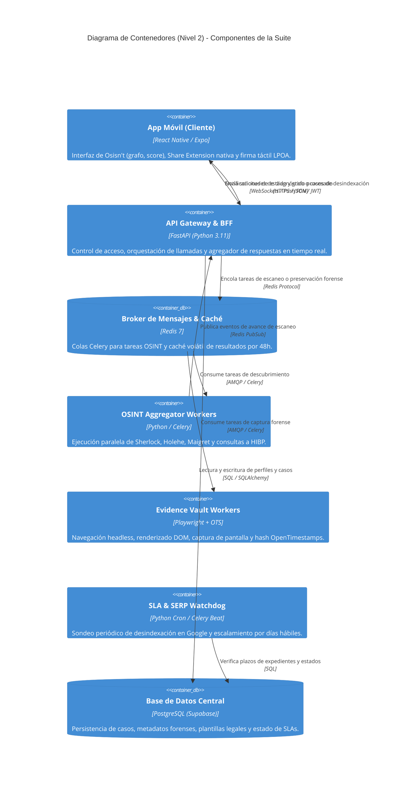
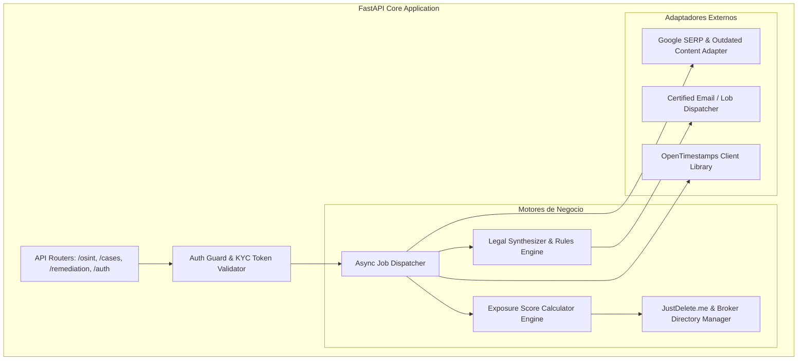
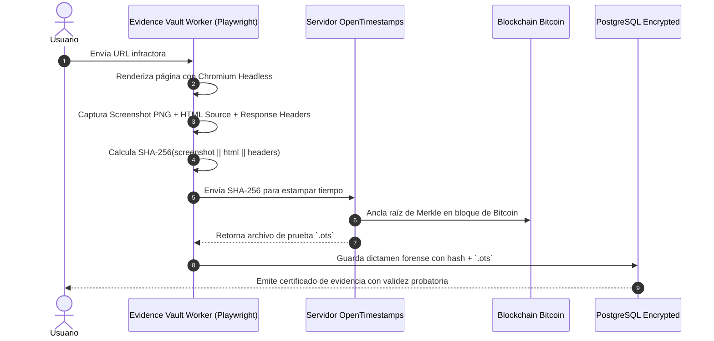

# Documento de Arquitectura de Software (SAD)
## Modelo C4, Patrones de Diseño y Architecture Decision Records (ADRs)
**Estándar de referencia:** ISO/IEC/IEEE 42010 / C4 Model (Simon Brown)  
**Versión:** 1.0.0  

---

## 1. Visión y Objetivos Arquitectónicos

La arquitectura de la suite está diseñada bajo cuatro pilares fundamentales:
1. **Zero-Knowledge por Diseño:** Procesamiento criptográfico en el dispositivo del usuario para imágenes íntimas y credenciales sensibles; la nube nunca recibe contenido no cifrado.
2. **Desacoplamiento Orientado a Eventos:** Las operaciones de rastreo OSINT y preservación forense son inherentemente lentas y propensas a latencias externas; por ello, la arquitectura es 100% asíncrona mediante colas de mensajes distribuidas.
3. **Resiliencia ante Anti-Scraping:** Manejo tolerante a fallos, reintentos con *exponential backoff* y rotación de proxies residenciales en la capa de agregación OSINT.
4. **Mobile-First Nativo:** Integración profunda con los mecanismos nativos del sistema operativo móvil (Share Extensions, biometría del enclave seguro y notificaciones push).

---

## 2. Modelo C4 - Niveles de Arquitectura

### 2.1 Nivel 1: Diagrama de Contexto del Sistema (System Context)
Muestra cómo interactúan los usuarios finales y los agentes legales con la suite y con el ecosistema externo de Big Tech, motores de búsqueda y data brokers.

---

### 2.2 Nivel 2: Diagrama de Contenedores (Container Diagram)
Describe los límites del software ejecutable, tecnologías seleccionadas y cómo viajan los datos entre el cliente y el backend.

---

### 2.3 Nivel 3: Diagrama de Componentes (Component Diagram - Backend API)
Detalla la estructura interna del contenedor de API Gateway & BFF.

---

## 3. Registros de Decisiones de Arquitectura (ADRs)

### ADR-01: Cómputo Local de Hashing Perceptual (Zero-Knowledge) para Imágenes Íntimas
* **Estado:** Aprobado.
* **Contexto:** Las víctimas de extorsión o fotos íntimas no consentidas (NCII) desconfían profundamente de subir sus fotografías a la nube de una startup o hackathon.
* **Decisión:** Implementar algoritmos de *perceptual hashing* (pHash / PhotoDNA) en el cliente móvil utilizando WebAssembly o librerías nativas C++/Swift/Kotlin. El backend nunca recibe ni almacena las imágenes originales; únicamente almacena y transmite el hash criptográfico para cotejo en bases de datos de bloqueo (StopNCII / Meta / Google).
* **Consecuencias:**
  * *Positivas:* Privacidad absoluta del usuario, cumplimiento legal estricto contra almacenamiento de material explícito sensible, reducción drástica de costos de almacenamiento S3.
  * *Negativas:* Ligero incremento en el uso de batería y CPU del smartphone durante los segundos de cálculo.

---

### ADR-02: Adopción de Celery + Redis como Motor Asíncrono de OSINT
* **Estado:** Aprobado.
* **Contexto:** Ejecutar búsquedas simultáneas en más de 400 sitios web mediante Sherlock y 120 plataformas mediante Holehe genera latencias de red impredecibles (de 10 a 60 segundos). Bloquear la petición HTTP del usuario agotaría los timeouts de los clientes móviles.
* **Decisión:** Utilizar un patrón *Asynchronous Request-Reply* soportado por Celery y Redis. El endpoint `POST /api/v1/osint/scan` retorna de inmediato un `job_id` con código HTTP `202 Accepted`. El cliente móvil escucha los avances progresivos mediante WebSockets o sondeos ligeros.
* **Consecuencias:**
  * *Positivas:* API reactiva de alta velocidad, tolerancia a desconexiones de red en el móvil y escalabilidad horizontal de workers independientes.
  * *Negativas:* Requiere mantener y monitorear la infraestructura del broker de Redis y los procesos Celery.

---

### ADR-03: Share Sheet Nativo como Canal Primario de Ingesta en Casos de Crisis
* **Estado:** Aprobado.
* **Contexto:** En situaciones de estrés emocional por doxxing o difamación, el usuario no abre una página web, no copia URLs complejas ni rellena formularios de 15 campos.
* **Decisión:** Diseñar la experiencia móvil alrededor de la extensión del menú "Compartir" de iOS y Android (*Share Sheet Extension*). Al compartir un enlace de Instagram/TikTok directamente con la app, se dispara en segundo plano la preservación forense y se precarga la plantilla legal en 3 toques.
* **Consecuencias:**
  * *Positivas:* Tiempos de respuesta reducidos de 30 minutos a 45 segundos; ventaja competitiva radical frente a servicios web de escritorio.
  * *Negativas:* Requiere desarrollo nativo multiplataforma específico para las extensiones del sistema operativo.

---

### ADR-04: Almacenamiento Caché Estático del Directorio JustDelete.me
* **Estado:** Aprobado.
* **Contexto:** La experiencia digestible de Osisn't requiere redirigir de inmediato al usuario a la URL de baja sin depender de peticiones HTTP externas que puedan fallar.
* **Decisión:** Empaquetar y sincronizar periódicamente la base de datos JSON abierta de JustDelete.me dentro del servidor de API y en la caché local SQLite de la app móvil.
* **Consecuencias:**
  * *Positivas:* Tiempos de respuesta de 0 milisegundos al tocar "Eliminar Cuenta"; disponibilidad completa incluso en condiciones de baja conectividad.
  * *Negativas:* Requiere un worker programado semanal para detectar cambios o nuevos enlaces en el repositorio de JustDelete.me.

---

## 4. Estrategia de Seguridad y Cadena de Custodia Forense

Esta arquitectura garantiza que la evidencia digital recolectada mantenga plena validez pericial ante tribunales de justicia y juzgados civiles, demostrando de forma inalterable que la publicación existía en una fecha y hora exactas antes de que el agresor intente borrarla.
