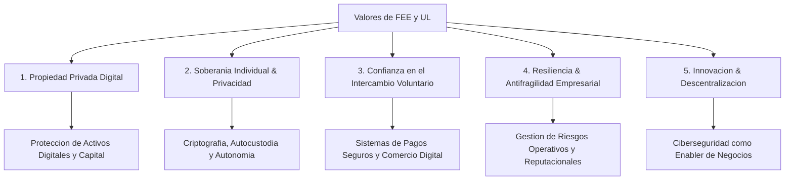

# Investigacion y Propuesta: Ciberseguridad, Finanzas y Negocios en el Marco de los Valores de FEE y UL

## 1. Introduccion: El Eslabon Perdido en la Narrativa de Libertad y Negocios
La **Foundation for Economic Education (FEE)** y la **Universidad de la Libertad (UL)** destacan por promover el libre mercado, el emprendimiento, la creacion de riqueza y el liderazgo financiero. Sin embargo, en la era digital del siglo XXI, surge una pregunta critica:

> *¿Como se sostiene la libertad economica, la propiedad privada y el crecimiento de un negocio si sus activos digitales, datos financieros e identidad no estan protegidos?*

La **seguridad de la informacion (Ciberseguridad)** no es una disciplina meramente tecnica o un "departamento de IT"; es la **infraestructura de proteccion de la libertad y de la propiedad privada digital**.

---

## 2. Conexión Filosofica entre la Ciberseguridad y los Valores de FEE y UL

---

### A. La Ciberseguridad como Defensa de la Propiedad Privada Digital (FEE)
* **El Principio de FEE:** La sociedad libre reposa sobre la santidad de la propiedad privada. Si un tercero roba tus bienes mediante coercion o fraude, la libertad se rompe.
* **Alineacion con la Ciberseguridad:** En el mundo moderno, el capital principal de las empresas y personas es digital (propiedad intelectual, bases de datos, llaves criptograficas, registros financieros). La ciberseguridad es el equivalente digital a los cerrojos, cajas fuertes y derechos de propiedad fisicos. Sin ciberseguridad, la propiedad privada digital es una ilusion.

### B. Soberania Individual, Autonomia y Privacidad Financiera
* **El Principio de FEE y UL:** El individuo es soberano y debe ser libre de administrar su capital sin vigilancia injustificada ni interferencias coercitivas.
* **Alineacion con la Ciberseguridad:** Tecnologias como el cifrado de extremo a extremo, la criptografia asimetrica, la identidad soberana (SSI) y la autocustodia financiera (por ejemplo, en activos digitales) son herramientas directas de libertad personal. Protegen a los ciudadanos y emprendedores contra la extorsion, la censura financiera y el ciberdelito.

### C. Confianza e Intercambio Voluntario en los Negocios
* **El Principio de FEE y UL:** Los mercados funcionan mediante transacciones libres y voluntarias basadas en la confianza mutua entre compradores y vendedores.
* **Alineacion con la Ciberseguridad:** En la economia digital, la confianza es el activo mas valioso. Una brecha de datos (*data breach*), la fuga de informacion de clientes o el fraude financiero destruyen instantaneamente la reputacion de un negocio. La ciberseguridad es la garantia de integridad y autenticidad que hace posible el comercio electronico global.

### D. Resiliencia Empresarial y Antifragilidad (Universidad de la Libertad)
* **El Principio de la UL:** Formar emprendedores capaces de liderar en entornos de incertidumbre y gestionar el riesgo con vision estrategica.
* **Alineacion con la Ciberseguridad:** Un ataque de *ransomware* o una interrupcion de servicio puede paralizar una empresa y llevarla a la quiebra. En la UL, la ciberseguridad debe abordarse desde la **gestion del riesgo corporativo y la toma de decisiones directivas (C-Level)**, ensenando a los futuros CEOs a disenar organizaciones antifragiles y cyber-resilientes.

---

## 3. Integracion Practica: Como incorporar la Ciberseguridad en el Modelo Educativo de FEE y UL

Para cerrar la brecha entre los negocios/finanzas y la seguridad de la informacion dentro de la vision de FEE y la UL, se proponen los siguientes ejes conceptuales:

### 1. "Cybersecurity as a Business Enabler" (La Ciberseguridad como Impulsor de Ventajas Competitivas)
* En lugar de ensenar la ciberseguridad como un costo burocratico, ensenarla como una **ventaja competitiva** que permite a las *startups* operar internacionalmente, escalar con confianza y proteger su valuacion ante inversionistas.

### 2. Finanzas Criptograficas y Seguridad en la Cadena de Pagos (FinTech & Security)
* Integrar la ciberseguridad en los programas de finanzas: gestion de riesgos en pasarelas de pago, mitigacion de fraudes digitales, tokenizacion, seguridad en finanzas descentralizadas (DeFi) y proteccion de sistemas bancarios.

### 3. Gestion de Riesgos Digitales para CEOs y Juntas Directivas (Governance & Risk Management)
* Ensenar a los estudiantes de la UL la ciberseguridad no como programacion, sino como **Gobernanza Digital y Administracion de Riesgos**:
  * Evaluacion de impacto financiero de ciberataques.
  * Compliance y privacidad de datos (RGPD, LFPDPPP).
  * Planes de continuidad de negocio (BCP) y respuesta a incidentes.

### 4. Etica, Libertad Digital y Ciberdefensa
* Promover la ciberseguridad ofensiva etica (*Ethical Hacking*) y el *Red Teaming* como disciplinas de pensamiento critico para desafiar sistemas, encontrar vulnerabilidades antes que los atacantes y defender la libertad digital.

---

## 4. Matriz de Relacion: Finanzas, Negocios y Ciberseguridad bajo la Filosofia de Libertad

| Dimension | Negocios y Finanzas Tradicionales | Impacto de la Ciberseguridad | Valor Asociado (FEE / UL) |
| :--- | :--- | :--- | :--- |
| **Capital y Activos** | Balance general, liquidez, IP | Proteccion contra ransomware, robo de activos y espionaje industrial | Proteccion de la Propiedad Privada |
| **Relacion con Clientes** | Ventas, lealtad, e-commerce | Garantia de privacidad de datos personales y transacciones seguras | Confianza e Intercambio Voluntario |
| **Estrategia y Riesgo** | Modelo de negocios, escalabilidad | Continuidad operativa, ciber-resiliencia y gestion de crisis | Antifragilidad y Liderazgo (UL) |
| **Autonomia Financiera** | Inversiones, libertad transaccional | Criptografia, autocustodia y sistemas descentralizados | Soberania Individual (FEE) |

---

## 5. Conclusiones y Oportunidades de Ideacion

La ciberseguridad no esta separada del mundo de los negocios y la libertad; **es su escudo protector**. 

* **FEE** puede abordar la ciberseguridad desde el plano de los derechos individuales en la era digital (privacidad, cifrado como libertad de expresion y proteccion contra la vigilancia).
* **Universidad de la Libertad** puede diferenciar su modelo educativo ensenando **"Cyber-Leadership & Digital Governance"** a los emprendedores, garantizando que las futuras empresas nacidas en la UL sean tecnológicamente seguras, eticas y altamente competitivas.
