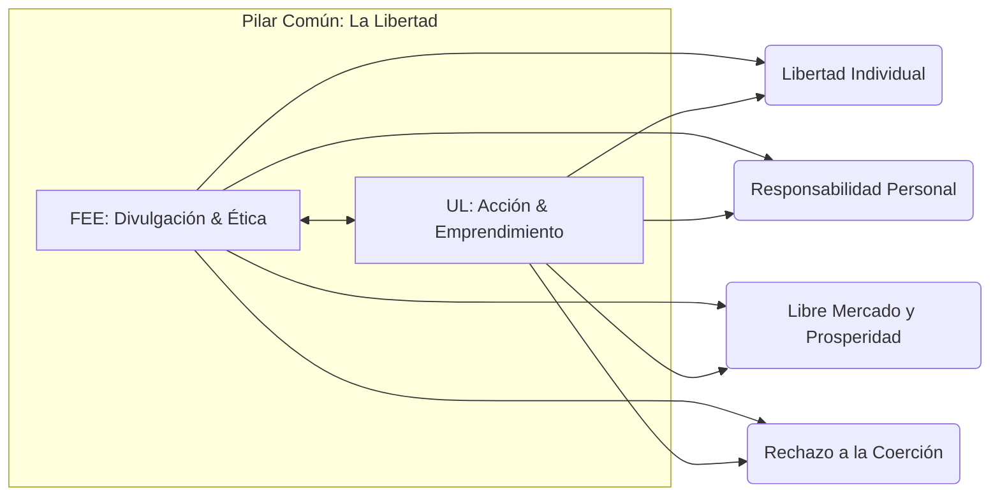

# Comparativa y Sinergias Organizacionales: FEE vs. Universidad de la Libertad

## 1. Resumen Ejecutivo
Tanto la **Foundation for Economic Education (FEE)** como la **Universidad de la Libertad (UL)** comparten una misma brujula filosofica: **la libertad individual como el motor supremo del bienestar moral, economico y social**. Sin embargo, operan en momentos historicos, contextos geograficos y formatos institucionales distintos pero altamente complementarios.

Mientras que FEE actua como una **fundacion educativa global y plataforma digital de divulgacion cultural**, la Universidad de la Libertad opera como una **institucion de educacion superior presencial y phygital enfocada en la accion emprendedora y el liderazgo de negocios**.

---

## 2. Matriz Comparativa de Valores Corporativos y Enfoque

| Criterio | Foundation for Economic Education (FEE) | Universidad de la Libertad (UL) |
| :--- | :--- | :--- |
| **Ano de Fundacion** | 1946 (EE. UU.) | 2023 (Mexico) |
| **Fundador Principal** | Leonard E. Read | Ricardo Salinas Pliego |
| **Naturaleza Juridica** | Non-profit 501(c)(3) / Fundacion Educativa | Institucion Educativa Universitaria |
| **Audiencia Objetivo** | Estudiantes de secundaria, universitarios y educadores globales | Estudiantes universitarios, emprendedores y profesionales |
| **Valor Central Definitivo** | Libertad Individual y Etica del Libre Mercado | Libertad Individual y Emprendimiento Práctico |
| **Metodologia Principal** | Persuasion etica, divulgacion de ideas, narrativa, cursos online | Aprendizaje hiper-personalizado, retos de negocio reales, phygital |
| **Cultura de Innovacion** | Transformacion de editorial tradicional a potencia de medios digitales | Campus inteligente, tecnologia adaptativa, entorno startup |
| **Rol del Docente/Mentor** | Pensadores economicos, divulgadores, creadores de contenido | Empresarios en activo, ejecutivos, practicantes de negocios |
| **Financiamiento** | Donaciones privadas (independiente de fondos gubernamentales) | Capital privado / Modelo institucional de alto valor agregado |

---

## 3. Convergencias Filosoficas y de Valores (Los Pilares Compartidos)

1. **La Libertad Individual como Axioma Supremo:**
   Ambas organizaciones sostienen que el individuo es la unidad fundamental de la sociedad y posee el derecho moral de perseguir sus propias metas sin interferencia coercitiva del Estado.

2. **La Responsabilidad Personal como Contraparte de la Libertad:**
   Ninguna de las dos promueve una libertad desordenada o irresponsable. En FEE se resalta el caracter moral; en la UL se acentua la asuncion de riesgos, las consecuencias de las decisiones financieras y la cultura del no-victimismo.

3. **El Libre Mercado como Herramienta de Erradicacion de la Pobreza:**
   FEE ensena los principios teoricos de la oferta, demanda, precios e intercambio voluntario; la UL aplica esos principios ensenando a construir empresas rentables que compitan en mercados abiertos.

4. **Independencia del Poder Politico / Estado:**
   Ambas instituciones promueven el gobierno limitado y mantienen una postura independiente frente a subsidios o mandatos estatales, garantizando total libertad de catedra e ideologica.

---

## 4. Complementariedad y Sinergias Estrategicas

### A. La Via de la Transicion: De la Conciencia (FEE) a la Accion (UL)
* **FEE despierta la mente:** Produce el chispazo de interes en jovenes de 15 a 25 anos sobre por que la libertad importa, mediante contenidos digitales, articulos cortos, eventos y webinars.
* **UL construye las capacidades:** Ofrece la estructura formativa inmersiva donde ese joven, convencido de la importancia de la libertad, aprende a ejecutar proyectos empresariales de alto valor.

### B. Creacion de un Ecosistema de Libertad regional en America Latina
* La colaboracion entre el contenido conceptual y pedagogico de FEE con el hub de emprendimiento e infraestructura de la UL crea un circuito de liderazgo libertad-emprendimiento unico en el mundo hispanohablante.

---

## 5. Conceptos Clave Unificados para Proyectos Futuros

1. **Freedom-Driven Enterprise (Empresa Impulsada por la Libertad):** Organizaciones cuya cultura interna y modelo de cara al cliente se fundamentan en la autonomia, el respeto al cliente y la creacion voluntaria de valor.
2. **Practitioner Mentorship (Mentoria por Practicantes):** Desplazamiento del academico teorico por el lider de industria que ensena desde la experiencia y la resiliencia.
3. **Phygital Education for Liberty (Educacion Phygital por la Libertad):** Uso de tecnologia moderna para escalar la ensenanza de principios eticos y economicos sin perder el valor de la comunidad presencial.
4. **Self-Ownership & Accountability:** El concepto de que cada colaborador o estudiante es dueno de sus resultados y responsable de su desarrollo continuo.
