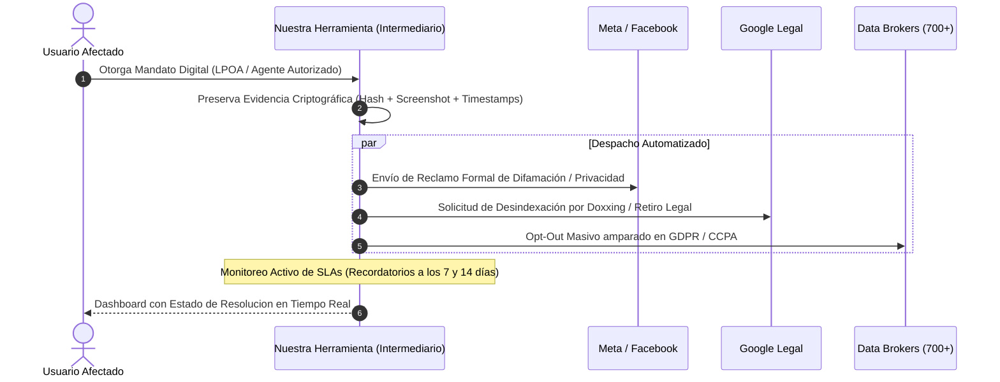

# Idea Central y Propuesta: Plataforma de Defensa de Reputacion, Desindexacion y Borrado de Huella Digital

> **Documento Central de Trabajo:** Este archivo sirve como la propuesta rectora y arquitectura conceptual del proyecto. Sera actualizado, refinado y perfeccionado iterativamente a medida que avancemos en la definicion de la herramienta.

---

## 1. El Problema Real del Usuario Final y la Asimetria de Poder

Hoy en dia, un individuo común o un profesionista enfrenta una vulnerabilidad abrumadora:
1. **Exposicion Involuntaria:** Filtracion de datos personales (*doxxing*), aparicion de fotos/videos no consentidos, contenido difamatorio en redes sociales (Facebook, Instagram, X, TikTok) o registros en buscadores de personas (*data brokers*).
2. **Dano Reputacional Inmediato:** Una busqueda en Google con contenido danino puede destruir la carrera profesional, las finanzas o la vida personal de una persona en cuestion de horas.
3. **El Calvario Burocratico (Dias a Semanas):**
   * Las grandes plataformas tecnologicas (**Big Tech**) no cuentan con una "API publica de borrado" para usuarios.
   * Disenan laberintos de soporte (*dark patterns*), formularios ocultos y exigencias probatorias complejas.
   * La respuesta depende de revisiones humanas lentas, donde los reclamos comunes son ignorados o archivados sin explicacion clara.
4. **La Falencia de las Herramientas Actuales:**
   * Las herramientas OSINT tradicionales (como Sherlock o Holehe) solo le entregan al usuario una lista cruda: *"Estas en 80 sitios"*.
   * Esto genera **ansiedad sin solucion**: el usuario sabe que esta expuesto, pero no tiene el conocimiento tecnico ni legal para resolverlo.

---

## 2. Alineacion con los Valores de FEE y Universidad de la Libertad

* **Propiedad Privada del Nombre, Imagen y Datos (FEE):** La identidad y la reputacion de un individuo son parte indiscutible de su propiedad privada. Nadie tiene derecho a explotar, mercantilizar o difamar la imagen de una persona sin su consentimiento voluntario.
* **Soberania Individual frente a Monopolios (FEE):** Reequilibrar la balanza entre el ciudadano individual y las megacorporaciones tecnologicas o corredores de datos.
* **Innovacion Emprendedora y Resolucion Práctica (UL):** No conformarse con el diagnostico pasivo; construir una solucion orientada a la ejecucion, reduciendo procesos dolorosos de semanas a pocos clics gracias a la tecnologia.
* **Gestion del Riesgo y Antifragilidad (UL):** Dotar al usuario de herramientas directivas para gestionar su reputacion personal y mitigar crisis digitales como un verdadero lider.

---

## 3. Investigacion Técnica: ¿Como Funcionan Realmente los Procesos en Google y Meta?

Para disenar una herramienta de automatizacion, primero debemos entender las tripas operativas y legales de Google y Meta:

```mermaid
graph TD
    subgraph Origen del Contenido Dañino
        A[Sitio Web / Perfil de Meta / Foro] -->|Indexado por| B[Buscador Google (SERP)]
    end

    subgraph Proceso de Mitigación Dual
        C[1. Eliminación en Origen: Meta / Webmaster] -->|Takedown Legal / Reporte| A
        D[2. Desindexación en Google] -->|Resultados sobre ti / Outdated Content| B
    end

    E[Intermediario Automatizado / Agente Autorizado] -->|Acción Paralela| C
    E -->|Acción Paralela| D
```

### A. El Ecosistema de Google: Desindexacion vs. Eliminacion
Google **no es el dueno de Internet ni aloja el contenido de terceros**, solo lo indexa. Por ende, existen dos caminos obligados:

1. **Desindexacion Legal Directa (Google Legal Removal):**
   * Aplica para: Datos personales sensibles (Doxxing, INE/CURP/SSN, cuentas bancarias), imagenes explicitas no consentidas (NCII) y difamacion respaldada por legislacion local o mandatos judiciales.
   * *Mecanismo:* Se tramita mediante formularios especificos en `support.google.com/legal`.
   * *Por que tarda:* Google cuenta con equipos de cumplimiento legal que sopesan el "interes publico y libertad de expresion" frente al "derecho a la privacidad".
2. **Herramienta "Results about you" (Resultados sobre ti):**
   * Diseñada para usuarios individuales para solicitar el retiro de resultados que contienen telefonos, domicilios o correos.
   * *Limitacion:* Es un flujo manual asistido por app; no cuenta con API publica de consumo B2B/B2C.
3. **Herramienta de Contenido Desactualizado (*Remove Outdated Content Tool*):**
   * Si el contenido ya fue borrado de Facebook o de la web de origen pero sigue apareciendo en el *snippet* o cache de Google, se puede forzar al robot de Google a verificar el codigo `404/410` para purgar la URL de los resultados en 24-48 horas.

### B. El Ecosistema de Meta (Facebook e Instagram)
1. **Suplantacion de Identidad (*Impersonation*):**
   * Requiere someter un formulario aportando documento de identificacion oficial (ID con fotografia).
2. **Difamacion y Vulneracion de Derechos al Honor:**
   * Meta cuenta con el formulario especializado de *Defamation / Rights Violation*. Exige citar los articulos de ley del pais del afectado y el enlace exacto de la publicacion o comentario.
3. **Imagenes Intimas No Consentidas (NCII / Porno Venganza):**
   * Integracion con iniciativas como **StopNCII.org** y **Take It Down** (de NCMEC).
   * *Como funciona la tecnologia:* La imagen nunca se sube a los servidores; se genera un **hash criptografico local (perceptual hash / PhotoDNA)** en el dispositivo del usuario. Ese hash se comparte con Meta, Google, TikTok y Reddit para bloquear la subida o eliminar copias existentes en segundos.

---

## 4. ¿Como puede Intervenir un Intermediario? (El Modelo del "Agente Autorizado")

El cuello de botella de estos procesos es que estan deliberadamente disenados para cansar al usuario individual. Un intermediario de software puede intervenir mediante las siguientes figuras tecnicas y legales:



### 1. La Figura Juridica: "Authorized Agent" y Poder Limitado (LPOA)
* Bajo normativas modernas como la **CCPA** (California Consumer Privacy Act) y el **Articulo 80 del GDPR** (y normativas analogas de proteccion de datos en Latinoamerica), una persona puede designar formalmente a un **"Agente Autorizado"** para que actue en su representacion.
* **El Intermediario Digital:** Al registrarse, el usuario firma electronicamente un mandato de representacion limitado (*Limited Power of Attorney* exclusivamente para la gestion de privacidad y derechos ARCO / eliminacion). Con este poder, la plataforma puede emitir notificaciones legales validas a nombre del afectado.

### 2. Preservacion Forense de la Evidencia (Paso Critico)
* Antes de reportar, el infractor suele borrar o modificar el contenido si sospecha algo, perdiendo la prueba.
* El intermediario realiza un **archivado forense automatico**:
  * Captura de pantalla certificada.
  * Extraccion de codigo fuente HTML y metadatos.
  * Hash criptografico (SHA-256) con sellado de tiempo (*timestamping*) para que tenga validez legal en caso de litigio.

### 3. Orquestador de Envio y Despacho Automatizado
* **Canales Directos a Registered Agents:** En lugar de utilizar los formularios web lentos que atienden bots, las empresas tienen direcciones de correo legales y agentes registrados dedicados a recepcion de notificaciones judiciales y reclamos DMCA/GDPR.
* El intermediario genera documentos formales con terminologia juridica precisa, anexando la evidencia forense y enviandolos via correo certificado / API de notificaciones legales.
* **Navegadores Headless Asistidos:** Para aquellos formularios que no tienen API y requieren completar campos web, el software utiliza automatizaciones (Playwright / Puppeteer) supervisadas por el usuario para pre-rellenar y enviar solicitudes complejas en segundos.

### 4. Motor de Seguimiento y Escalacion por SLAs
* La ley establece plazos maximos para que las empresas respondan (por ejemplo, 15 a 30 dias bajo legislaciones de privacidad).
* Si Meta o Google no responden en 7 dias, el intermediario envia automaticamente un recordatorio formal con advertencia de escalamiento a la autoridad de proteccion de datos correspondiente (ej. INAI en Mexico, AEPD en Espana, FTC en EE. UU.).

### 5. Verificador Continuo de Desindexacion
* Un bot en segundo plano monitorea periodicamente:
  * Codigo de respuesta HTTP de la URL infractora (verificando si ya es `404 Not Found` o `410 Gone`).
  * Consultas recurrentes a las SERPs (Search Engine Result Pages) de Google para certificar que el enlace ha sido desindexado.

---

## 5. Arquitectura Conceptual de la Herramienta Propuesta

La plataforma se concibe como una aplicacion orientada al usuario final con los siguientes modulos modulares:

| Modulo | Nombre Clave | Funcion Principal |
| :--- | :--- | :--- |
| **Modulo 1** | **Evidence & URL Vault** | Entrada del usuario (pegar link o foto); captura forense instantanea con hash SHA-256. |
| **Modulo 2** | **Legal Matrix Engine** | Clasificacion automatica del incidente (Difamacion, Doxxing, Suplantacion, Imagen No Consentida) y seleccion de la via legal optima. |
| **Modulo 3** | **Big Tech Liaison (Meta/Google)** | Generacion y despacho del paquete de reclamo hacia los canales legales de Meta y Google. |
| **Modulo 4** | **Data Broker Cleaner** | Integracion de opt-outs masivos hacia corredores de datos personales (estilo Eraser / DeleteMe open-source). |
| **Modulo 5** | **Radar de Desindexacion & Dashboard** | Seguimiento en tiempo real de los dias transcurridos, estado del ticket y confirmacion automatica de eliminacion en Google. |

---

## 6. Proximos Puntos a Desarrollar e Iterar
Este documento servira como base para nuestras siguientes definiciones:
1. **Definicion de Casos de Uso Prioritarios:** ¿Nos enfocaremos primero en personas individuales afectadas por fotos/videos o en profesionistas/ejecutivos atacados por resenas falsas y difamacion?
2. **Diseno de la Experiencia del Usuario (UX):** ¿Como hacer que una persona en panico/crisis emocional complete el proceso en menos de 3 minutos?
3. **Mecanismo de Verificacion de Identidad:** ¿Como aseguramos que quien solicita el borrado es el dueno legitimo de los datos y no un atacante intentando censurar a otro?
