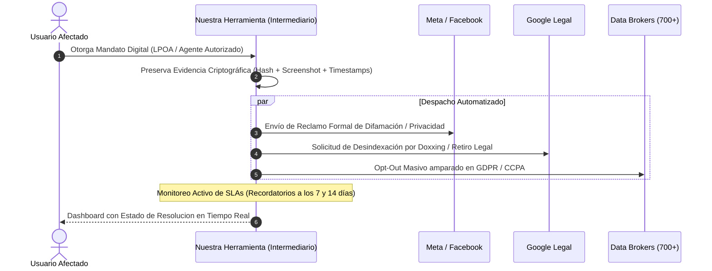
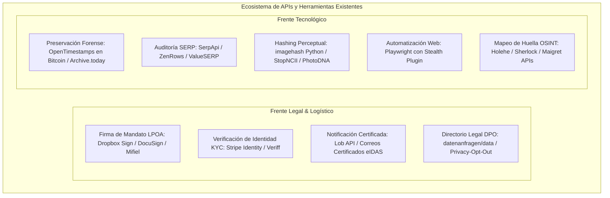
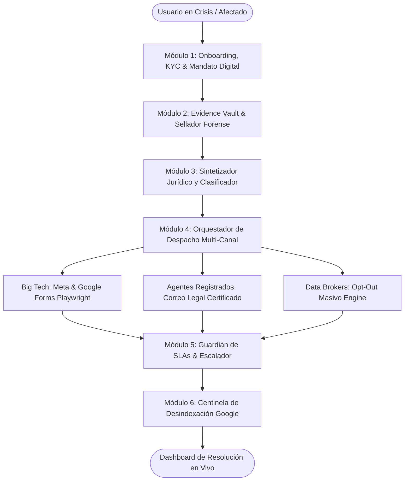

# Idea Central y Propuesta: Plataforma de Defensa de Reputacion, Desindexacion y Borrado de Huella Digital

> **Documento Central de Trabajo:** Este archivo sirve como la propuesta rectora y arquitectura conceptual del proyecto. Sera actualizado, refinado y perfeccionado iterativamente a medida que avancemos en la definicion de la herramienta.

---

## 1. El Problema Real del Usuario Final y la Asimetria de Poder

Hoy en dia, un individuo común o un profesionista enfrenta una vulnerabilidad abrumadora:
1. **Exposicion Involuntaria:** Filtracion de datos personales (*doxxing*), aparicion de fotos/videos no consentidos, contenido difamatorio en redes sociales (Facebook, Instagram, X, TikTok) o registros en buscadores de personas (*data brokers*).
2. **Dano Reputacional Inmediato:** Una busqueda en Google con contenido danino puede destruir la carrera profesional, las finanzas o la vida personal de una persona en cuestion de horas.
3. **El Calvario Burocratico (Dias a Semanas):**
   * Las grandes plataformas tecnologicas (**Big Tech**) no cuentan con una "API publica de borrado" para usuarios.
   * Disenan laberintos de soporte (*dark patterns*), formularios ocultos y exigencias probatorias complejas.
   * La respuesta depende de revisiones humanas lentas, donde los reclamos comunes son ignorados o archivados sin explicacion clara.
4. **La Falencia de las Herramientas Actuales:**
   * Las herramientas OSINT tradicionales (como Sherlock o Holehe) solo le entregan al usuario una lista cruda: *"Estas en 80 sitios"*.
   * Esto genera **ansiedad sin solucion**: el usuario sabe que esta expuesto, pero no tiene el conocimiento tecnico ni legal para resolverlo.

---

## 2. Alineacion con los Valores de FEE y Universidad de la Libertad

* **Propiedad Privada del Nombre, Imagen y Datos (FEE):** La identidad y la reputacion de un individuo son parte indiscutible de su propiedad privada. Nadie tiene derecho a explotar, mercantilizar o difamar la imagen de una persona sin su consentimiento voluntario.
* **Soberania Individual frente a Monopolios (FEE):** Reequilibrar la balanza entre el ciudadano individual y las megacorporaciones tecnologicas o corredores de datos.
* **Innovacion Emprendedora y Resolucion Práctica (UL):** No conformarse con el diagnostico pasivo; construir una solucion orientada a la ejecucion, reduciendo procesos dolorosos de semanas a pocos clics gracias a la tecnologia.
* **Gestion del Riesgo y Antifragilidad (UL):** Dotar al usuario de herramientas directivas para gestionar su reputacion personal y mitigar crisis digitales como un verdadero lider.

---

## 3. Investigacion Técnica: ¿Como Funcionan Realmente los Procesos en Google y Meta?

Para disenar una herramienta de automatizacion, primero debemos entender las tripas operativas y legales de Google y Meta:

```mermaid
graph TD
    subgraph Origen del Contenido Dañino
        A[Sitio Web / Perfil de Meta / Foro] -->|Indexado por| B[Buscador Google (SERP)]
    end

    subgraph Proceso de Mitigación Dual
        C[1. Eliminación en Origen: Meta / Webmaster] -->|Takedown Legal / Reporte| A
        D[2. Desindexación en Google] -->|Resultados sobre ti / Outdated Content| B
    end

    E[Intermediario Automatizado / Agente Autorizado] -->|Acción Paralela| C
    E -->|Acción Paralela| D
```

### A. El Ecosistema de Google: Desindexacion vs. Eliminacion
Google **no es el dueno de Internet ni aloja el contenido de terceros**, solo lo indexa. Por ende, existen dos caminos obligados:

1. **Desindexacion Legal Directa (Google Legal Removal):**
   * Aplica para: Datos personales sensibles (Doxxing, INE/CURP/SSN, cuentas bancarias), imagenes explicitas no consentidas (NCII) y difamacion respaldada por legislacion local o mandatos judiciales.
   * *Mecanismo:* Se tramita mediante formularios especificos en `support.google.com/legal`.
   * *Por que tarda:* Google cuenta con equipos de cumplimiento legal que sopesan el "interes publico y libertad de expresion" frente al "derecho a la privacidad".
2. **Herramienta "Results about you" (Resultados sobre ti):**
   * Diseñada para usuarios individuales para solicitar el retiro de resultados que contienen telefonos, domicilios o correos.
   * *Limitacion:* Es un flujo manual asistido por app; no cuenta con API publica de consumo B2B/B2C.
3. **Herramienta de Contenido Desactualizado (*Remove Outdated Content Tool*):**
   * Si el contenido ya fue borrado de Facebook o de la web de origen pero sigue apareciendo en el *snippet* o cache de Google, se puede forzar al robot de Google a verificar el codigo `404/410` para purgar la URL de los resultados en 24-48 horas.

### B. El Ecosistema de Meta (Facebook e Instagram)
1. **Suplantacion de Identidad (*Impersonation*):**
   * Requiere someter un formulario aportando documento de identificacion oficial (ID con fotografia).
2. **Difamacion y Vulneracion de Derechos al Honor:**
   * Meta cuenta con el formulario especializado de *Defamation / Rights Violation*. Exige citar los articulos de ley del pais del afectado y el enlace exacto de la publicacion o comentario.
3. **Imagenes Intimas No Consentidas (NCII / Porno Venganza):**
   * Integracion con iniciativas como **StopNCII.org** y **Take It Down** (de NCMEC).
   * *Como funciona la tecnologia:* La imagen nunca se sube a los servidores; se genera un **hash criptografico local (perceptual hash / PhotoDNA)** en el dispositivo del usuario. Ese hash se comparte con Meta, Google, TikTok y Reddit para bloquear la subida o eliminar copias existentes en segundos.

---

## 4. ¿Como puede Intervenir un Intermediario? (El Modelo del "Agente Autorizado")

El cuello de botella de estos procesos es que estan deliberadamente disenados para cansar al usuario individual. Un intermediario de software puede intervenir mediante las siguientes figuras tecnicas y legales:



### 1. La Figura Juridica: "Authorized Agent" y Poder Limitado (LPOA)
* Bajo normativas modernas como la **CCPA** (California Consumer Privacy Act) y el **Articulo 80 del GDPR** (y normativas analogas de proteccion de datos en Latinoamerica), una persona puede designar formalmente a un **"Agente Autorizado"** para que actue en su representacion.
* **El Intermediario Digital:** Al registrarse, el usuario firma electronicamente un mandato de representacion limitado (*Limited Power of Attorney* exclusivamente para la gestion de privacidad y derechos ARCO / eliminacion). Con este poder, la plataforma puede emitir notificaciones legales validas a nombre del afectado.

### 2. Preservacion Forense de la Evidencia (Paso Critico)
* Antes de reportar, el infractor suele borrar o modificar el contenido si sospecha algo, perdiendo la prueba.
* El intermediario realiza un **archivado forense automatico**:
  * Captura de pantalla certificada.
  * Extraccion de codigo fuente HTML y metadatos.
  * Hash criptografico (SHA-256) con sellado de tiempo (*timestamping*) para que tenga validez legal en caso de litigio.

### 3. Orquestador de Envio y Despacho Automatizado
* **Canales Directos a Registered Agents:** En lugar de utilizar los formularios web lentos que atienden bots, las empresas tienen direcciones de correo legales y agentes registrados dedicados a recepcion de notificaciones judiciales y reclamos DMCA/GDPR.
* El intermediario genera documentos formales con terminologia juridica precisa, anexando la evidencia forense y enviandolos via correo certificado / API de notificaciones legales.
* **Navegadores Headless Asistidos:** Para aquellos formularios que no tienen API y requieren completar campos web, el software utiliza automatizaciones (Playwright / Puppeteer) supervisadas por el usuario para pre-rellenar y enviar solicitudes complejas en segundos.

### 4. Motor de Seguimiento y Escalacion por SLAs
* La ley establece plazos maximos para que las empresas respondan (por ejemplo, 15 a 30 dias bajo legislaciones de privacidad).
* Si Meta o Google no responden en 7 dias, el intermediario envia automaticamente un recordatorio formal con advertencia de escalamiento a la autoridad de proteccion de datos correspondiente (ej. INAI en Mexico, AEPD en Espana, FTC en EE. UU.).

### 5. Verificador Continuo de Desindexacion
* Un bot en segundo plano monitorea periodicamente:
  * Codigo de respuesta HTTP de la URL infractora (verificando si ya es `404 Not Found` o `410 Gone`).
  * Consultas recurrentes a las SERPs (Search Engine Result Pages) de Google para certificar que el enlace ha sido desindexado.

---

## 5. Mapeo de Tecnologias y APIs Existentes (No reinventar la rueda)

Para construir una plataforma escalable y viable en tiempos de hackathon o desarrollo ágil, se deben apalancar herramientas y APIs ya consolidadas en dos frentes: **Legal/Logístico** y **Tecnológico**.



### A. Apartado Legal y Logistico (APIs & Herramientas Existentes)

1. **Firma Electronica del Mandato Digital (LPOA):**
   * **Herramientas:** `Dropbox Sign API (HelloSign)`, `DocuSign API`, o `Mifiel API` (firma electrónica avanzada con constancia de conservación NOM-151 para México/Latam) / `eIDAS` para Europa.
   * **Funcion:** Permite que el usuario firme legalmente en su teléfono un poder de representación limitado (*Limited Power of Attorney*) en 15 segundos sin imprimir papeles.
2. **Verificacion de Identidad (KYC Anti-Abuso y Anti-Censura):**
   * **Herramientas:** `Stripe Identity API`, `Persona API` o `Veriff API`.
   * **Funcion:** Garantiza que quien solicita el retiro de una foto o dato es verdaderamente el titular legítimo, impidiendo que un atacante use la herramienta para sabotear o censurar a terceras personas.
3. **Despacho Legal Certificado (Notificaciones Fehascientes):**
   * **Herramientas:** `Lob API` (para envío físico automatizado de cartas certificadas legales a los Agentes Registrados de Meta y Google en EE.UU.) y proveedores de correo electrónico certificado con fe pública (ej. `Lleida.net API`, `Docaposte` o `Certified Mail APIs`).
   * **Funcion:** Entrega acuse de recibo legal vinculante que activa los plazos perentorios de respuesta legal (15 a 30 días) bajo amenaza de multas de los reguladores.
4. **Directorio Colaborativo de Data Brokers y DPOs:**
   * **Herramientas:** Base de datos de código abierto de `datenanfragen/data` y repositorio `The-Osint-Toolbox/Privacy-Opt-Out`.
   * **Funcion:** Directorio con más de 2,000 correos de contacto directo de Oficiales de Protección de Datos (DPO) y formularios de opt-out sin tener que investigar uno por uno.

### B. Apartado Tecnologico (APIs & Bibliotecas Existentes)

1. **Sellado de Tiempo Criptografico e Inmutable (Prueba Forense):**
   * **Herramientas:** `python-opentimestamps` (`ots`) y `Wayback Machine API (Save Page Now)`.
   * **Funcion:** Ancla el hash SHA-256 de la captura de pantalla y del HTML de la URL infractora en la blockchain de Bitcoin de forma gratuita. Proporciona una prueba matemática irrefutable de existencia previa ante cualquier juzgado.
2. **Hashing Perceptual para Imagenes/Videos No Consentidos:**
   * **Herramientas:** Biblioteca Python `imagehash` (algoritmos pHash y dHash) e integración con los estándares de `StopNCII.org` / `PhotoDNA`.
   * **Funcion:** Genera una huella digital única de la fotografía en el cliente sin que la imagen sensible viaje por servidores externos, permitiendo rastrear duplicados o solicitar bloqueos preventivos de subida en redes sociales.
3. **Auditoria y Scraping de Resultados de Busqueda (SERPs):**
   * **Herramientas:** `SerpApi`, `ValueSERP` o `ZenRows`.
   * **Funcion:** Consulta programática limpia a Google Search para monitorear si una palabra clave, nombre o URL infractora sigue apareciendo en los primeros 100 resultados de búsqueda o si ya fue purgada.
4. **Automatizacion de Navegacion Web Evasiva (Headless Browsers):**
   * **Herramientas:** `Playwright` o `Puppeteer` con `playwright-stealth`.
   * **Funcion:** Simula un navegador real para rellenar de forma asistida los formularios web de Google Legal y Meta Defamation que carecen de API REST pública, eludiendo bloqueos de Cloudflare y WAF.
5. **Deteccion de Huella Previa (OSINT Core):**
   * **Herramientas:** `Holehe` (como microservicio Python para escaneo de email) y `Sherlock` (para rastreo de alias).

---

## 6. Modulos Propios que SI se tienen que Implementar (Custom Built)

Todo el software propio a programar se centrará en la **orquestación, la lógica de negocio, la preservación forense y la experiencia de usuario**:



### Modulo 1: Onboarding, KYC & Mandato Digital (*Legal Proxy Gateway*)
* **Que hace:** Proporciona un flujo intuitivo donde el usuario ingresa en un estado de estrés. Permite pegar el enlace infractor o subir la imagen, verificar su identidad en 60 segundos con Stripe/Veriff y estampar su firma táctil en el poder de representación limitado (LPOA).
* **Por que es propio:** La experiencia de usuario debe ser ultra-simplificada (estilo "botón de pánico") y el documento legal generado debe contener cláusulas dinámicas según el país del usuario.

### Modulo 2: Motor Forense de Captura y Sellado (*Evidence Vault*)
* **Que hace:** Worker en segundo plano que navega a la URL infractora, realiza un volcado completo de headers, captura de pantalla de resolución completa, renderiza el DOM, calcula el hash SHA-256 y ejecuta `ots stamp` con OpenTimestamps.
* **Por que es propio:** Debe garantizar la cadena de custodia digital y generar un PDF con dictamen técnico forense que se anexará al reclamo legal.

### Modulo 3: Sintetizador Juridico y Clasificador de Infracciones (*Legal Matrix Engine*)
* **Que hace:** Analizador de reglas que clasifica la infracción:
  * *Ruta A:* Difamación / Daño moral -> Cita artículos del Código Civil local.
  * *Ruta B:* Imagen íntima no consentida -> Vía penal (ej. Ley Olimpia en México / Art. 197 CP en España).
  * *Ruta C:* Doxxing / Datos financieros -> Vía de derechos ARCO / GDPR Art. 17 / CCPA.
  * *Ruta D:* Suplantación de identidad -> Violación de Términos de Servicio de Meta.
* **Por que es propio:** Las plantillas deben redactarse en lenguaje legal riguroso y amenazante para los equipos legales de las Big Tech, citando plazos perentorios y precedentes judiciales.

### Modulo 4: Orquestador de Despacho Multi-Canal (*Big Tech & Broker Dispatcher*)
* **Que hace:** Gestiona las colas de envío:
  * Despacha correos certificados a las direcciones legales de Google y Meta.
  * Ejecuta scripts de Playwright para someter los formularios web de Google Legal (`support.google.com/legal`).
  * Dispara peticiones de opt-out masivo hacia la lista curada de data brokers.
* **Por que es propio:** Requiere el manejo de reintentos, resolución de campos dinámicos de formularios y rotación de proxies residenciales.

### Modulo 5: Guardian de SLAs y Escalador Legal Automatico (*Legal SLA Watchdog*)
* **Que hace:** Motor de base de datos que computa los plazos legales (7, 14, 20, 30 días hábiles).
  * Día 7: Si no hay acuse o respuesta, reenvía una notificación de apercibimiento con marcado de urgencia.
  * Día 15/30: Si la plataforma ignora el requerimiento, redacta y prepara la queja formal lista para firmar ante las autoridades reguladoras (INAI, AEPD, FTC).
* **Por que es propio:** Este seguimiento automatizado es exactamente lo que ningún usuario hace por falta de tiempo o conocimiento.

### Modulo 6: Centinela de Desindexacion y Purga de Cache (*SERP De-indexing Sentinel*)
* **Que hace:** Consulta periódicamente (cada 12-24 horas) mediante SerpApi si el enlace sigue indexado en Google. En paralelo, verifica si el servidor de origen ya arrojó código `404 Not Found`. En cuanto detecta el `404`, somete automáticamente la petición a la herramienta de *Remove Outdated Content* de Google para acelerar la purga de caché.
* **Por que es propio:** Cierra el ciclo completo: no solo busca la eliminación en la red social, sino que garantiza que desaparezca de los resultados de búsqueda globales.

---

## 7. Resumen de la Pila Tecnologica Recomendada (Tech Stack)

| Capa | Tecnologia Propuesta | Justificacion |
| :--- | :--- | :--- |
| **Backend & Workers** | Python (FastAPI + Celery / Redis) | Ecosistema ideal para OSINT, OpenTimestamps, imagehash y automatizaciones. |
| **Automatizacion Web** | Playwright + Playwright-Stealth | Mayor estabilidad y control asíncrono que Selenium para evadir WAFs. |
| **Firma & KYC** | Stripe Identity + Dropbox Sign API | APIs estables con SDKs probados y cumplimiento legal internacional. |
| **Base de Datos** | PostgreSQL + Supabase / Redis | Almacenamiento relacional para trazabilidad legal y colas rápidas para workers. |
| **Frontend / UX** | Next.js (React) + Tailwind CSS | Interfaz moderna, reactiva, accesible y orientada a dispositivos móviles. |
| **Monitoreo SERP** | SerpApi / ValueSERP | Extracción limpia de rankings de Google sin riesgo de bloqueo de IPs propias. |

---

## 8. Proximos Puntos a Desarrollar e Iterar
1. **Definir el Caso de Uso Piloto (MVP):** ¿Con qué caso de uso arrancaremos la prueba de concepto? (Recomendado: Retiro de datos personales / doxxing o difamación en redes con desindexación en Google).
2. **Estructura del Mandato Legal (LPOA Template):** Redacción del contrato de mandato simplificado.
3. **Flujo de Pantallas de la UX:** Prototipo del "Botón de Pánico Digital".
