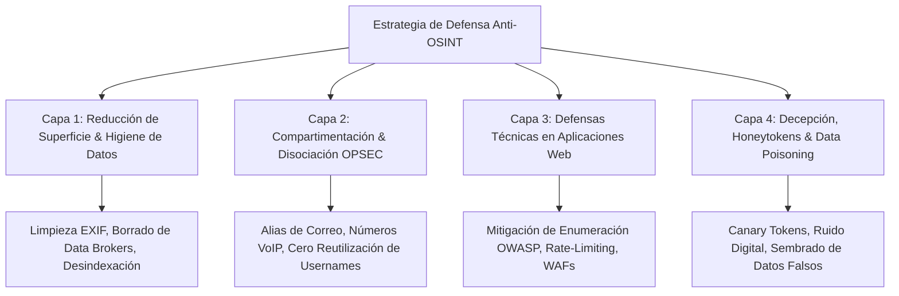
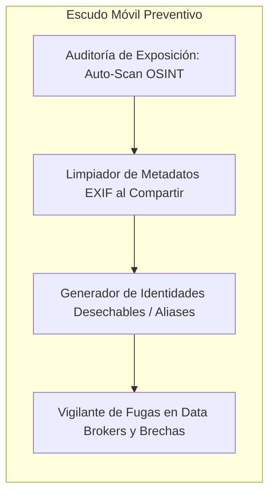

# Investigacion: ¿Se puede Defender contra el OSINT? Estrategias de Counter-OSINT y OPSEC

## 1. La Gran Paradoja del OSINT y la Ciberdefensa

La respuesta corta y directa es: **Sí, pero no mediante un "antivirus" tradicional, sino a traves de una disciplina conocida como OPSEC (Operations Security) y Counter-OSINT.**

El **OSINT (Open Source Intelligence)** es devastadoramente poderoso porque no explota vulnerabilidades en el software (*exploits* o *0-days*), sino **fugas de informacion publica, habitos humanos, negligencia en la configuracion y caracteristicas de diseno de la web moderna**.

> *"No puedes parchar la identidad de un ser humano como parchas un servidor. La defensa contra el OSINT consiste en elevar el costo de investigacion del atacante hasta que desista, y en compartimentar la vida digital para que una brecha en una cuenta no comprometa todo tu patrimonio."*

---

## 2. Los Cuatro Niveles de Defensa contra OSINT

Para construir una defensa solida, se debe operar en cuatro capas complementarias:

---

### Capa 1: Reduccion de Superficie de Ataque (Attack Surface Reduction)

Consiste en eliminar activamente los datos que ya estan flotando en Internet:

1. **Limpieza de Metadatos Ocultos (EXIF Scrubbing):**
   * *El riesgo OSINT:* Cada foto tomada con un smartphone contiene metadatos EXIF: coordenadas GPS exactas de tu casa, modelo de camara, fecha y hora. Aunque redes como Instagram los limpian al subirlos, fotos compartidas en foros, blogs o marketplaces (MercadoLibre, Craigslist) a menudo los conservan intactos.
   * *La defensa:* Utilizar herramientas de borrado de EXIF local antes de cualquier publicacion.
2. **Erradicacion Sistematica en Data Brokers (Lo que hace nuestra App):**
   * Corredores de datos (Whitepages, Spokeo, Radaris, etc.) unifican registros publicos, domicilios y familiares.
   * *La defensa:* Ejercer opt-outs continuos y solicitudes formales amparadas en normativas (GDPR / CCPA / ARCO).
3. **Desindexacion Proactiva en Google:**
   * Utilizar la herramienta *Results about you* y solicitudes de desindexacion para purgar telefonos personales, domicilios y documentos de identidad de los resultados publicos de Google.

---

### Capa 2: Compartimentacion y Disociacion de Identidad (La Regla de Oro del OPSEC)

La razon por la que herramientas como **Sherlock** o **Holehe** tienen exito es porque los seres humanos somos criaturas de confort: usamos el mismo nombre de usuario (*handle*) y el mismo correo electronico para todo.

| Practica Comun Vulnerable | Estrategia de Defensa Anti-OSINT |
| :--- | :--- |
| Usar el alias `@juanperez_dev` en GitHub, Twitter, Spotify, Steam y foros. | **Rotacion de Usernames:** Usar identificadores pseudoaleatorios inconexos en plataformas secundarias. |
| Registrarte con tu correo personal/profesional en 80 sitios web. | **Compartimentacion por Capas (Email Aliases):** Usar servicios como SimpleLogin, AnonAddy o Apple *Hide My Email*. Si una web es hackeada, el correo filtrado no conduce a tu identidad real. |
| Asociar tu numero telefonico personal a cuentas de redes sociales para 2FA. | **Telefonos Disociados (VoIP / SIM secundaria):** Usar 2FA basado en llaves de hardware (YubiKey) o TOTP (Aegis/Authy). Jamas vincular el celular personal a cuentas publicas. |
| Pagar dominios web con tarjeta y datos personales. | **WHOIS Privacy & Sociedades Proxy:** Registrar activos digitales con proteccion de privacidad estricta. |

---

### Capa 3: Defensas Tecnicas en Aplicaciones Web (Para Desarrolladores y Empresas)

Si eres el dueno de una plataforma, ¿como evitas que herramientas OSINT utilicen tu web como un "oraculo" para investigar a tus usuarios?

1. **Eliminar Vulnerabilidades de Enumeracion de Usuarios (OWASP API Security):**
   * *El error:* Al solicitar restablecer contrasena, la API responde: `"No encontramos ese usuario"` vs `"Te enviamos un correo"`.
   * *La solucion tecnica:* Responder siempre con un mensaje generico e identico:
     > *"Si los datos ingresados corresponden a una cuenta activa, hemos enviado un correo de recuperacion."*
   * *Normalizacion de Tiempos (Timing Attack Protection):* Asegurar que el backend tarde exactamente los mismos milisegundos en responder tanto si el usuario existe como si no existe (agregando demoras artificiales si es necesario).
2. **Rate Limiting Adaptativo y Fingerprinting de Red (WAF):**
   * Herramientas como Sherlock lanzan decenas de peticiones concurrentes.
   * *La solucion:* Implementar Cloudflare / AWS WAF con analisis de firmas **JA3 / JA4** y desafios de prueba de trabajo (*Proof of Work* / Turnstile) cuando se detectan peticiones en masa hacia endpoints de perfiles.
3. **Autenticacion Previa en APIs Internas:**
   * Jamas exponer endpoints de `/api/check-username` de manera publica y abierta sin un token CSRF ligado a una sesion legitima con evaluacion de comportamiento humano.

---

### Capa 4: Decepcion Tactica y Data Poisoning (Nivel Avanzado)

Cuando la invisibilidad total no es posible, la mejor defensa es **introducir ruido, caos y trampas**:

1. **Canary Tokens (Honeytokens):**
   * Servicios como *Thinkst Canary* permiten generar correos trampa, enlaces trampa o archivos Word trampa con webhooks integrados.
   * Si un atacante recolecta estos datos en un raspado OSINT y hace clic en el enlace, el sistema dispara una alerta inmediata informandote la direccion IP, navegador y ubicacion geografica de quien te esta investigando.
2. **Envenenamiento de Datos (Data Poisoning):**
   * Crear intencionalmente perfiles publicos en plataformas secundarias con biografias, ciudades de residencia o intereses falsos pero verosimiles.
   * Herramientas como **Maigret** correlacionan estos datos; al encontrar incongruencias contradictorias (p. ej., un perfil en Tokio y otro en Londres), los motores de correlacion automatizados generan dossiers inutilizables o con baja confianza.

---

## 3. ¿Como Integra esto Nuestra Aplicacion Movil?

Nuestra propuesta no solo debe ser un "servicio de emergencia" cuando el usuario ya fue atacado; debe convertirse en su **"Guardaespaldas Digital Preventivo"**:

1. **Auto-Diagnostico OSINT Seguro:** La app le permite al usuario ejecutar un escaneo de si mismo (usando modulos de Sherlock/Holehe en servidores aislados) para ver exactamente que ve un acosador o ciberdelincuente sobre el.
2. **Filtro de Privacidad al Compartir (Metadata Stripper):** Un modulo nativo en el celular que limpia automaticamente la ubicacion GPS y metadatos EXIF de cualquier foto o video antes de subirlo a redes.
3. **Radar de Reutilizacion de Alias:** La app analiza los perfiles del usuario y le avisa: *"Alerta: Estas usando el mismo handle en 15 plataformas; esto te hace 95% rastreable"*.

---

## 4. Conclusion Filosofica (FEE y Universidad de la Libertad)

* **Autonomia y Responsabilidad (FEE):** La privacidad no es ocultar delitos; es la capacidad del individuo libre de decidir que parte de su vida comparte con el mercado y la sociedad. Defenderse del OSINT es ejercer la propiedad privada sobre la propia identidad.
* **Mentalidad Estrategica de Negocio (UL):** Para un lider empresarial, el OSINT ajeno es inteligencia de mercado; pero el OSINT sobre si mismo es una brecha de seguridad. Saber defenderse es gestion de riesgo corporativo y liderazgo en la era de la informacion.
