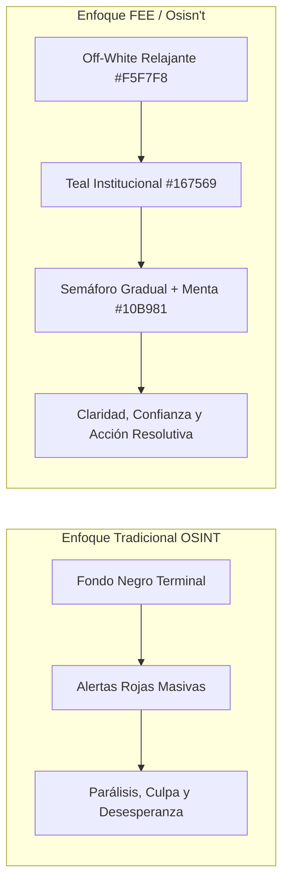

# Colorimetría y Sistema Cromático Semántico

El sistema de color de **Osisn't / Hackaton-FEE** responde a una necesidad psicológica fundamental: **desactivar el pánico y fomentar el empoderamiento**. La mayoría de las aplicaciones de seguridad saturan al usuario con rojos alarmistas, fondos negros y parpadeos amenazantes. Nuestro sistema adopta una paleta inspirada en la banca privada suiza, el diseño nórdico y la tecnología limpia (*Clean-Tech*), combinando autoridad técnica con serenidad visual.

---

## 1. Psicología del Color en Ciberseguridad Empática



* **Cyber Teal / Deep Pine (`#167569`):** Une la estabilidad y prudencia del verde bosque con la precisión tecnológica del cian. Es el color de la custodia de la propiedad privada y la calma bajo presión.
* **Superficies Claras Anti-Fatiga (`#F5F7F8`):** Rompen el cliché del "hacker de capucha negra", invitando al usuario a percibir la ciberhigiene como una tarea cotidiana, ordenada y libre de estrés.
* **Semáforo Racional:** Los tonos cálidos y rojos solo se emplean como acentos semánticos acotados, nunca como fondos envolventes ni titulares acusatorios.

---

## 2. Paleta Institucional (Brand & Surface Tokens)

### 2.1. Colores Primarios y de Marca

| Token Name | HEX | RGB | Muestra | Uso y Semántica |
| :--- | :--- | :--- | :---: | :--- |
| `color.brand.primary` | `#167569` | `rgb(22, 117, 105)` |  | **Color Semilla Principal.** Botones de acción primaria, encabezados institucionales, barras de progreso y acentos clave. |
| `color.brand.primaryDark` | `#0F5249` | `rgb(15, 82, 73)` |  | Estados *pressed/hover* de botones primarios y textos sobre fondos claros con alto contraste. |
| `color.brand.primaryLight` | `#E0F2EF` | `rgb(224, 242, 239)` |  | Contenedores suaves de badges, fondos de selección y chips activos. |
| `color.brand.secondary` | `#285F8F` | `rgb(40, 95, 143)` |  | Azul zafiro sobrio. Elementos informativos, vínculos a documentación y botones secundarios. |
| `color.brand.secondaryContainer` | `#E2EDF8` | `rgb(226, 237, 248)` |  | Fondo para banners de orientación pedagógica y tarjetas de ayuda. |

### 2.2. Superficies y Neutros (Neutrals & Slate Hierarchy)

| Token Name | HEX | Muestra | Aplicación en la Interfaz |
| :--- | :--- | :---: | :--- |
| `color.surface.scaffold` | `#F5F7F8` |  | Fondo de pantalla global (`Scaffold.backgroundColor`). |
| `color.surface.card` | `#FFFFFF` |  | Fondo de tarjetas, hojas de modal (`BottomSheet`) y diálogos. |
| `color.surface.cardBorder` | `#E2E8F0` |  | Borde sutil de 1px en tarjetas y separadores de lista. |
| `color.surface.textPrimary` | `#1E293B` |  | Títulos, valores de score y texto principal (Slate 800). |
| `color.surface.textSecondary` | `#64748B` |  | Subtítulos, descripciones de hallazgos y notas secundarias (Slate 500). |
| `color.surface.textMuted` | `#94A3B8` |  | Fechas relativas, metadatos y placeholders de formularios (Slate 400). |

---

## 3. Semáforo Semántico de Riesgo (Exposure Score)

El medidor de riesgo (*Exposure Gauge*) y las tarjetas de hallazgos utilizan una escala cromática calibrada de 4 niveles que informa con exactitud sin recurrir al sensacionalismo:

```
[ 0 ------------ 25 ]   [ 26 ----------- 55 ]   [ 56 ----------- 79 ]   [ 80 ---------- 100 ]
     BAJO / MENTA            MODERADO / ÁMBAR          ELEVADO / CORAL          CRÍTICO / CARMESÍ
       #10B981                   #F59E0B                   #F97316                  #EF4444
```

| Nivel de Riesgo | Rango | Color Token | Contenedor Suave | Significado y Experiencia de Usuario |
| :--- | :---: | :---: | :---: | :--- |
| **Bajo / Fantasma Digital** | `0 - 25` | `#10B981` (Mint) | `#ECFDF5` | Huella mínima o excelente higiene digital. No hay filtraciones ni registros sensibles públicos. |
| **Moderado / Usuario Habitual** | `26 - 55` | `#F59E0B` (Amber) | `#FEF3C7` | Presencia típica en redes y comercios electrónicos sin contraseñas comprometidas. Mantenimiento preventivo. |
| **Elevado / Vulnerable** | `56 - 79` | `#F97316` (Coral) | `#FFEDD5` | Mismo alias o teléfono reutilizado en múltiples servicios o sitios con incidentes pasados. Remediación aconsejada. |
| **Crítico / Peligro Inmediato** | `80 - 100` | `#EF4444` (Crimson) | `#FEE2E2` | Documentos de identidad, datos bancarios indexados en Google o contraseñas en texto plano expuestas. |

---

## 4. Paleta de Categorías de Huella Digital (Bubble Map & Tags)

Para el gráfico de burbujas solares y los filtros de la lista de hallazgos, cada esfera de datos expuestos cuenta con un color representativo:

| Categoría | Color Token | Fondo de Chip | Icono Típico | Ámbitos y Ejemplos |
| :--- | :---: | :---: | :---: | :--- |
| **Redes Sociales & Comunicación** | `#3B82F6` | `#EFF6FF` | `Icons.people_alt_outlined` | Instagram, X/Twitter, TikTok, Telegram, WhatsApp, LinkedIn. |
| **Comercio & Finanzas** | `#10B981` | `#ECFDF5` | `Icons.shopping_bag_outlined` | MercadoLibre, Amazon, PayPal, billeteras de criptomonedas. |
| **Estilo de Vida & Streaming** | `#8B5CF6` | `#F5F3FF` | `Icons.sports_esports_outlined`| Spotify, Steam, Netflix, Tinder, Strava, Chess.com. |
| **Cuentas Olvidadas / Inactivas** | `#D97706` | `#FFFBEB` | `Icons.history_toggle_off` | Gravatar, foros antiguos (phpBB, vBulletin), Ask.fm, Tumblr. |
| **Brechas de Datos & Dumps** | `#DC2626` | `#FEF2F2` | `Icons.warning_amber_rounded` | Bases de datos filtradas (HaveIBeenPwned), Pastebin, leaks. |

---

## 5. Especificación de Modo Oscuro (*Dark Theme*)

Para entornos de baja luminosidad o preferencias del usuario, el sistema cuenta con su contraparte oscura calculada para mantener el confort visual sin perder el carácter institucional:

| Elemento | Token Claro | Token Oscuro | Razón de Diseño |
| :--- | :--- | :--- | :--- |
| **Scaffold** | `#F5F7F8` | `#0F172A` (Slate 900) | Fondo profundo mate, evita el negro puro `#000000` para reducir el destello de contraste extremo. |
| **Cards & Sheets** | `#FFFFFF` | `#1E293B` (Slate 800) | Superficie elevada con excelente separación del fondo. |
| **Primary Accent** | `#167569` | `#2DD4BF` (Teal 400) | Menta luminosa optimizada para legibilidad sobre fondos oscuros. |
| **Texto Principal** | `#1E293B` | `#F8FAFC` (Slate 50) | Blanco con leve tinte frío para evitar deslumbramiento. |
| **Texto Secundario** | `#64748B` | `#94A3B8` (Slate 400) | Gris neutro que garantiza contraste accesible en párrafos. |

---

## 6. Ratios de Contraste y Accesibilidad (WCAG 2.1 AA)

Todos los pares de color de texto y superficie han sido verificados contra las pautas de accesibilidad WCAG 2.1 nivel AA:

| Par Evaluado | Razón de Contraste | Cumplimiento WCAG AA |
| :--- | :---: | :---: |
| `#167569` (Primario) sobre `#FFFFFF` (Card) | **4.91 : 1** | ✅ Pasa (Mínimo 4.5:1) |
| `#1E293B` (Texto Primario) sobre `#F5F7F8` (Scaffold) | **12.43 : 1** | ✅ Pasa con excelencia (AAA) |
| `#64748B` (Texto Secundario) sobre `#FFFFFF` (Card) | **4.68 : 1** | ✅ Pasa (Mínimo 4.5:1) |
| `#EF4444` (Crítico) sobre `#FEE2E2` (Badge Container) | **5.12 : 1** | ✅ Pasa (Mínimo 4.5:1) |
| `#0F5249` (PrimaryDark) sobre `#E0F2EF` (Container) | **7.85 : 1** | ✅ Pasa con excelencia (AAA) |
