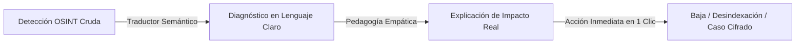
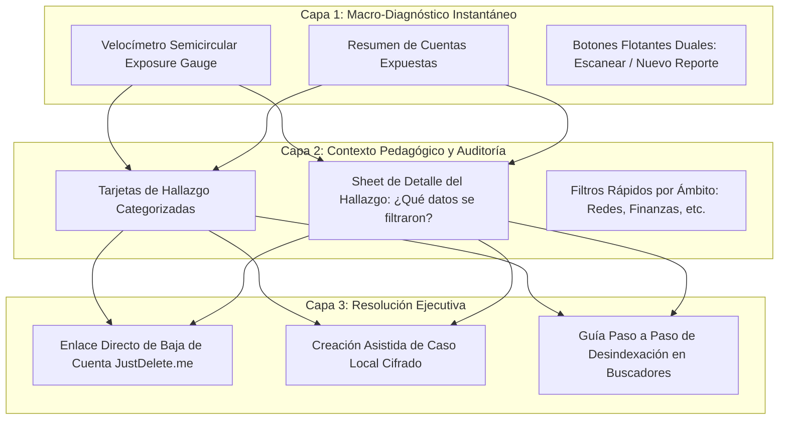

# Métodos de Diseño y Experiencia de Usuario (UX Methodology)

> **"El software de seguridad no debe asustar al usuario; debe empoderarlo para actuar con serenidad y certeza."**

Este documento detalla los métodos de diseño de interacción, los principios de psicología cognitiva y los patrones de experiencia de usuario (*UX*) aplicados en la plataforma **Osisn't / Hackaton-FEE**.

---

## 1. El Paradigma "Calm Security UX" (Superación de la Parálisis por Ansiedad)

En la ciberseguridad convencional abunda lo que en psicología cognitiva se denomina **"Fatiga de Alertas" (*Alert Fatigue*)** y **"Parálisis por Sobrecarga de Riesgo"**: al usuario se le muestran decenas de advertencias crípticas en rojo, términos como *"Data Dump"*, *"HTTP 200 Exfiltration"* o *"Hash SHA-256 compromised"*, sin ofrecerle una salida viable. La reacción natural del 80% de los usuarios ante este estímulo es cerrar la aplicación y fingir que el problema no existe.

**Nuestra Metodología:**
1. **Descompresión Cognitiva:** La severidad no se expresa como un grito, sino como una métrica matemática neutral (el *Exposure Score* del 0 al 100).
2. **Traducción Inmediata a Lenguaje Humano:** Ningún hallazgo técnico se presenta sin responder de forma transparente a tres preguntas fundamentales:
   - *¿Dónde se encontró este dato?*
   - *¿Por qué representa un riesgo para mi vida diaria o profesional?*
   - *¿Qué puedo hacer exactamente en este momento para resolverlo?*
3. **El Principio de Acción en 1 Clic:** Todo diagnóstico incluye al menos una acción resolutiva directa y sin rodeos (abrir la página de baja directa en JustDelete.me, revocar acceso o registrar el caso de desindexación).

---

## 2. La Arquitectura de Interacción en Tres Capas

La interfaz está estructurada para permitir tanto una lectura de 5 segundos como una auditoría profunda de 15 minutos:

### Capa 1: Nivel Ejecutivo y Global (Dashboard)
* **Objetivo:** Informar el estado de salud digital en un vistazo.
* **Componente Central:** El `ExposureGauge` con número central en tipografía Display (44sp) y barra curva con animación suave al cargar.
* **Acciones Principales:** Los botones flotantes duales (`DualFloatingActionButtons`) colocados al alcance natural del pulgar en la zona inferior de la pantalla:
  - **Escanear Identidad:** Permite auditar otro correo, teléfono o alias en cualquier momento.
  - **Nuevo Reporte:** Permite crear un caso de retiro si el usuario ya cuenta con una URL específica que desea documentar.

### Capa 2: Profundización Contextual (Finding Cards & Detail Sheets)
* **Objetivo:** Conectar el hallazgo con la realidad de la persona sin abrumar.
* Al tocar una tarjeta de hallazgo (`FindingCard`), se abre una hoja inferior modal (`FootprintDetailSheet`) que detalla:
  - Fecha estimada de exposición o antigüedad de la cuenta.
  - Lista de datos concretos involucrados (e.g. *Nombre completo, foto de perfil, ubicación, contraseña filtrada*).
  - Nivel de dificultad para eliminar la cuenta (Fácil / Medio / Imposible según estándares de privacidad).

### Capa 3: Remediación Asistida (Executive Action)
* **Objetivo:** Resolver el problema en el menor número de pasos posible.
* **Vía A (Borrado Directo):** Botón *"Eliminar Cuenta"* que abre el enlace verificado de baja inmediata (vía protocolo JustDelete.me).
* **Vía B (Protección Local):** Botón *"Iniciar Caso de Retiro"*, el cual pre-llena automáticamente el formulario de casos con el título, URL de origen y notas forenses en el almacenamiento cifrado del dispositivo (`FlutterSecureStorage`).

---

## 3. Heurísticas de Usabilidad y Cuidados al Usuario (*User Care*)

Siguiendo los lineamientos documentados en `app/docs/architecture.md`:

1. **Privacidad Primero y Cero Conocimiento (*Zero-Knowledge*):**
   - La aplicación no transmite borradores a escondidas ni guarda historiales de búsqueda en servidores remotos no autorizados.
   - El almacenamiento de casos es estrictamente local en el dispositivo del usuario (`Keychain` en iOS y `EncryptedSharedPreferences` en Android).

2. **Retroalimentación Accesible y Respetuosa (`StatusNotice`):**
   - Los avisos de estado y confirmaciones de guardado no bloquean la pantalla mediante popups intrusivos.
   - **Regla Crítica de Accesibilidad:** Los anuncios de los lectores de pantalla (*TalkBack* / *VoiceOver*) informan sobre el éxito de la operación ("Caso guardado con éxito"), pero **nunca verbalizan en voz alta URLs comprometidas ni contraseñas expuestas** para proteger la privacidad física del usuario ante personas cercanas.

3. **Prevención de Errores y Salvaguarda de Registros:**
   - Si un caso excede los límites seguros (24 KiB para entradas, 32 KiB por registro total), se alerta con claridad antes de guardar, sin truncar el texto ni fingir una escritura fallida.
   - No se aplican borrados destructivos accidentales: los botones de eliminación solicitan confirmación explícita con explicación de irreversibilidad.

---

## 4. Conexión con el Arquetipo de Usuario (Persona: Luisa Alfonsa Castilleja)

Nuestra metodología está validada contra el perfil documentado en `documentation/persona.md`:
* **Perfil:** Directora de operaciones y consultora independiente; maneja información sensible de clientes, utiliza múltiples dispositivos y no dispone de horas para aprender comandos de terminal.
* **Dolor Principal:** Preocupación por suplantación de identidad o filtración de cuentas antiguas que dañen su reputación profesional.
* **Respuesta del Sistema:**
  - Diagnóstico en menos de 10 segundos.
  - Lenguaje profesional, sin tecnicismos innecesarios ni paternalismo.
  - Capacidad de exportar evidencia estructurada para trámites legales o de derecho ARCO / desindexación.
