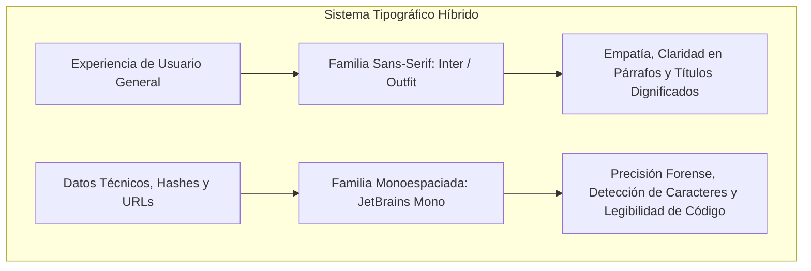

# Tipografía y Escala Modular de Texto

La tipografía de **Osisn't / Hackaton-FEE** está estructurada para lograr un equilibrio preciso entre **calidez humana y rigor técnico**. Debido a que la aplicación comunica diagnósticos de seguridad y datos personales sensibles, cada estilo tipográfico tiene un propósito funcional directo: reducir el esfuerzo cognitivo del usuario y priorizar la legibilidad en cualquier dispositivo móvil.

---

## 1. Familias Tipográficas



### 1.1. Fuente Primaria: Sans-Serif Humana (*Inter* / *Outfit*)
* **Uso:** Toda la interfaz de usuario, títulos, botones, explicaciones pedagógicas de hallazgos y formularios.
* **Propiedades:** Geometría moderna con alta altura de la "x" (*x-height*), trazos equilibrados y excelente distinción entre caracteres conflictivos (como `I` mayúscula, `l` minúscula y el número `1`).
* **Fallback Nativo:** En iOS recurre a *SF Pro Text / SF Pro Display*; en Android a *Roboto*.

### 1.2. Fuente Técnica: Monoespaciada (*JetBrains Mono* / *Roboto Mono*)
* **Uso:** URLs de origen, identificadores de caso (`fee.case.v1.uuid`), correos escaneados, hashes criptográficos y términos de protocolos OSINT.
* **Propiedades:** Ancho de caracteres uniforme que evita errores de lectura al inspeccionar cadenas de texto largas o comandos técnicos.

---

## 2. Escala Modular de Tipografía (Type Scale)

Nuestra escala sigue un ratio modular armónico (*Major Second* / *Minor Third*), adaptado para pantallas táctiles de alta densidad (Android mdpi a xxxhdpi e iOS @2x/@3x):

| Nivel Semántico | Tamaño (`fontSize`) | Altura de Línea (`height`) | Peso (`fontWeight`) | Tracking (`letterSpacing`) | Uso Principal en la App |
| :--- | :---: | :---: | :---: | :---: | :--- |
| **Display (Hero)** | `44sp` | `52px` (1.18) | **Bold (800)** | `-0.02em` (`-0.8px`) | Valor numérico del *Exposure Score* (0 a 100) en el velocímetro principal. |
| **Headline Large** | `24sp` | `30px` (1.25) | **Bold (700)** | `-0.01em` (`-0.2px`) | Título principal de pantallas (`Dashboard`, `Mis Casos`, `Ayuda`). |
| **Headline Medium**| `20sp` | `26px` (1.30) | **SemiBold (600)**| `0` | Títulos de hojas modales (`ScanBottomSheet`, `FootprintDetailSheet`). |
| **Title Medium**   | `18sp` | `24px` (1.33) | **SemiBold (600)**| `0` | Encabezados de tarjetas (`FindingCard`, `RecommendationCard`). |
| **Title Small**    | `16sp` | `22px` (1.37) | **Medium (500)**  | `0.01em` (`0.1px`) | Nombre de la plataforma encontrada (ej. "Instagram", "Gravatar"). |
| **Body Large**     | `16sp` | `24px` (1.50) | **Regular (400)** | `0` | Explicaciones en lenguaje humano de los hallazgos y textos de lectura. |
| **Body Medium**    | `14sp` | `20px` (1.42) | **Regular (400)** | `0` | Descripciones secundarias, notas de casos y campos de texto. |
| **Body Small**     | `13sp` | `18px` (1.38) | **Regular (400)** | `0.01em` | Marcas de tiempo, recuento de datos expuestos y advertencias auxiliares. |
| **Label / Badge**  | `12sp` | `16px` (1.33) | **SemiBold (600)**| `+0.04em` (`+0.5px`)| Etiquetas de severidad ("CRÍTICO", "BAJO") y chips de categoría. |
| **Code / Mono**    | `13sp` | `18px` (1.38) | **Medium (500)**  | `0` | URLs fuentes (`https://...`), alias escaneados y tokens técnicos. |

---

## 3. Principios de Legibilidad y Redacción en Ciberseguridad

### 3.1. Tratamiento de Grafemas y Emojis en el Dominio
Como se especifica en la arquitectura del cliente (`app/docs/architecture.md`), los títulos (límite 80 caracteres) y notas (límite 2,000) procesan cadenas usando **recuento de grafemas** (Unicode Grapheme Clusters). La tipografía del sistema garantiza que combinaciones complejas de emojis, acentos diacríticos y caracteres internacionales no rompan el layout ni produzcan saltos de línea desalineados.

### 3.2. Formato de Etiquetas de Criticidad (*Badges*)
Las etiquetas de riesgo emplean:
* `fontSize: 11-12sp`
* `fontWeight: FontWeight.w600` (SemiBold)
* Mayúsculas con espaciado entre letras (*letterSpacing: 0.5px*)
* Contenedor con esquinas redondeadas (`borderRadius: 6-8dp`)
* Relleno interno armónico (`padding: EdgeInsets.symmetric(horizontal: 8, vertical: 3)`)

---

## 4. Implementación en Flutter (`TextTheme`)

A continuación se detalla cómo se integra este sistema en el archivo `lib/app/theme.dart`:

```dart
TextTheme buildAppTextTheme() {
  const primaryFont = 'Inter';
  const monoFont = 'JetBrains Mono';

  return const TextTheme(
    displayLarge: TextStyle(
      fontFamily: primaryFont,
      fontSize: 44,
      fontWeight: FontWeight.w800,
      letterSpacing: -0.8,
      color: Color(0xFF1E293B),
    ),
    headlineMedium: TextStyle(
      fontFamily: primaryFont,
      fontSize: 24,
      fontWeight: FontWeight.w700,
      letterSpacing: -0.2,
      color: Color(0xFF1E293B),
    ),
    titleMedium: TextStyle(
      fontFamily: primaryFont,
      fontSize: 18,
      fontWeight: FontWeight.w600,
      color: Color(0xFF1E293B),
    ),
    bodyLarge: TextStyle(
      fontFamily: primaryFont,
      fontSize: 16,
      height: 1.5,
      fontWeight: FontWeight.w400,
      color: Color(0xFF1E293B),
    ),
    bodyMedium: TextStyle(
      fontFamily: primaryFont,
      fontSize: 14,
      height: 1.42,
      fontWeight: FontWeight.w400,
      color: Color(0xFF64748B),
    ),
    labelSmall: TextStyle(
      fontFamily: primaryFont,
      fontSize: 11,
      fontWeight: FontWeight.w600,
      letterSpacing: 0.5,
    ),
  );
}
```
