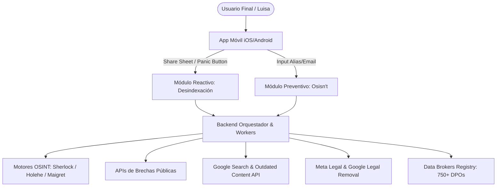

# Especificación de Requisitos de Software (SRS)
## Sistema: Suite de Soberanía Digital, Osisn't y Defensa de Reputación
**Estándar de referencia:** ISO/IEC/IEEE 29148:2018 / IEEE 830  
**Versión:** 1.0.0  
**Estado:** Aprobado para Fase de Desarrollo / MVP Hackathon  

---

## 1. Introducción

### 1.1 Propósito del Documento
El presente documento define formalmente los requisitos funcionales y no funcionales para la construcción de la suite integral de privacidad y reputación digital conformada por:
1. **Osisn't:** Módulo preventivo de auditoría visual de huella digital y remediación asistida en 1 clic.
2. **Reputation Panic Button (Share Sheet Nativo):** Módulo reactivo de preservación forense, otorgamiento de mandato legal (LPOA) y orquestación de desindexación forzada en Big Tech y Data Brokers.

### 1.2 Alcance del Producto
El sistema opera como una aplicación móvil multiplataforma (iOS y Android) conectada a un backend de microservicios y workers asíncronos distribuidos. Permite a usuarios no técnicos auditar su rastro público en Internet, entender sus riesgos en lenguaje coloquial, eliminar cuentas expuestas y activar defensas legales y técnicas inmediatas ante vulneraciones activas (doxxing, difamación, suplantación o fuga de datos sensibles).

### 1.3 Definiciones, Acrónimos y Abreviaturas
* **OSINT:** *Open Source Intelligence* (Inteligencia de Fuentes Abiertas).
* **LPOA:** *Limited Power of Attorney* (Poder Limitado de Representación Legal).
* **pHash:** *Perceptual Hash* (Algoritmo de hash perceptual resistente a cambios de resolución/compresión).
* **OTS:** *OpenTimestamps* (Protocolo de sellado de tiempo criptográfico anclado a la cadena de bloques).
* **SLA:** *Service Level Agreement* (Plazos perentorios de respuesta legal).
* **ZK:** *Zero-Knowledge* (Cómputo local que preserva la confidencialidad absoluta del usuario).

---

## 2. Descripción General del Sistema

### 2.1 Perspectiva del Producto
El sistema se posiciona como una solución híbrida (B2C preventiva y reactiva) que reequilibra la asimetría de poder entre el individuo y las grandes plataformas digitales.

### 2.2 Características de los Usuarios
* **Usuario Objetivo Primario (Arquetipo Luisa):** Individuo sin formación técnica en informática, consumidor activo de redes sociales móviles, vulnerable a estafas, filtraciones o difamación.
* **Oficial de Privacidad / Revisor Legal (Admin):** Analista interno encargado de supervisar escalamientos legales complejos ante reguladores (INAI, AEPD, FTC).

---

## 3. Requisitos Específicos del Sistema

### 3.1 Requisitos Funcionales (RF) - Módulo Preventivo: Osisn't

| ID | Nombre | Descripción | Prioridad (MoSCoW) |
| :--- | :--- | :--- | :--- |
| **RF-OS-01** | **Ingreso Multivariable de Identidad** | La app debe permitir al usuario ingresar uno o varios identificadores: nombre de usuario (*handle*), correo(s) electrónico(s) y/o teléfono móvil. | **Must Have** |
| **RF-OS-02** | **Sondeo Silencioso de Cuentas (Email OSINT)** | El backend debe consultar endpoints de recuperación y validación (motor Holehe) sin detonar notificaciones por correo o SMS al titular. | **Must Have** |
| **RF-OS-03** | **Rastreo Concurrente de Alias (Username OSINT)** | El backend debe ejecutar barridos multihilo sobre más de 400 plataformas (motor Sherlock) utilizando rotación de proxies para evitar bloqueos por tasa de peticiones (*rate-limiting*). | **Must Have** |
| **RF-OS-04** | **Cálculo Dinámico del Exposure Score** | El sistema debe computar un puntaje algorítmico de 0 a 100 ponderando: volumen de cuentas activas, presencia en brechas de contraseñas conocidas, metadatos expuestos y visibilidad en Google SERP. | **Must Have** |
| **RF-OS-05** | **Visualización Digestible en Grafo Radial** | La interfaz móvil debe renderizar los hallazgos agrupados en esferas de colores temáticas (Redes, Finanzas, Ocio, Inactivas, Brechas), eliminando tablas crudas o jerga técnica. | **Must Have** |
| **RF-OS-06** | **Tarjetas Explicativas en Lenguaje Natural** | Al seleccionar un nodo del grafo, la app debe presentar una tarjeta pedagógica explicando exactamente qué datos expone esa cuenta y cuál es su nivel de riesgo. | **Must Have** |
| **RF-OS-07** | **Baja Asistida en 1 Clic (JustDelete.me Integration)** | La app debe vincular cada servicio detectado con su URL directa de cancelación catalogada en el repositorio JustDelete.me, abriéndola en un WebView aislado. | **Must Have** |
| **RF-OS-08** | **Despacho de Solicitudes a Data Brokers (Eraser)** | Para registros presentes en *people search engines*, el sistema debe permitir despachar solicitudes estandarizadas de borrado (*opt-out*) amparadas en GDPR/CCPA a los Oficiales de Protección de Datos (DPO). | **Should Have** |
| **RF-OS-09** | **Limpiador Preventivo de Metadatos EXIF** | La app debe incorporar una utilidad nativa local que purgue coordenadas GPS y metadatos EXIF de cualquier imagen antes de ser compartida en mensajería o redes. | **Should Have** |

---

### 3.2 Requisitos Funcionales (RF) - Módulo Reactivo: Escudo de Reputación (Panic Button)

| ID | Nombre | Descripción | Prioridad (MoSCoW) |
| :--- | :--- | :--- | :--- |
| **RF-RP-01** | **Captura Nativa vía Share Sheet** | La app debe registrarse en el sistema operativo (iOS Action Extension / Android Send Intent) para recibir URLs directamente desde Instagram, TikTok, X o navegadores web en un solo toque. | **Must Have** |
| **RF-RP-02** | **Preservación Forense Certificada (Evidence Vault)** | Al recibir una URL infractora, un worker headless debe capturar pantallazo completo, código HTML, cabeceras HTTP de respuesta y sellar el hash SHA-256 en la cadena de bloques vía OpenTimestamps. | **Must Have** |
| **RF-RP-03** | **Firma Táctil y Biométrica del Mandato LPOA** | La app debe generar un mandato de representación legal limitado en pantalla y capturar la firma manuscrita digitalizada respaldada por biometría (Face ID / Touch ID). | **Must Have** |
| **RF-RP-04** | **Generación y Despacho de Reclamo Jurídico** | El sistema debe clasificar la infracción (difamación, doxxing, NCII, suplantación) e inyectar los datos en plantillas legales formales dirigidas a los buzones legales de Meta y Google. | **Must Have** |
| **RF-RP-05** | **Gestor de Vencimiento de SLAs Legales** | El sistema debe monitorear el cronómetro legal (7, 14 y 30 días hábiles). A falta de respuesta, debe emitir apercibimientos automáticos y preparar expedientes ante reguladores oficiales. | **Must Have** |
| **RF-RP-06** | **Auditor Continuo de Desindexación (SERP Sentinel)** | Un worker programado debe sondear Google Search periódicamente. Si la URL ya arroja código `404/410`, debe someter de inmediato la purga de caché ante la herramienta *Remove Outdated Content*. | **Must Have** |
| **RF-RP-07** | **Notificaciones Push de Progreso de Caso** | El sistema debe notificar al usuario en tiempo real ante hitos clave: confirmación de recepción legal, retiro del contenido y desindexación exitosa de Google. | **Must Have** |

---

## 4. Requisitos No Funcionales (RNF)

### 4.1 Seguridad y Privacidad (Zero-Knowledge)
* **RNF-SEC-01 (Cómputo Local de Hashing):** Todo hash perceptual de imágenes sensibles (NCII) debe calcularse exclusivamente en el dispositivo del cliente. Las imágenes crudas jamás deben transmitirse ni almacenarse en los servidores de la plataforma.
* **RNF-SEC-02 (Cifrado en Reposo y Tránsito):** Todas las comunicaciones deben forzar TLS 1.3 con HSTS. La base de datos debe almacenar los identificadores de escaneo cifrados con AES-GCM-256 utilizando claves rotadas periódicamente.
* **RNF-SEC-03 (Política de Retención Efímera):** Los resultados crudos de escaneos OSINT deben purgarse automáticamente de la memoria y caché transitoria transcurridas 48 horas desde la finalización del reporte, salvo que el usuario decida archivarlos explícitamente en su dispositivo.

### 4.2 Rendimiento y Escalabilidad
* **RNF-PERF-01 (Tiempo de Diagnóstico Osisn't):** El escaneo asíncrono completo para un alias o correo electrónico no debe exceder los 60 segundos bajo condiciones normales de red.
* **RNF-PERF-02 (Latencia de Share Sheet):** La intercepción de una URL compartida y la confirmación inicial de apertura de caso en la app móvil no debe tardar más de 3 segundos.
* **RNF-PERF-03 (Concurrencia de Workers):** La arquitectura debe soportar un mínimo de 250 tareas de rastreo OSINT concurrentes mediante colas distribuidas basadas en Redis y Celery sin degradación de SLAs.

### 4.3 Usabilidad y Accesibilidad
* **RNF-UX-01 (Curva de Aprendizaje Cero):** Un usuario sin experiencia previa debe ser capaz de interpretar su nivel de riesgo y ejecutar su primera acción de remediación en menos de 3 clics o toques de pantalla.
* **RNF-UX-02 (Diseño Mobile-First):** Cumplimiento estricto con las guías de interfaz humana (Apple Human Interface Guidelines y Google Material Design 3).

---

## 5. Historias de Usuario con Criterios de Aceptación (BDD)

### Historia de Usuario 1: Auditoría de Huella con Osisn't (Luisa)
> **Como** usuaria preocupada por mi privacidad digital,  
> **Quiero** ingresar mi correo personal y ver en qué plataformas estoy registrada,  
> **Para** saber qué información mía está expuesta públicamente sin tener que entender código técnico.

* **Escenario 1: Escaneo exitoso con hallazgos críticos**
  * **Given** que Luisa abre la app e ingresa `luisa.castilleja@gmail.com`,
  * **When** presiona el botón "Iniciar Diagnóstico Osisn't",
  * **Then** la app muestra una animación de progreso no mayor a 45 segundos,
  * **And** presenta el panel con su Exposure Score (ej. 68/100 en color amarillo/ámbar),
  * **And** despliega el grafo interactivo con 18 nodos clasificados por categoría.

* **Escenario 2: Remediación en 1 clic**
  * **Given** que Luisa visualiza una cuenta olvidada en Tumblr,
  * **When** toca el botón "Eliminar esta cuenta",
  * **Then** la app abre de forma segura la URL directa de JustDelete.me para la baja en Tumblr,
  * **And** al confirmar el borrado, el Exposure Score de Luisa se recalcula a la baja.

---

### Historia de Usuario 2: Reacción Rápida ante Doxxing en Redes Sociales
> **Como** usuario víctima de una publicación difamatoria en Instagram,  
> **Quiero** compartir el enlace del post directamente con la app desde el menú nativo,  
> **Para** que se preserve la evidencia antes de que sea borrada y se inicie la desindexación legal en Google.

* **Escenario 1: Captura forense y apertura de caso**
  * **Given** que el usuario visualiza una publicación ofensiva en Instagram,
  * **When** presiona "Compartir en..." y selecciona el ícono de la app,
  * **Then** la app abre una hoja de diálogo nativa,
  * **And** el motor Evidence Vault toma una captura de pantalla completa con código HTML y genera un hash SHA-256 en menos de 10 segundos,
  * **And** solicita al usuario su firma táctil para activar el mandato LPOA.
