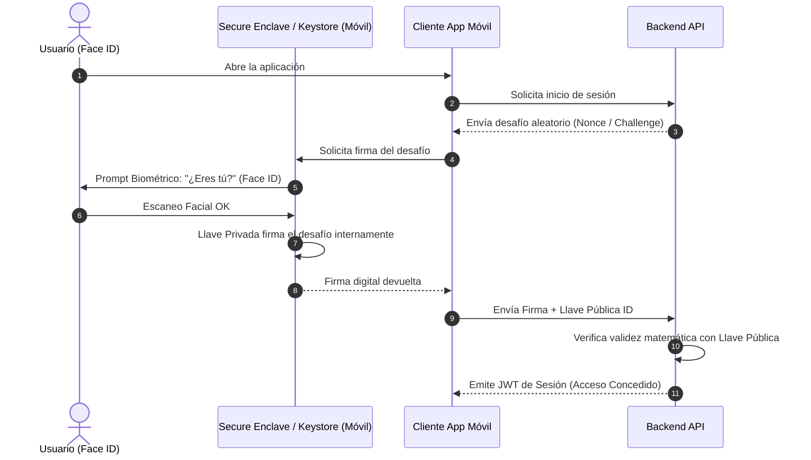
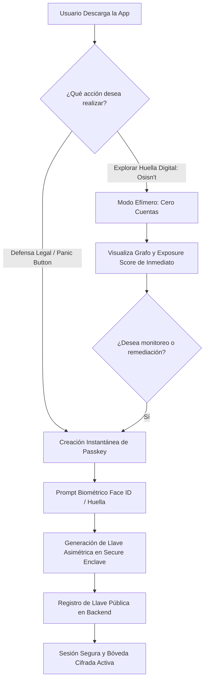

# Estrategia de Autenticación: Passkeys (FIDO2), Criptografía en Hardware y Onboarding Progresivo

> **Documento de Decisión Técnica y de Producto:** Análisis de alternativas para la creación y autenticación de usuarios sin contraseñas ni formularios invasivos, alineado con los principios de privacidad, soberanía individual (FEE) y experiencia de usuario ágil (UL).

---

## 1. Diagnóstico del Dilema: ¿Por qué fallan los enfoques tradicionales?

| Método Tradicional | Problema de UX | Falla Crítica en Privacidad / Ciberseguridad |
| :--- | :--- | :--- |
| **Formulario Clásico (Usuario + Password)** | Tasa de abandono superior al 60% en móviles. El usuario debe verificar correos, inventar contraseñas y recordarlas. | **Paradoja de Seguridad:** La mayoría reutiliza contraseñas. Pedir una contraseña en una app que audita filtraciones de contraseñas destruye la credibilidad del producto. |
| **Social Login / OAuth (Google, Meta, Apple)** | Rápido (1 clic), pero genera dependencia de terceros. | **Paradoja Filosófica Absoluta:** En una app diseñada para defender al usuario de Google y Meta, poner un botón *"Iniciar sesión con Google"* o *"Continuar con Facebook"* le regala telemetría a las mismas corporaciones que se pretende fiscalizar. |

---

## 2. La Verdad Técnica sobre la "Biometría" (Face ID / Huella)

Existe un mito común al pensar en *"autenticación biométrica"*: creer que la cara o la huella del usuario se pueden enviar a un servidor backend para autenticarlo como si fuera una contraseña.

> **Regla de Oro de la Ciberdefensa Móvil:**  
> **Los datos biométricos crudos NUNCA salen del dispositivo.**  
> Ni Apple (en el *Secure Enclave*) ni Google (en el *Android Keystore / Titan M*) permiten que ninguna aplicación o servidor externo acceda a los puntos faciales o minucias de la huella dactilar.

### ¿Cómo funciona realmente la biometría en un flujo de autenticación seguro?
La biometría actúa como un **mecanismo local de desbloqueo físico** para una **llave criptográfica asimétrica**:
1. El dispositivo genera un par de llaves: una **Llave Privada** (que queda atrapada dentro del hardware del chip de seguridad) y una **Llave Pública** (que se envía al servidor).
2. Cada vez que el usuario quiere entrar, el servidor le envía un desafío criptográfico (*challenge* aleatorio).
3. El usuario mira a la cámara (Face ID) o pone el dedo (Touch ID).
4. El procesador biométrico autoriza a la Llave Privada a **firmar matemáticamente el desafío**.
5. El servidor verifica la firma con la Llave Pública. Si coincide, autoriza la sesión.

---

## 3. Matriz de Alternativas Evaluadas

### Alternativa 1: Passkeys (FIDO2 / WebAuthn Nativo) — [RECOMENDADA]
* **Cómo funciona:** Es el estándar moderno de la industria (respaldado por W3C y FIDO Alliance). Usa biometría nativa mediante el *Credential Manager* de Android y los *Authentication Services* de iOS.
* **Experiencia de Usuario (UX):**
  * *Registro:* El usuario toca un botón: *"Crear Bóveda con Face ID"*. El sistema muestra el diálogo nativo del sistema operativo y en 0.8 segundos la cuenta está creada.
  * *Inicio de sesión:* Face ID instantáneo. Sin códigos por SMS, sin correos de confirmación.
  * *Sincronización multi-dispositivo:* Se respalda de forma cifrada de extremo a extremo en iCloud Keychain o Google Password Manager si el usuario lo desea.
* **Ventajas:** Máxima seguridad del mercado, resistente a phishing, estándar abierto, compatible con web y móvil.

---

### Alternativa 2: Bóveda Criptográfica Ligada al Dispositivo (Device-Bound Cryptographic Vault)
* **Cómo funciona:** Modelo utilizado por aplicaciones de privacidad extrema como **Signal**, **Session** o billeteras Web3 (Non-Custodial).
* **Experiencia de Usuario (UX):**
  * Al instalar la app, se genera un par de llaves Ed25519 en el chip local. La app no pregunta nombre, ni correo, ni teléfono.
  * La "cuenta" del usuario es simplemente el Hash de su Llave Pública (`pubkey_9a8f...`).
* **Ventajas:** Anonimato técnico absoluto. No hay riesgo de filtración de datos de usuarios en el backend porque el servidor no sabe quién es la persona.
* **Desventajas:** Si el usuario pierde el teléfono y no guardó una frase de recuperación de 12 palabras (*recovery seed phrase*), pierde el acceso a sus casos guardados.

---

### Alternativa 3: Arquitectura "Zero-Account" (Onboarding Progresivo) — [ESTRATEGIA COMPLEMENTARIA]
* **Cómo funciona:** Diferenciar entre la fase de curiosidad y la fase de compromiso legal:
  1. **Para Osisn't (Auditoría preventiva):** **CERO CUENTAS.** El usuario descarga la app, escribe un correo o alias y ve el resultado inmediatamente en una sesión efímera en memoria. No se le pide registrarse ni autenticarse.
  2. **Para Guardar Monitoreo o Activar el Panic Button (LPOA):** Cuando el usuario decide guardar su historial o ejecutar un reclamo formal contra Meta/Google, se le solicita: *"Asegura tu caso con Face ID"*. En ese momento se genera la **Passkey**.
* **Ventajas:** Fricción cero de entrada. La tasa de conversión se dispara porque el usuario experimenta el valor del producto antes de que se le pida cualquier compromiso.

---

### Alternativa 4: Magic Links por Correo (Passwordless Clásico)
* **Cómo funciona:** El usuario ingresa su correo y recibe un enlace de un solo uso o código de 6 dígitos. Una vez dentro, se vincula Face ID localmente.
* **Ventajas:** Fácil de implementar, no requiere configurar dominios de asociación de Passkeys.
* **Desventajas:** Obliga al usuario a salir de la app para abrir su correo, rompiendo la inmediatez en situaciones de crisis.

---

## 4. Arquitectura Propuesta: El Modelo Híbrido "Progressive Passkey"

### Stack Técnico Recomendado para React Native:
1. **`react-native-passkey`** o **`react-native-biometrics`**:
   * Para gestionar el diálogo nativo de creación y validación de Passkeys FIDO2 en iOS y Android.
2. **`react-native-keychain`**:
   * Para almacenar el token JWT de sesión con el atributo `ACCESS_CONTROL.BIOMETRY_ANY_OR_DEVICE_PASSCODE` (garantiza que el token solo puede leerse tras autenticación biométrica exitosa).
3. **Servidor Backend (FastAPI):**
   * Integración de la librería `webauthn` (Python) para generar los desafíos (*challenges*) y validar las firmas criptográficas de las Passkeys.
