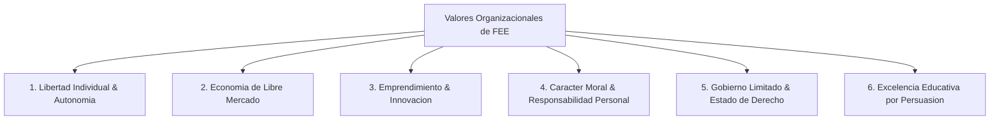

# Investigacion Profunda: Foundation for Economic Education (FEE) y sus Valores Organizacionales

## 1. Introduccion y Contexto Historico
La **Foundation for Economic Education (FEE)**, fundada en **1946** por **Leonard E. Read**, es una de las organizaciones de divulgacion filosofica y economica mas influyentes del mundo. Nacida en un contexto post-Guerra Mundial caracterizado por el auge de economias planificadas y el intervencionismo estatal, FEE fue concebida como un faro educativo no partidista y sin fines de lucro dedicado a defender la **"Filosofia de la Libertad"** (*Freedom Philosophy*).

Desde sus inicios con pensadores de la talla de **Henry Hazlitt**, **Ludwig von Mises** y **Milton Friedman**, FEE ha mantenido como eje central la idea de que la libertad individual y el libre mercado no solo son eficientes economicamente, sino fundamentalmente imperativos morales.

---

## 2. Mision, Vision y Filosofia Colectiva

### Mision
> *"Inspirar, educar y conectar a las futuras generaciones con los principios economicos, eticos y legales de una sociedad libre."*

### Vision
Transformar la percepcion de la libertad en los jovenes, convirtiendola en una filosofia de vida integral, atractiva, creible y aplicable al mundo cotidiano.

### Filosofia Educativa: El Metodo del "Autoperfeccionamiento" (Self-Improvement)
Leonard Read establecio un principio fundamental para la cultura organizacional de FEE:
* **Cambio de abajo hacia arriba (Bottom-up):** En lugar de hacer cabildeo (lobbying) politico o agitación partidista, FEE cree que el verdadero cambio cultural y social ocurre cuando los individuos trabajan en su propia educacion y caracter.
* **Persuasion por Atraccion:** No se trata de imponer ideas mediante la confrontacion, sino de presentar los principios de la libertad con tal claridad, elegancia e integridad que resulten irresistibles para quienes buscan el conocimiento.
* **El Clasico *"I, Pencil"*:** Escrito por Leonard Read en 1958, ilustra la cooperacion voluntaria del mercado libre sin la necesidad de un planificador central, marcando la pauta del estilo pedagocico de FEE.

---

## 3. Valores Fundamentales de FEE como Empresa / Organizacion

A continuacion se detallan los valores corporativos y organizacionales que rigen el accionar, la cultura interna y los programas de FEE:

### 1. Libertad Individual y Autonomia (*Individual Liberty*)
* **Definicion:** El reconocimiento del principio de propiedad sobre uno mismo (*self-ownership*) y el derecho inalienable de cada ser humano a vivir su vida segun sus propias elecciones, libre de coercion o violencia iniciada.
* **Aplicacion Organizacional:** FEE promueve la autonomia interna en sus equipos, motivando el pensamiento critico, la iniciativa propia y el respeto irrestricto hacia los colaboradores y audiencia.

### 2. Libre Mercado y Intercambio Voluntario (*Free-Market Economics*)
* **Definicion:** La conviccion de que la prosperidad y el bienestar social emergen de transacciones voluntarias, la propiedad privada y el sistema de precios libres.
* **Aplicacion Organizacional:** FEE opera internamente respetando el valor que genera para sus donantes, estudiantes y socios, midiendo su impacto no por subsidios estatales sino por el valor real aportado a la comunidad.

### 3. Emprendimiento e Innovacion (*Entrepreneurship*)
* **Definicion:** El espiritu emprendedor visto no solo como la creacion de negocios, sino como la mentalidad humana orientada a resolver problemas, crear valor y desafiar el *statu quo*.
* **Aplicacion Organizacional:** Constantemente adapta sus formatos educativos, migrando con exito desde publicaciones impresas (*The Freeman*) hacia plataformas digitales de alto impacto para jovenes (articulos virales, videos, podcasts, cursos online).

### 4. Caracter Moral y Responsabilidad Personal (*High Moral Character*)
* **Definicion:** La libertad no puede subsistir sin responsabilidad personal, integridad, honestidad y respeto etico.
* **Aplicacion Organizacional:** FEE enfatiza la etica de trabajo y la transparencia en su gestion financiera y de contenido, guiada por un compromiso absoluto con la verdad y el respeto a la dignidad humana.

### 5. Gobierno Limitado (*Limited Government*)
* **Definicion:** La funcion del gobierno debe restringirse estrictamente a la proteccion de los derechos individuales (vida, libertad y propiedad) bajo el imperio de la ley, sin intervenir en la economia ni en la vida privada.
* **Aplicacion Organizacional:** FEE no acepta financiamiento gubernamental, garantizando independencia absoluta de pensamiento y accion.

### 6. Excelencia Educativa sin Proselitismo Politicco (*Educational Integrity*)
* **Definicion:** Dedicacion exclusiva a la educacion en principios economicos y eticos, rechazando la participacion en campanas electorales o el cabildeo legislativo.
* **Aplicacion Organizacional:** Su cultura corporativa fomenta la produccion de contenido rigorously analitico, accesible y fundamentado en teoria economica solida (Escuela Austriaca, Economia Neoclasica, Public Choice).

---

## 4. Estructura de Operacion y Cultura Corporativa

* **Cultura Digital First:** FEE ha sabido reinventarse para llegar a la Generacion Z y Millennial, construyendo equipos agiles de creacion de contenido, diseno y estrategia digital.
* **Redes y Alianzas:** Colabora con educadores, estudiantes y lideres globales de opinion, actuando como un puente entre la academia y el publico joven.
* **Principios Operativos Internos:**
  * Transparencia financiera y rendicion de cuentas a donantes.
  * Meritocracia y enfoque en resultados tangibles (alcance digital, engagement, impacto educativo).
  * Fomento del debate abierto y la curiosidad intelectual.

---

## 5. Conceptos Clave de FEE para Destacar

1. **Freedom Philosophy (Filosofia de la Libertad):** Sistema de pensamiento que integra la etica, la economia y el derecho en torno al individuo.
2. **Spontaneous Order (Orden Espontaneo):** La sociedad y el mercado se autorregulan eficazmente a traves de acuerdos voluntarios sin supervision estatal.
3. **Persuasion sobre Coercion:** Metodologia de trabajo basada en inspirar y convencer, no en forzar ni imponer.
4. **Value Creation (Creacion de Valor):** La riqueza y el progreso son el resultado de la capacidad de servir al projimo mediante productos, servicios o ideas.
