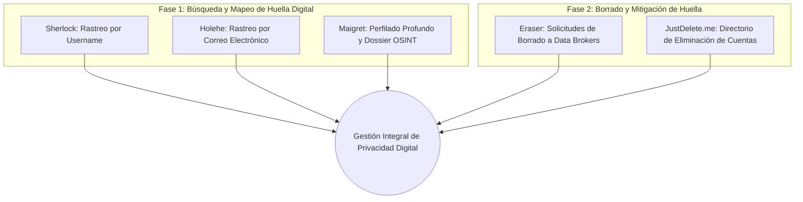

# Investigacion: 5 Herramientas Open-Source para Busqueda y "Borrado" de Huella Digital

## 1. Introduccion
La **huella digital** (*digital footprint*) comprende el rastro acumulado de datos, cuentas, registros, comentarios y metadatos que una persona o empresa deja en Internet a lo largo del tiempo. 

Para gestionar y mitigar este rastro existen dos fases fundamentales:
1. **Fase de Descubrimiento (Búsqueda / OSINT):** Mapear dónde existen cuentas, correos, nombres de usuario o datos filtrados.
2. **Fase de Remoción ("Borrado" / Opt-Out):** Eliminar cuentas inactivas, desindexar información y enviar solicitudes formales de eliminación a *data brokers* (intermediarios de datos).

A continuacion se analizan **5 herramientas open-source de referencia** que cubren ambas fases.

---

## 2. Mapa General de las Herramientas

---

## 3. Analisis Detallado de las 5 Herramientas

### 1. Sherlock (`sherlock-project/sherlock`)
* **Repositorio oficial:** [https://github.com/sherlock-project/sherlock](https://github.com/sherlock-project/sherlock)
* **Categoria:** Busqueda / Reconocimiento de identidad (Username OSINT).
* **Lenguaje principal:** Python.

#### ¿Como funciona internamente?
Sherlock toma un nombre de usuario (*alias* o *handle*) y consulta concurrentemente (usando `asyncio`) una base de datos mantenida comunitariamente (`data.json`) que contiene los patrones de URL y firmas de respuesta de mas de **400 plataformas y redes sociales** (Twitter/X, GitHub, Reddit, TikTok, Spotify, Steam, etc.). 
Determina la existencia de la cuenta mediante codigos de estado HTTP (200 vs 404), deteccion de redirecciones o comprobacion de texto especifico en el cuerpo de la respuesta para evitar falsos positivos.

#### Puntos Fuertes:
* Altamente optimizado, rapido y con ejecucion asincrona multihilo.
* Soporte nativo para proxies (Tor, HTTP/SOCKS) para proteger la IP de quien investiga.
* Exportacion estructurada en CSV, JSON o texto plano.

#### Limitaciones:
* Solo busca por nombre de usuario exacto (no resuelve variaciones foneticas o nombres reales por si solo).
* Algunas plataformas implementan protecciones *anti-scraping* o *Cloudflare challenges* que pueden arrojar falsos negativos temporales.

---

### 2. Holehe (`megadose/holehe`)
* **Repositorio oficial:** [https://github.com/megadose/holehe](https://github.com/megadose/holehe)
* **Categoria:** Busqueda de cuentas por correo electronico.
* **Lenguaje principal:** Python.

#### ¿Como funciona internamente?
Holehe comprueba si un correo electronico especifico esta registrado en mas de **120 servicios y plataformas web** sin alertar al objetivo. 
Para lograrlo, interactua con los endpoints publicos de recuperacion de contrasena (*password reset*), APIs de registro (*sign-up*) o validacion de campos de formulario. Si el servidor responde "este correo ya esta registrado" o muestra pistas parciales (como numeros telefonicos enmascarados), Holehe confirma la existencia de la cuenta **sin enviar ningun correo al buzon de la victima**.

#### Puntos Fuertes:
* Muy silencioso: no genera notificaciones intrusivas en la bandeja de entrada del usuario evaluado.
* En varios servicios extrae metadatos adicionales utiles (p. ej., terminaciones de numero telefonico asociadas a la cuenta).
* Puede ser integrado facilmente como modulo en otros scripts de automatizacion de ciberseguridad.

#### Limitaciones:
* Sujeto a cambios constantes de las APIs web de terceros; cuando una plataforma modifica su flujo de login o agrega Captchas forzados, el modulo correspondiente debe actualizarse.

---

### 3. Maigret (`soxoj/maigret`)
* **Repositorio oficial:** [https://github.com/soxoj/maigret](https://github.com/soxoj/maigret)
* **Categoria:** Investigacion profunda, agregacion y dossier OSINT.
* **Lenguaje principal:** Python.

#### ¿Como funciona internamente?
Nacido como una evolucion avanzada de Sherlock, Maigret no se limita a verificar si un usuario existe: **analiza y parsea el contenido HTML de los perfiles encontrados**. 
Extrae de manera recursiva datos clave: nombres reales, fotos de perfil, ubicacion declarada, enlaces en bio, identificadores unicos (IDs) y otros nombres de usuario alternativos. Luego, permite relanzar la busqueda sobre los nuevos identificadores descubiertos para construir un mapa relacional completo.

#### Puntos Fuertes:
* Generacion de informes visuales interactivos en HTML, grafos de relaciones y formato PDF.
* Cobertura masiva: soporte para mas de 3,000 sitios y plataformas.
* Clasificacion semantica de cuentas por categorias (software, juegos, finanzas, adultos, etc.).

#### Limitaciones:
* Al hacer *scraping* mas profundo, consume mayor ancho de banda y tiempo de procesamiento.
* Requiere gestion cuidadosa de *rate-limiting* (bloqueo por peticiones masivas).

---

### 4. Eraser (`digisamroc/eraser`)
* **Repositorio oficial:** [https://github.com/digisamroc/eraser](https://github.com/digisamroc/eraser)
* **Categoria:** "Borrado" / Automatizacion de solicitudes de eliminacion a *Data Brokers*.
* **Lenguaje principal:** Python / Scripts de automatizacion.

#### ¿Como funciona internamente?
Las empresas de venta de datos personales (*data brokers* y buscadores de personas como Whitepages, Spokeo, Radaris, etc.) recopilan registros publicos e historiales financieros de millones de personas. 
`Eraser` actua como una alternativa gratuita y de codigo abierto a servicios de pago comerciales (como DeleteMe o Incogni). Utiliza una base de datos curada de contactos legales de mas de **750 intermediarios de datos** y automatiza el envio de cartas y correos estandarizados amparados bajo leyes de privacidad (**GDPR** en Europa o **CCPA** en California/EE. UU.) exigiendo el borrado definitivo de los datos personales.

#### Puntos Fuertes:
* Automatiza una tarea que manualmente tomaria cientos de horas de contacto individual.
* Ejecucion 100% local: las credenciales y datos del usuario no se comparten con ningun intermediario comercial.
* Lleva un registro y seguimiento (*status tracking*) de las respuestas de los *brokers*.

#### Limitaciones:
* Los corredores de datos suelen exigir verificaciones adicionales o enlaces de confirmacion manual en algunos casos.
* La eliminacion no siempre es permanente de por vida; los intermediarios de datos vuelven a agregar registros si encuentran nuevas fuentes publicas con el tiempo.

---

### 5. JustDelete.me (`justdeleteme/justdelete.me` / `jkwakman/Open-Directory`)
* **Repositorio oficial:** [https://github.com/justdeleteme/justdelete.me](https://github.com/justdeleteme/justdelete.me) (o fork mantenido [https://github.com/jkwakman/Open-Directory](https://github.com/jkwakman/Open-Directory))
* **Categoria:** "Borrado" / Directorio sistematico y enlaces directos de eliminacion de cuentas.
* **Tecnologia:** HTML, JavaScript, datos abiertos en JSON.

#### ¿Como funciona internamente?
La mayoria de las plataformas de redes sociales y servicios web ocultan intencionalmente los botones de eliminacion de cuenta detras de laberintos de configuracion para evitar el abandono de usuarios (*dark patterns*).
JustDelete.me es un proyecto colaborativo de codigo abierto que cataloga cientos de servicios en linea, proporcionando:
1. El enlace URL directo a la pagina exacta de cancelacion/borrado definitivo.
2. Una clasificacion de dificultad codificada por colores:
   * **Verde (Facil):** Proceso directo en pocos clics.
   * **Amarillo (Medio):** Requiere pasos adicionales (enviar un correo al soporte, verificacion).
   * **Rojo (Dificil):** Requiere atencion al cliente manual o procedimientos complejos.
   * **Negro (Imposible):** Servicios que no permiten eliminar los datos bajo ninguna circunstancia.

#### Puntos Fuertes:
* Resuelve el problema de los *dark patterns* y ahorra tiempo crucial de navegacion.
* Informacion mantenida por una comunidad global con explicaciones claras de politicas de retencion.
* Ligero, rapido y accesible tanto en web como en extensiones de navegador.

#### Limitaciones:
* Requiere la intervencion manual del usuario para ingresar a su cuenta y confirmar el borrado.

---

## 4. Comparativa Resumida

| Herramienta | Proposito Principal | Vector de Entrada | Nivel de Automatizacion | Enfoque de Seguridad |
| :--- | :--- | :--- | :--- | :--- |
| **Sherlock** | Descubrimiento de cuentas | Username (*handle*) | Alto (escaneo asincrono) | Deteccion de huella publica |
| **Holehe** | Mapeo de registros | Correo electronico | Alto (endpoints silenciosos) | Identificacion de exposicion |
| **Maigret** | Dossier relacional completo | Username / ID | Alto (scraping + grafos) | Analisis de correlacion de datos |
| **Eraser** | Borrado masivo en *data brokers* | Datos personales / Email | Medio-Alto (envio legal masivo) | Derecho al olvido y privacidad legal |
| **JustDelete.me** | Eliminacion de cuentas web | Plataforma web objetivo | Manual asistido (directorio de URLs) | Erradicacion de cuentas inactivas |

---

## 5. Vinculacion con los Valores de FEE y Universidad de la Libertad

* **Soberania sobre los Propios Datos (FEE):** Estas herramientas empoderan al individuo para fiscalizar quien tiene su informacion y reclamar el control sobre sus datos, eliminando la dependencia de monopolios corporativos de datos.
* **Higiene Operativa para Emprendedores (UL):** Un fundador o ejecutivo de negocios debe mantener un perfil de ciberseguridad higienico. Mitigar la huella digital personal reduce drasticamente vectores de ataque como *spear-phishing*, suplantacion de identidad (*CEO fraud*) e ingenieria social contra su empresa.
