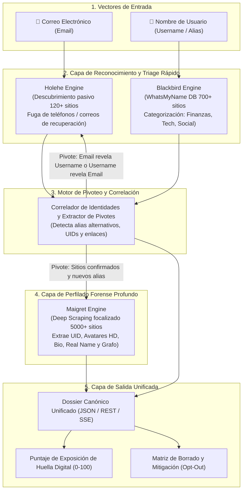

# Arquitectura e Integración Técnica: Trilogía OSINT (Blackbird - Maigret - Holehe)

Este documento define la arquitectura técnica de la plataforma OSINT unificada, basada en la integración de tres motores complementarios (**Blackbird**, **Maigret** y **Holehe**) para el descubrimiento, correlación y análisis profundo de huella digital tanto por **nombre de usuario (*username*)** como por **correo electrónico (*email*)**.

---

## 1. Visión y Estrategia de la Trilogía OSINT

En lugar de herramientas redundantes o superficiales, el sistema adopta una **arquitectura por niveles con pivoteo bidireccional**:



### Roles Específicos de Cada Motor:
1. **Holehe (Vector Email):** Actúa como el radar silencioso inicial cuando se ingresa un correo. Comprueba la existencia de cuentas en más de 120 plataformas sin alertar a la víctima y rescatando fragmentos de números telefónicos o correos alternativos.
2. **Blackbird (Vector Username - Triage Rápido & Semántico):** Escanea a alta velocidad más de 700 plataformas utilizando la base de datos WhatsMyName, emite JSON nativo limpio y clasifica los hallazgos por temática (`finance`, `crypto`, `coding`, `social`, `gaming`).
3. **Maigret (Deep Profiling & Grafo Relacional):** Entra de forma quirúrgica sobre los perfiles detectados para raspar el código HTML/API, extraer la identidad real (nombre completo, foto de perfil, fecha de registro, ubicación declarada, bio, identificadores como Steam ID o Gaia ID) y expandir el grafo de huella digital de forma recursiva.

---

## 2. Flujo de Pivoteo Bidireccional (Deep Footprint Discovery)

El objetivo central es que la investigación no se detenga en una lista plana de enlaces, sino que profundice automáticamente mediante pivoteo:

### Flujo A: Entrada por Correo Electrónico (`Email -> Deep Footprint`)
1. El analista o usuario ingresa `juan.perez@dominio.com`.
2. **Holehe** ejecuta el escaneo pasivo contra 120+ plataformas.
3. Se detectan cuentas confirmadas (ej. Spotify, GitHub, Adobe, Gravatar).
4. Del endpoint de Gravatar o GitHub, el sistema extrae el *username* público asociado (`jperez_dev`).
5. El sistema pivota automáticamente y envía `jperez_dev` a **Blackbird** para mapear su presencia en 700+ redes.
6. Los perfiles con mayor densidad de datos pasan a **Maigret** para extraer nombre real, ubicación y conexiones sociales.

### Flujo B: Entrada por Nombre de Usuario (`Username -> Deep Footprint`)
1. El analista ingresa el alias `darkcoder`.
2. **Blackbird** barre 700+ plataformas en menos de 30 segundos y devuelve un JSON estructurado con categorías semánticas.
3. **Maigret** toma los perfiles confirmados (`--site GitHub --site DevTo --site Twitter`) y extrae metadatos embebidos:
   - Bio de GitHub: contiene el correo de contacto `darkcoder@proton.me`.
   - Avatar: URL de imagen en alta resolución.
4. El sistema pivota y envía el correo descubierto `darkcoder@proton.me` a **Holehe**.
5. **Holehe** descubre si ese correo privado está vinculado a billeteras cripto, foros o servicios de mensajería.
6. Se consolida el expediente en un **Dossier de Identidad Único**.

---

## 3. Análisis Técnico de los Tres Motores y Salidas Reales Capturadas

Las tres herramientas fueron probadas y validadas en el entorno local (`osint_lab/venv`). A continuación se detallan sus especificaciones y las **salidas verídicas capturadas directamente en laboratorio**.

---

### Motor 1: Blackbird (Filtro Rápido y Categorización Semántica)

* **Propósito:** Mapeo veloz y estructurado de nombres de usuario en >700 sitios.
* **Tecnología:** Python 3 + `aiohttp` (asincronía nativa).
* **Formato de Salida:** JSON estructurado nativo (`--json`).

#### Salida Real Capturada en Laboratorio (`testuser12345_09_10_2026_blackbird.json`):

```json
[
  {
    "name": "Wattpad",
    "url": "https://www.wattpad.com/api/v3/users/testuser12345",
    "category": "social",
    "status": "FOUND",
    "metadata": null
  },
  {
    "name": "Gitea",
    "url": "https://gitea.com/api/v1/users/testuser12345",
    "category": "coding",
    "status": "FOUND",
    "metadata": null
  },
  {
    "name": "Duolingo",
    "url": "https://www.duolingo.com/2017-06-30/users?username=testuser12345&_=1628308619574",
    "category": "hobby",
    "status": "FOUND",
    "metadata": [
      {
        "schema": "JSON",
        "type": "Image",
        "name": "Avatar",
        "prefix": "https:",
        "path": ["users", 0, "picture"],
        "downloaded": false,
        "value": "https://simg-ssl.duolingo.com/avatar/default_2"
      },
      {
        "schema": "JSON",
        "type": "Array",
        "item-path": ["title"],
        "name": "Courses",
        "path": ["users", 0, "courses"],
        "value": ["Spanish"]
      }
    ]
  }
]
```

---

### Motor 2: Maigret (Dossier Forense y Deep Profiling)

* **Propósito:** Extracción forense profunda de metadatos de usuario (avatar, UID, biografía, nombre real) y soporte de grafos relacionales.
* **Tecnología:** Python 3 + `aiohttp` + `curl-cffi` + `socid-extractor` + `networkx`.
* **Formato de Salida:** JSON simple (`-J simple`), NDJSON, HTML, PDF y grafos Neo4j.

#### Salida Real Capturada en Laboratorio (`report_torvalds_simple.json`):

```json
{
  "GitHub": {
    "site": {
      "tags": ["business", "coding", "networking"],
      "regexCheck": "^[a-zA-Z0-9](?:[a-zA-Z0-9]|-(?=[a-zA-Z0-9])){0,38}$",
      "urlProbe": "https://api.github.com/users/{username}",
      "checkType": "status_code",
      "alexaRank": 10,
      "urlMain": "https://www.github.com/",
      "url": "https://github.com/{username}"
    },
    "username": "torvalds",
    "status": {
      "username": "torvalds",
      "site_name": "GitHub",
      "url": "https://github.com/torvalds",
      "status": "Claimed",
      "ids": {
        "uid": "1024025",
        "image": "https://avatars.githubusercontent.com/u/1024025?v=4",
        "created_at": "2011-09-03T15:26:22Z",
        "location": "Portland, OR",
        "follower_count": "321694",
        "following_count": "0",
        "fullname": "Linus Torvalds",
        "public_gists_count": "1",
        "public_repos_count": "12",
        "company": "Linux Foundation",
        "_extractor": "GitHub API"
      },
      "tags": ["business", "coding", "networking"]
    },
    "http_status": 200,
    "is_similar": false,
    "rank": 10
  }
}
```

---

### Motor 3: Holehe (Reconocimiento Pasivo de Cuentas por Email)

* **Propósito:** Comprobar si un correo está registrado en plataformas web sin enviar alertas al titular.
* **Tecnología:** Python 3 + `httpx` + `trio`.
* **Formato de Salida:** CSV estructurado (`-C`).

#### Salida Real Capturada en Laboratorio (`holehe_*_results.csv`):

```csv
name,domain,method,frequent_rate_limit,rateLimit,exists,emailrecovery,phoneNumber,others
blip,blip.fm,register,True,False,False,,,
caringbridge,caringbridge.org,register,False,False,False,,,
spotify,spotify.com,register,True,True,,,,
aboutme,about.me,register,False,True,False,,,
adobe,adobe.com,password recovery,False,True,False,,,
amazon,amazon.com,login,False,True,False,,,
atlassian,atlassian.com,register,False,True,False,,,
```

> [!IMPORTANT]
> **Lección Operativa de Laboratorio:**  
> Holehe opera consultando endpoints de recuperación y validación. En conexiones directas desde IPs comerciales o datacenters, muchos servicios devuelven desafíos de bot (`rateLimit: True`). En producción, Holehe debe operar obligatoriamente conectado a un pool de **proxies residenciales rotativos** para garantizar lecturas con `exists: True/False` y capturar las fugas de teléfono (`phoneNumber`).

---

## 4. Matriz Comparativa de la Trilogía

| Dimensión | Blackbird | Maigret | Holehe |
| :--- | :--- | :--- | :--- |
| **Vector de Entrada** | Username / Alias | Username / Identificadores | Correo Electrónico (Email) |
| **Catálogo de Servicios** | 700+ plataformas | 5,300+ plataformas | 121 plataformas |
| **Tiempo de Ejecución Típico** | ~25 a 35 segundos | ~15 s (focalizado) a 2 min (completo) | ~3 a 8 segundos |
| **Nivel de Intrusividad** | Pasivo (Lectura HTTP/API) | Pasivo (Lectura + Scraping HTML) | Pasivo silencioso (Sin emails) |
| **Metadatos Extraídos** | Categoría temática, avatar básico | UID, bio, avatar HD, real name, tags | Teléfono enmascarado, correo respaldo |
| **Salida Predilecta para API** | JSON estructurado (`--json`) | JSON simple (`-J simple`) | CSV tabulado (`-C`) parseable a JSON |
| **Manejo de Proxies** | SOCKS5 / HTTP | SOCKS5 / Tor / I2P | SOCKS5 / HTTP (via httpx) |

---

## 5. Modelo Canónico de Datos Unificado (`UnifiedOSINTRecord`)

El backend consolidará los resultados de los tres motores en un único contrato JSON:

```typescript
export interface UnifiedOSINTRecord {
  metadata: {
    scan_id: string;
    target_input: string;
    primary_vector: "username" | "email";
    started_at: string;
    completed_at: string;
    duration_seconds: number;
    engines_executed: ("blackbird" | "maigret" | "holehe")[];
    pivots_triggered: {
      from_vector: string;
      to_vector: string;
      value: string;
    }[];
  };
  identity_profile: {
    primary_username?: string;
    confirmed_full_name?: string;
    primary_avatar_url?: string;
    detected_locations: string[];
    associated_emails: string[];
    masked_phone_numbers: string[];
    inferred_interests_tags: string[];
  };
  presence_by_category: {
    category: "finance" | "coding" | "social" | "gaming" | "music" | "hobby" | "other";
    count: number;
    services: Array<{
      platform: string;
      url: string;
      status: "CONFIRMED" | "RATE_LIMITED";
      discovered_by: "blackbird" | "maigret" | "holehe";
      account_uid?: string;
      bio?: string;
      creation_date?: string;
      opt_out_link?: string;
    }>;
  }[];
  risk_assessment: {
    footprint_score: number; // 0 (Huella nula) a 100 (Exposición masiva)
    risk_level: "LOW" | "MEDIUM" | "HIGH" | "CRITICAL";
    critical_exposures: string[]; // e.g. ["PHONE_FRAGMENT_LEAKED", "FINANCIAL_ACCOUNT_FOUND"]
    recommended_actions: string[];
  };
}
```

---

## 6. Orquestador de Integración en Python (`AsyncOSINTOrchestrator`)

A continuación se presenta la implementación de referencia del orquestador asíncrono para ejecutar los tres motores de forma cooperativa:

```python
import asyncio
import csv
import json
import os
from typing import Dict, Any, List, Optional

class AsyncOSINTOrchestrator:
    def __init__(self, venv_bin: str, workspace_dir: str):
        self.venv_bin = venv_bin
        self.workspace_dir = workspace_dir
        self.blackbird_dir = os.path.join(workspace_dir, "osint_lab/blackbird")
        self.output_dir = os.path.join(workspace_dir, "osint_lab/test_runs")
        os.makedirs(self.output_dir, exist_ok=True)

    async def run_holehe(self, email: str, proxy: Optional[str] = None) -> List[Dict[str, Any]]:
        """Paso 1 (Email): Ejecuta Holehe para mapear cuentas asociadas al correo."""
        cmd = [
            f"{self.venv_bin}/holehe",
            email,
            "--no-color",
            "-C",
            "--timeout", "8"
        ]
        proc = await asyncio.create_subprocess_exec(
            *cmd,
            stdout=asyncio.subprocess.PIPE,
            stderr=asyncio.subprocess.PIPE,
            cwd=self.output_dir
        )
        await proc.communicate()
        
        # Parsear el CSV generado por Holehe
        results = []
        for file in os.listdir(self.output_dir):
            if file.startswith("holehe_") and file.endswith(".csv") and email in file:
                csv_path = os.path.join(self.output_dir, file)
                with open(csv_path, mode="r", encoding="utf-8", errors="ignore") as f:
                    reader = csv.DictReader(f)
                    for row in reader:
                        if row.get("exists") == "True":
                            results.append({
                                "platform": row.get("name"),
                                "domain": row.get("domain"),
                                "masked_phone": row.get("phoneNumber") or None,
                                "email_recovery": row.get("emailrecovery") or None,
                                "engine": "holehe"
                            })
        return results

    async def run_blackbird(self, username: str) -> List[Dict[str, Any]]:
        """Paso 2 (Username): Ejecuta Blackbird para barrido rápido de 700+ sitios."""
        cmd = [
            f"{self.venv_bin}/python",
            "blackbird.py",
            "-u", username,
            "--json",
            "--timeout", "10",
            "--max-concurrent-requests", "30"
        ]
        proc = await asyncio.create_subprocess_exec(
            *cmd,
            stdout=asyncio.subprocess.PIPE,
            stderr=asyncio.subprocess.PIPE,
            cwd=self.blackbird_dir
        )
        await proc.communicate()
        
        # Localizar el archivo JSON exportado por Blackbird
        found_records = []
        results_folder = os.path.join(self.blackbird_dir, "results")
        if os.path.exists(results_folder):
            for folder in os.listdir(results_folder):
                if username in folder:
                    target_json = os.path.join(results_folder, folder, f"{username}_blackbird.json")
                    if os.path.exists(target_json):
                        with open(target_json, "r", encoding="utf-8") as jf:
                            data = json.load(jf)
                            for item in data:
                                if item.get("status") == "FOUND":
                                    found_records.append({
                                        "platform": item.get("name"),
                                        "url": item.get("url"),
                                        "category": item.get("category", "other"),
                                        "metadata": item.get("metadata"),
                                        "engine": "blackbird"
                                    })
        return found_records

    async def run_maigret_targeted(self, username: str, sites: List[str]) -> Dict[str, Any]:
        """Paso 3 (Deep Scraping): Ejecuta Maigret de forma quirúrgica sobre los sitios confirmados."""
        if not sites:
            return {}
            
        cmd = [
            f"{self.venv_bin}/maigret",
            username,
            "--folderoutput", self.output_dir,
            "-J", "simple",
            "--no-progressbar"
        ]
        for s in sites[:20]: # Limitar a los 20 más relevantes para maximizar velocidad
            cmd.extend(["--site", s])
            
        proc = await asyncio.create_subprocess_exec(
            *cmd,
            stdout=asyncio.subprocess.PIPE,
            stderr=asyncio.subprocess.PIPE
        )
        await proc.communicate()
        
        report_file = os.path.join(self.output_dir, f"report_{username}_simple.json")
        if os.path.exists(report_file):
            with open(report_file, "r", encoding="utf-8") as rf:
                return json.load(rf)
        return {}

    async def execute_deep_footprint_pipeline(self, target: str) -> Dict[str, Any]:
        """Pipeline principal con detección automática de vector y pivoteo cruzado."""
        is_email = "@" in target
        consolidated = {
            "target": target,
            "vector": "email" if is_email else "username",
            "findings": []
        }
        
        if is_email:
            # 1. Escaneo por Email con Holehe
            email_hits = await self.run_holehe(target)
            consolidated["findings"].extend(email_hits)
            
            # Pivoteo: Inferir alias del email (e.g. "usuario" de "usuario@gmail.com")
            inferred_user = target.split("@")[0]
            bb_hits = await self.run_blackbird(inferred_user)
            consolidated["findings"].extend(bb_hits)
            
            # Deep profiling con Maigret de sitios confirmados
            sites_to_scrape = [h["platform"] for h in bb_hits]
            maigret_dossier = await self.run_maigret_targeted(inferred_user, sites_to_scrape)
            consolidated["deep_dossier"] = maigret_dossier
            
        else:
            # 1. Escaneo por Username con Blackbird
            bb_hits = await self.run_blackbird(target)
            consolidated["findings"].extend(bb_hits)
            
            # 2. Deep profiling con Maigret
            sites_to_scrape = [h["platform"] for h in bb_hits]
            maigret_dossier = await self.run_maigret_targeted(target, sites_to_scrape)
            consolidated["deep_dossier"] = maigret_dossier
            
        return consolidated
```

---

## 7. Plan de Despliegue en Producción (Docker / Microservicios)

Para asegurar la robustez de este ecosistema:

1. **Aislamiento en Contenedores Separados:**
   * `service-holehe`: Contenedor especializado con pool de proxies residenciales rotativos.
   * `service-blackbird`: Contenedor de alta concurrencia (`aiohttp`) para escaneo rápido.
   * `service-maigret`: Contenedor con `curl-cffi` y selectores de deep scraping para extracción de dossiers.
2. **Cola de Tareas Centralizada (RabbitMQ / Redis + Celery):**
   * El cliente hace una petición HTTP `POST /api/v1/osint/footprint`.
   * El orquestador distribuye las tareas y emite eventos en tiempo real al frontend mediante **Server-Sent Events (SSE)** conforme cada motor reporta hallazgos.
3. **Privacidad y Retención de Datos:**
   * Almacenamiento seguro en PostgreSQL con cifrado en reposo para los reportes de auditoría solicitados por el propio usuario, con política de auto-eliminación transcurridos 30 días.
