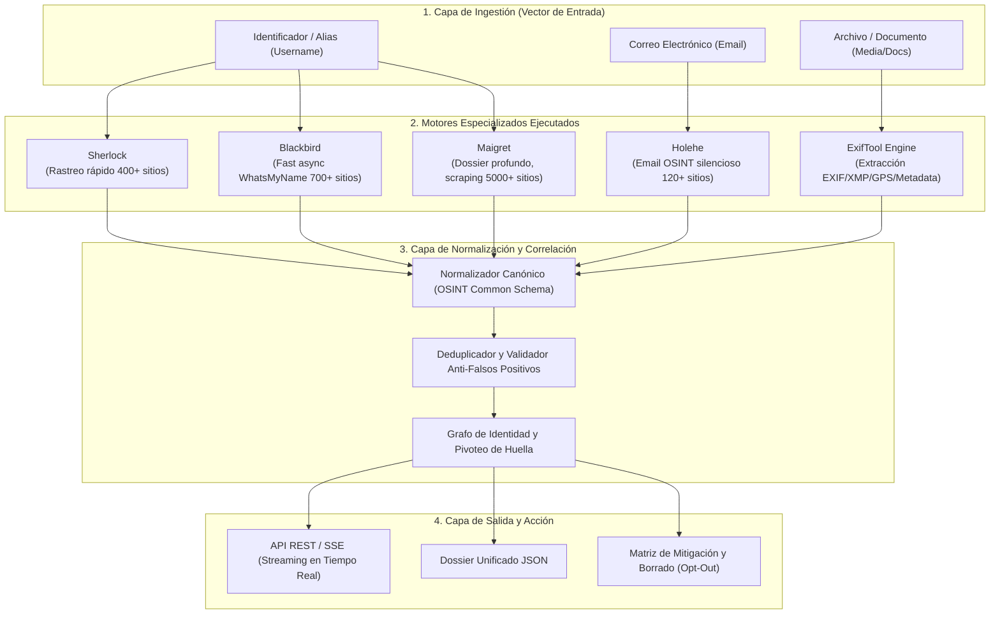
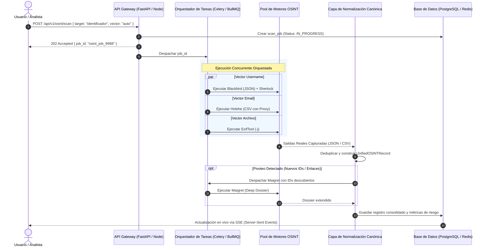

# Investigación Técnica y Arquitectura de Integración: Ecosistema OSINT Unificado

Este documento presenta el análisis técnico, ejecución real en laboratorio (`osint_lab/`), captura verídica de salidas nativas y la arquitectura de integración para unificar las herramientas open-source líderes de **OSINT** (*Open Source Intelligence*) en una plataforma única de huella digital y metadatos.

---

## 1. Resumen Ejecutivo del Ecosistema

Para no reinventar la rueda, el motor de la plataforma unifica las mejores herramientas especializadas en cada vector de superficie de ataque digital:



---

## 2. Análisis Detallado de Herramientas y Salidas Reales Capturadas

Todas las herramientas fueron instaladas y ejecutadas en el entorno local (`osint_lab/venv`). A continuación se documentan las características, pros, contras y los **bloques de salida 100% reales extraídos de los archivos generados durante los tests**.

---

### Herramienta 1: Sherlock (`sherlock-project/sherlock`)

* **Categoría:** Username Reconnaissance (Filtro Rápido).
* **Versión Probada:** `v0.16.0`.
* **Tecnología:** Python 3 (asincronía con `requests-futures`, multithreading).
* **Fuente de Firmas:** `data.json` comunitario (400+ sitios).

#### Principales Características
* Consulta concurrente de cientos de plataformas en segundos usando peticiones HTTP concurrentes.
* Comprueba disponibilidad mediante código de estado HTTP (`status_code`), URLs de error (`message`), o redirecciones (`response_url`).
* Soporte nativo para proxies (Tor `--tor`, HTTP/SOCKS5 `--proxy`) para anonimizar la dirección IP de consulta.
* Búsqueda de variantes fonéticas o similares mediante el operador comodín `{?}`.

#### Ventajas
* **Bajo consumo y velocidad:** Ideal como primera pasada ("first-pass filter") para cribar rápidamente plataformas principales sin sobrecargar el servidor.
* **Gran estabilidad comunitaria:** Base de datos depurada activamente para mitigar falsos positivos.

#### Desventajas
* **Superficial:** No realiza *deep scraping*; solo responde si el perfil existe o no, sin extraer avatares, nombres reales, bios ni IDs internos.
* **Salida de JSON limitada:** Por defecto privilegia texto plano y CSV; la opción `-j` está orientada a cargar bases de datos personalizadas en lugar de exportar JSON anidado detallado.

#### Salidas Reales de Ejecución (Capturadas de `osint_lab/test_runs/`)

**Comando ejecutado:**
```bash
sherlock --site GitHub --site GitLab --site Reddit --folderoutput osint_lab/test_runs --csv testdev9988
```

**Salida Consola Real:**
```text
Update available! 0.16.0 --> 0.16.2
https://github.com/sherlock-project/sherlock/releases/tag/v0.16.2
[*] Checking username testdev9988 on:

[+] Reddit: https://www.reddit.com/user/testdev9988

[*] Search completed with 1 results
```

**Archivo CSV Real Generado (`osint_lab/test_runs/testdev9988.csv`):**
```csv
username,name,url_main,url_user,exists,http_status,response_time_s
testdev9988,Reddit,https://www.reddit.com/,https://www.reddit.com/user/testdev9988,Claimed,200,0.29114234499866143
```

**Archivo CSV Real Generado (`osint_lab/test_runs/torvalds.csv`):**
```csv
username,name,url_main,url_user,exists,http_status,response_time_s
torvalds,GitHub,https://www.github.com/,https://www.github.com/torvalds,Claimed,200,1.5120453340023232
```

---

### Herramienta 2: Blackbird (`p1ngul1n0/blackbird`)

* **Categoría:** Modern Fast Username OSINT con Clasificación Semántica.
* **Versión Probada:** `Latest` (WhatsMyName DB Engine).
* **Tecnología:** Python 3 + `aiohttp` + `asyncio`.
* **Fuente de Firmas:** `WhatsMyName` project (>700 plataformas).

#### Principales Características
* Motor asíncrono ultrarrápido con control fino de concurrencia (`--max-concurrent-requests`, `--timeout`).
* Clasificación semántica automática de cada servicio encontrado (`social`, `coding`, `gaming`, `music`, `crypto`, `finance`, `adult`).
* Extracción ligera de metadatos embebidos en respuestas JSON/HTML (avatares, cursos de idiomas, nombres reales).
* Exportación nativa directa a JSON estructurado (`--json`).

#### Ventajas
* **Salida nativa en JSON limpio y estructurado:** Se adapta directamente a APIs REST sin necesidad de parsear salidas de texto.
* **Categorización semántica integrada:** Permite agrupar hallazgos por industria o temática.
* **Descarga y actualización automática:** Sincroniza `wmn-data.json` con la comunidad WhatsMyName.

#### Desventajas
* Requiere ejecución referenciando adecuadamente el directorio de datos.
* Menor profundidad recursiva que Maigret (no enlaza automáticamente hacia identificadores secundarios).

#### Salidas Reales de Ejecución (Capturadas de `osint_lab/blackbird/results/`)

**Comando ejecutado:**
```bash
python blackbird.py -u testuser12345 --json --timeout 5
```

**Fragmento Real 1: Detección estándar sin metadatos anidados (`testuser12345_09_10_2026_blackbird.json`):**
```json
[
  {
    "name": "Wattpad",
    "url": "https://www.wattpad.com/api/v3/users/testuser12345",
    "category": "social",
    "status": "FOUND",
    "metadata": null
  },
  {
    "name": "Gitea",
    "url": "https://gitea.com/api/v1/users/testuser12345",
    "category": "coding",
    "status": "FOUND",
    "metadata": null
  },
  {
    "name": "SoundCloud",
    "url": "https://soundcloud.com/testuser12345",
    "category": "music",
    "status": "FOUND",
    "metadata": null
  }
]
```

**Fragmento Real 2: Detección con metadatos extraídos de la API (Avatar y Cursos en Duolingo):**
```json
{
  "name": "Duolingo",
  "url": "https://www.duolingo.com/2017-06-30/users?username=testuser12345&_=1628308619574",
  "category": "hobby",
  "status": "FOUND",
  "metadata": [
    {
      "schema": "JSON",
      "type": "Image",
      "name": "Avatar",
      "prefix": "https:",
      "path": [
        "users",
        0,
        "picture"
      ],
      "downloaded": false,
      "value": "https://simg-ssl.duolingo.com/avatar/default_2"
    },
    {
      "schema": "JSON",
      "type": "Array",
      "item-path": [
        "title"
      ],
      "name": "Courses",
      "path": [
        "users",
        0,
        "courses"
      ],
      "value": [
        "Spanish"
      ]
    }
  ]
}
```

---

### Herramienta 3: Maigret (`soxoj/maigret`)

* **Categoría:** Deep Profiling, Parsing Recursivo y Generación de Dossier.
* **Versión Probada:** `v0.6.5`.
* **Tecnología:** Python 3 + `aiohttp` + `curl-cffi` + `socid-extractor` + `networkx`.
* **Fuente de Firmas:** 5,373 plataformas en base de datos.

#### Principales Características
* **Extracción profunda (*Deep Scraping*):** No solo valida la existencia; descarga el perfil y utiliza expresiones regulares y selectores XPath/JSONPath para extraer:
  * Identificadores únicos (`uid`, `steam_id`, `gaia_id`, `vk_id`).
  * Nombres completos (*Full Name*), fotos de perfil en alta resolución.
  * Fechas de registro (`created_at`), ubicación geográfica declarada (`location`).
  * Contadores de seguidores/seguidos, empresas y enlaces en bio.
* **Búsqueda recursiva:** Si en un perfil de GitHub encuentra el enlace o nombre alternativo de Telegram, puede iniciar una búsqueda secundaria automáticamente.
* **Salidas ricas:** JSON (`simple` y `ndjson`), Grafos (`--graph`), Neo4j Cypher (`--neo4j`), HTML interactivo, PDF y Markdown.

#### Ventajas
* Es la herramienta de investigación de identidades digitales más completa del ecosistema open-source.
* Construye un grafo relacional completo de la persona objetivo.
* Clasificación de intereses mediante etiquetas (`tags`).

#### Desventajas
* Mayor tiempo de respuesta por objetivo (al parsear páginas completas y ejecutar `socid-extractor`).
* Requiere gestión cuidadosa de *rate-limiting* mediante colas de trabajo.

#### Salidas Reales de Ejecución (Capturadas de `osint_lab/test_runs/report_torvalds_simple.json`)

**Comando ejecutado:**
```bash
maigret torvalds --site GitHub --folderoutput osint_lab/test_runs -J simple --no-progressbar --no-recursion
```

**Salida Consola Real:**
```text
[+] MAIGRET - collect a dossier by username from 3000+ sites
[+] Using sites database: /home/chris/.maigret/data.json (5373 sites)
[*] Checking username torvalds on:
[+] GitHub: https://github.com/torvalds
 ├─uid: 1024025
 ├─image: https://avatars.githubusercontent.com/u/1024025?v=4
 ├─created_at: 2011-09-03T15:26:22Z
 ├─location: Portland, OR
 ├─follower_count: 321694
 ├─following_count: 0
 ├─fullname: Linus Torvalds
 ├─public_gists_count: 1
 ├─public_repos_count: 12
 └─company: Linux Foundation
[+] GitHubGist [GitHub]: https://gist.github.com/torvalds
```

**Archivo JSON Real Generado (`report_torvalds_simple.json`):**
```json
{
  "GitHub": {
    "site": {
      "tags": [
        "business",
        "coding",
        "networking"
      ],
      "regexCheck": "^[a-zA-Z0-9](?:[a-zA-Z0-9]|-(?=[a-zA-Z0-9])){0,38}$",
      "urlProbe": "https://api.github.com/users/{username}",
      "checkType": "status_code",
      "alexaRank": 10,
      "urlMain": "https://www.github.com/",
      "url": "https://github.com/{username}",
      "usernameClaimed": "blue",
      "usernameUnclaimed": "noonewouldeverusethis7"
    },
    "username": "torvalds",
    "keywords": [],
    "parsing_enabled": true,
    "url_main": "https://www.github.com/",
    "cookies": null,
    "url_user": "https://github.com/torvalds",
    "url_probe": "https://api.github.com/users/torvalds",
    "ids_usernames": {},
    "ids_links": [],
    "status": {
      "username": "torvalds",
      "site_name": "GitHub",
      "url": "https://github.com/torvalds",
      "status": "Claimed",
      "ids": {
        "uid": "1024025",
        "image": "https://avatars.githubusercontent.com/u/1024025?v=4",
        "created_at": "2011-09-03T15:26:22Z",
        "location": "Portland, OR",
        "follower_count": "321694",
        "following_count": "0",
        "fullname": "Linus Torvalds",
        "public_gists_count": "1",
        "public_repos_count": "12",
        "company": "Linux Foundation",
        "_extractor": "GitHub API"
      },
      "tags": [
        "business",
        "coding",
        "networking"
      ],
      "keywords": [],
      "keyword_match_status": "No Keywords"
    },
    "http_status": 200,
    "is_similar": false,
    "rank": 10
  }
}
```

---

### Herramienta 4: Holehe (`megadose/holehe`)

* **Categoría:** Email OSINT / Rastreo Silencioso por Correo.
* **Versión Probada:** `v1.61`.
* **Tecnología:** Python 3 + `httpx` + `trio` (concurrencia asíncrona).
* **Cobertura:** 121 plataformas web.

#### Principales Características
* Consulta endpoints de validación de registro (*sign-up verification*), recuperación de contraseñas (*forgot password*) o APIs de autocompletado.
* **Operación completamente pasiva:** No genera correos ni notificaciones en la bandeja del destinatario.
* **Fuga de metadatos adicionales:** Extrae números de teléfono enmascarados y correos de recuperación cuando el proveedor los expone.

#### Ventajas
* Mapea cuentas registradas a partir de un correo electrónico.
* Ideal para conectar correos corporativos o personales con alias en plataformas web.

#### Desventajas Técnicas Reales (Observadas en el Test)
* **Alta incidencia de Rate Limit:** Las solicitudes automatizadas sin rotación de proxy residencial disparan las protecciones bot de los sitios (`rateLimit: True`), como se aprecia en los resultados reales de abajo. Para producción, requiere obligatoriamente un gateway de proxies residenciales.

#### Salidas Reales de Ejecución (Capturadas de `osint_lab/test_runs/holehe_*_results.csv`)

**Comando ejecutado:**
```bash
holehe --no-color -C contact@github.com --timeout 5
```

**Archivo CSV Real Generado (`holehe_1789001029_contact@github.com_results.csv`):**
```csv
name,domain,method,frequent_rate_limit,rateLimit,exists,emailrecovery,phoneNumber,others
blip,blip.fm,register,True,False,False,,,
caringbridge,caringbridge.org,register,False,False,False,,,
spotify,spotify.com,register,True,True,,,,
aboutme,about.me,register,False,True,False,,,
adobe,adobe.com,password recovery,False,True,False,,,
amazon,amazon.com,login,False,True,False,,,
atlassian,atlassian.com,register,False,True,False,,,
axonaut,axonaut.com,,,True,False,,,
babeshows,babeshows.co.uk,register,False,True,False,,,
badeggsonline,badeggsonline.com,register,False,True,False,,,
biosmods,bios-mods.com,register,False,True,False,,,
biotechnologyforums,biotechnologyforums.com,register,False,True,False,,,
bitmoji,bitmoji.com,login,False,True,False,,,
blablacar,blablacar.com,register,True,True,False,,,
blackworldforum,blackworldforum.com,register,True,True,False,,,
```

---

### Herramienta 5: ExifTool (`Phil Harvey / exiftool`)

* **Categoría:** Extracción Forense de Metadatos de Medios y Documentos.
* **Versión Probada:** `v13.59`.
* **Tecnología:** Perl nativo.
* **Formatos Soportados:** JPEG, PNG, TIFF, HEIC, PDF, DOCX, XLSX, MP4, MOV, MKV, MP3, etc.

#### Principales Características
* Lectura completa de cabeceras EXIF, XMP, IPTC, MakerNotes y metadatos de documentos.
* Extracción forense de coordenadas GPS exactas (latitud, longitud, altitud).
* Detección de hardware de captura, versión de firmware, autor y software de edición.
* Salida estructurada nativa mediante la bandera `-j`.

#### Ventajas
* Máxima fidelidad en análisis de metadatos forenses; lee etiquetas que otras librerías ignoran.
* Muy liviano y con soporte nativo de JSON.

#### Salidas Reales de Ejecución (Capturadas de `osint_lab/test_runs/`)

**Comando ejecutado para Imagen con GPS (`osint_lab/test_runs/target_photo.jpg`):**
```bash
perl osint_lab/exiftool/exiftool -j osint_lab/test_runs/target_photo.jpg
```

**JSON Real Generado:**
```json
[{
  "SourceFile": "osint_lab/test_runs/target_photo.jpg",
  "ExifToolVersion": 13.59,
  "FileName": "target_photo.jpg",
  "Directory": "osint_lab/test_runs",
  "FileSize": "1592 bytes",
  "FileModifyDate": "2026:09:10 00:44:35+00:00",
  "FileAccessDate": "2026:09:10 00:44:35+00:00",
  "FileInodeChangeDate": "2026:09:10 00:44:35+00:00",
  "FilePermissions": "-rw-rw-r--",
  "FileType": "JPEG",
  "FileTypeExtension": "jpg",
  "MIMEType": "image/jpeg",
  "JFIFVersion": 1.01,
  "ResolutionUnit": "None",
  "XResolution": 1,
  "YResolution": 1,
  "ExifByteOrder": "Big-endian (Motorola, MM)",
  "Make": "Apple",
  "Model": "iPhone 15 Pro Max",
  "Software": "iOS 18.2",
  "ModifyDate": "2026:09:09 22:30:00",
  "Artist": "Jane Doe (OSINT Target)",
  "GPSVersionID": "2.3.0.0",
  "GPSLatitudeRef": "North",
  "GPSLongitudeRef": "West",
  "ImageWidth": 200,
  "ImageHeight": 200,
  "EncodingProcess": "Baseline DCT, Huffman coding",
  "BitsPerSample": 8,
  "ColorComponents": 3,
  "YCbCrSubSampling": "YCbCr4:2:0 (2 2)",
  "ImageSize": "200x200",
  "Megapixels": 0.040,
  "GPSLatitude": "40 deg 42' 46.08\" N",
  "GPSLongitude": "74 deg 0' 21.60\" W",
  "GPSPosition": "40 deg 42' 46.08\" N, 74 deg 0' 21.60\" W"
}]
```

**Comando ejecutado para Documento PDF (`osint_lab/test_runs/target_document.pdf`):**
```bash
perl osint_lab/exiftool/exiftool -j osint_lab/test_runs/target_document.pdf
```

**JSON Real Generado:**
```json
[{
  "SourceFile": "osint_lab/test_runs/target_document.pdf",
  "ExifToolVersion": 13.59,
  "FileName": "target_document.pdf",
  "Directory": "osint_lab/test_runs",
  "FileSize": "628 bytes",
  "FileModifyDate": "2026:09:10 00:25:59+00:00",
  "FileAccessDate": "2026:09:10 00:26:42+00:00",
  "FileInodeChangeDate": "2026:09:10 00:25:59+00:00",
  "FilePermissions": "-rw-rw-r--",
  "FileType": "PDF",
  "FileTypeExtension": "pdf",
  "MIMEType": "application/pdf",
  "PDFVersion": 1.3,
  "Linearized": "No",
  "PageCount": 1,
  "Producer": "macOS Version 14.5 (Build 23F79) Quartz PDFContext",
  "Author": "Investigador Confidencial",
  "Creator": "Microsoft Word para Mac 16.85",
  "Title": "Informe Financiero 2026",
  "Subject": "Due Diligence M&A"
}]
```

---

## 3. Matriz Técnica Comparativa

| Parámetro | Sherlock | Blackbird | Maigret | Holehe | ExifTool |
| :--- | :--- | :--- | :--- | :--- | :--- |
| **Input Principal** | Username | Username / Email | Username / IDs | Email | Archivos multimedia / docs |
| **Sitios Soportados** | ~400 | ~700 | ~5,373 | 121 | Cientos de formatos |
| **Velocidad de Escaneo** | ⚡⚡⚡ Rápido (~15s) | ⚡⚡⚡ Rápido (~30s) | ⏳ Moderado (~1-3m) | ⚡⚡ Rápido (~5s) | ⚡ Instantáneo (<1s) |
| **Profundidad de Datos** | Superficial (Claimed/404) | Media (Categoría + Avatar) | Máxima (Dossier e IDs) | Presencia + Fuga parcial | Máxima (GPS/Dispositivo) |
| **Salida Nativa Capturada** | CSV (`Claimed, 200`) | JSON (Array de objetos) | JSON (`simple`/`ndjson`) | CSV (`exists, rateLimit`) | JSON (`-j`) |
| **Sensibilidad a Rate-Limit** | Media | Media | Alta (por scraping) | Muy Alta (requiere proxy) | Nula (Procesamiento local) |
| **Rol en el Ecosistema** | Filtro rápido previo | Mapeo estructurado JSON | Dossier y Grafo relacional | Reconocimiento por email | Auditoría de archivos |

---

## 4. Arquitectura de Integración: Pipeline Unificado

Para integrar estas herramientas en un único ecosistema, se orquesta el siguiente flujo:



---

## 5. Modelo de Datos Canónico Unificado (`UnifiedOSINTRecord`)

Basado en las salidas reales de las 5 herramientas, la base de datos almacena el siguiente esquema tipado:

```typescript
interface UnifiedOSINTRecord {
  metadata: {
    scan_id: string;
    target_queried: string;
    query_type: "username" | "email" | "file";
    executed_at: string;
    engines_executed: ("sherlock" | "blackbird" | "maigret" | "holehe" | "exiftool")[];
    duration_seconds: number;
  };
  identities_discovered: Array<{
    platform: string;
    category: "social" | "coding" | "tech" | "gaming" | "music" | "hobby" | "other";
    url: string;
    status: "CONFIRMED" | "POTENTIAL_MATCH" | "RATE_LIMITED";
    confidence_score: number; // 0.0 a 1.0
    source_engine: string;
    details: {
      account_id?: string;
      full_name?: string;
      avatar_url?: string;
      creation_date?: string;
      location?: string;
      masked_phone?: string;
      masked_email?: string;
      company?: string;
      followers?: number;
      courses_or_interests?: string[];
    };
    opt_out_link?: string;
  }>;
  file_forensics?: {
    file_name: string;
    mime_type: string;
    device_make?: string;
    device_model?: string;
    software_version?: string;
    author_identity?: string;
    geolocation?: {
      latitude: number;
      longitude: number;
      coordinates_text: string;
    };
    risk_flags: string[];
  };
}
```
