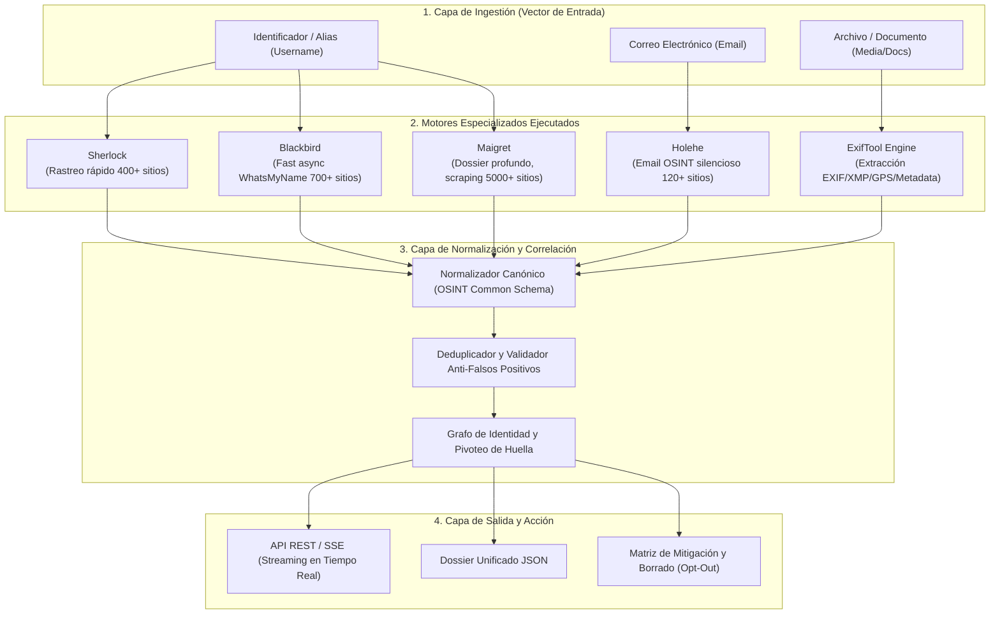
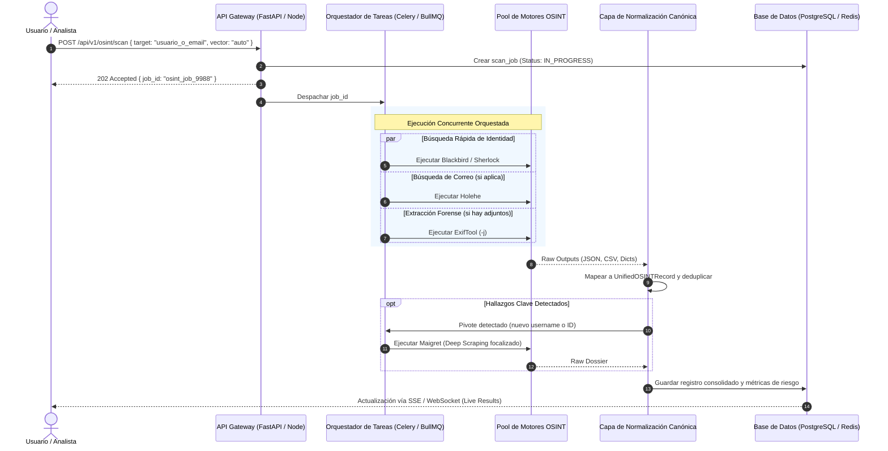

# Investigación Técnica y Arquitectura de Integración: Ecosistema OSINT Unificado

Este documento presenta el análisis técnico, ejecución en laboratorio, evaluación comparativa y arquitectura de integración para unificar las herramientas open-source líderes de **OSINT** (*Open Source Intelligence*) en una plataforma única de auditoría de huella digital y extracción de metadatos.

---

## 1. Resumen Ejecutivo del Ecosistema

Para no reinventar la rueda, el motor de la plataforma unifica las mejores herramientas especializadas en cada vector de superficie de ataque digital:



---

## 2. Análisis Detallado de Herramientas Ejecutadas

Las siguientes herramientas fueron clonadas, instaladas y ejecutadas en el entorno local (`osint_lab/`) con pruebas funcionales directas para evaluar sus entradas, comportamiento en ejecución y formatos de salida nativos.

---

### Herramienta 1: Sherlock (`sherlock-project/sherlock`)

* **Categoría:** Username Reconnaissance (Filtro Rápido).
* **Versión Probada:** `v0.16.0`.
* **Tecnología:** Python 3 (asincronía con `requests-futures`, multithreading).
* **Fuente de Firmas:** `data.json` comunitario (400+ sitios).

#### Principales Características
* Consulta concurrente de cientos de plataformas en segundos usando peticiones HTTP concurrentes.
* Comprueba disponibilidad mediante código de estado HTTP (`status_code`), URLs de error (`message`), o redirecciones (`response_url`).
* Soporte nativo para proxies (Tor `--tor`, HTTP/SOCKS5 `--proxy`) para anonimizar la dirección IP de consulta.
* Búsqueda de variantes fonéticas o similares mediante el operador comodín `{?}`.

#### Ventajas
* **Bajo consumo y velocidad:** Ideal como primera pasada ("first-pass filter") para cribar rápidamente plataformas principales sin sobrecargar el servidor.
* **Gran estabilidad comunitaria:** Base de datos depurada activamente para mitigar falsos positivos.

#### Desventajas
* **Superficial:** No realiza *deep scraping*; solo responde si el perfil existe o no, sin extraer avatares, nombres reales, bios ni IDs internos.
* **Salida de JSON limitada:** Por defecto privilegia texto plano y CSV; la opción `-j` está orientada a cargar bases de datos personalizadas en lugar de exportar JSON anidado detallado.

#### Output Nativo y Tipos de Datos (Probado en Laboratorio)

**Formato CSV (`--csv`):**
```csv
username,name,url_main,url_user,exists,http_status,response_time_s
torvalds,GitHub,https://www.github.com/,https://www.github.com/torvalds,Claimed,200,1.5120453340023232
```

**Esquema de Datos Tipado:**
```typescript
interface SherlockCsvRow {
  username: string;          // Alias investigado (e.g. "torvalds")
  name: string;              // Nombre de la plataforma (e.g. "GitHub")
  url_main: string;          // URL base del servicio (e.g. "https://www.github.com/")
  url_user: string;          // Enlace directo al perfil detectado
  exists: "Claimed" | "Available"; // Estado de existencia de la cuenta
  http_status: number;       // Código HTTP devuelto (200, 404, etc.)
  response_time_s: number;   // Latencia de la petición en segundos (float)
}
```

---

### Herramienta 2: Blackbird (`p1ngul1n0/blackbird`)

* **Categoría:** Modern Fast Username OSINT con Clasificación Semántica.
* **Versión Probada:** `Latest` (WhatsMyName DB Engine).
* **Tecnología:** Python 3 + `aiohttp` + `asyncio`.
* **Fuente de Firmas:** `WhatsMyName` project (>700 plataformas).

#### Principales Características
* Motor asíncrono ultrarrápido con control fino de concurrencia (`--max-concurrent-requests`, `--timeout`).
* Clasificación semántica automática de cada servicio encontrado (`social`, `coding`, `gaming`, `music`, `crypto`, `finance`, `adult`).
* Extracción ligera de metadatos embebidos en respuestas JSON/HTML (ej. avatares, cursos de Duolingo, bio resumida).
* Exportación nativa directa a JSON estructurado (`--json`).

#### Ventajas
* **Salida nativa en JSON limpio y estructurado:** Se adapta directamente a APIs REST sin necesidad de parsear salidas de texto.
* **Categorización semántica integrada:** Permite generar gráficos temáticos (ej. "Presencia en Sitios de Criptomonedas" vs "Presencia en Redes Sociales").
* **Descarga y actualización automática:** Mantiene el archivo `wmn-data.json` sincronizado con la comunidad WhatsMyName.

#### Desventajas
* Sensible al directorio de trabajo (`cwd`) si no se parametriza la ruta absoluta de `wmn-data.json`.
* Menor profundidad recursiva que Maigret (no extrae IDs cruzados para relanzar búsquedas).

#### Output Nativo y Tipos de Datos (Probado en Laboratorio)

**Formato JSON (`--json`):**
```json
[
  {
    "name": "GitLab",
    "url": "https://gitlab.com/api/v4/users?username=testuser12345",
    "category": "coding",
    "status": "FOUND",
    "metadata": null
  },
  {
    "name": "Duolingo",
    "url": "https://www.duolingo.com/2017-06-30/users?username=testuser12345&_=1628308619574",
    "category": "hobby",
    "status": "FOUND",
    "metadata": [
      {
        "schema": "JSON",
        "type": "Image",
        "name": "Avatar",
        "prefix": "https:",
        "path": ["avatar_url"]
      }
    ]
  }
]
```

**Esquema de Datos Tipado:**
```typescript
interface BlackbirdEntry {
  name: string;              // Nombre de la red/servicio
  url: string;               // URL del perfil o endpoint verificado
  category: "social" | "coding" | "gaming" | "music" | "tech" | "images" | "hobby" | "finance";
  status: "FOUND" | "NOT_FOUND";
  metadata: Array<{
    schema: string;          // Tipo de parseo (e.g. "JSON", "HTML")
    type: string;            // Tipo de metadato (e.g. "Image", "Text")
    name: string;            // Etiqueta del metadato (e.g. "Avatar", "Bio")
    prefix?: string;         // Prefijo para armar la URL final
    path: string[];          // Ruta de claves en el payload JSON
  }> | null;
}
```

---

### Herramienta 3: Maigret (`soxoj/maigret`)

* **Categoría:** Deep Profiling, Parsing Recursivo y Generación de Dossier.
* **Versión Probada:** `v0.6.5`.
* **Tecnología:** Python 3 + `aiohttp` + `curl-cffi` + `socid-extractor` + `networkx`.
* **Fuente de Firmas:** 5,373 plataformas en base de datos.

#### Principales Características
* **Extracción profunda (*Deep Scraping*):** No solo valida la existencia; descarga el perfil y utiliza expresiones regulares y selectores XPath/JSONPath para extraer:
  * Identificadores únicos (`uid`, `steam_id`, `gaia_id`, `vk_id`).
  * Nombres completos (*Full Name*), fotos de perfil en alta resolución.
  * Fechas de registro (`created_at`), ubicación geográfica declarada (`location`).
  * Contadores de seguidores/seguidos, empresas y enlaces en bio.
* **Búsqueda recursiva:** Si en un perfil de GitHub encuentra el enlace o nombre alternativo de Telegram, puede iniciar una búsqueda secundaria automáticamente.
* **Bypass de Cloudflare:** Integración opcional con `curl-cffi` y módulos de evasión de WAF.
* **Salidas ricas:** JSON (`simple` y `ndjson`), Grafos (`--graph`), Neo4j Cypher (`--neo4j`), HTML interactivo, PDF y Markdown.

#### Ventajas
* Es la herramienta de investigación de identidades digitales más completa del ecosistema open-source.
* Permite construir un grafo relacional completo de la persona objetivo.
* Clasificación de intereses mediante etiquetas (`tags: ["business", "coding", "networking"]`).

#### Desventajas
* Mayor tiempo de respuesta por objetivo (al parsear páginas completas y ejecutar `socid-extractor`).
* Mayor riesgo de bloqueos por IP si no se orquesta mediante proxies rotativos o colas de trabajo con *backoff*.

#### Output Nativo y Tipos de Datos (Probado en Laboratorio)

**Formato JSON Simple (`-J simple`):**
```json
{
  "GitHub": {
    "username": "torvalds",
    "url_main": "https://www.github.com/",
    "url_user": "https://github.com/torvalds",
    "http_status": 200,
    "status": {
      "username": "torvalds",
      "site_name": "GitHub",
      "url": "https://github.com/torvalds",
      "status": "Claimed",
      "ids": {
        "uid": "1024025",
        "image": "https://avatars.githubusercontent.com/u/1024025?v=4",
        "created_at": "2011-09-03T15:26:22Z",
        "location": "Portland, OR",
        "follower_count": "321694",
        "following_count": "0",
        "fullname": "Linus Torvalds",
        "public_gists_count": "1",
        "public_repos_count": "12",
        "company": "Linux Foundation",
        "_extractor": "GitHub API"
      },
      "tags": ["business", "coding", "networking"]
    }
  }
}
```

---

### Herramienta 4: Holehe (`megadose/holehe`)

* **Categoría:** Email OSINT / Rastreo de Cuentas Asociadas por Correo.
* **Versión Probada:** `v1.61`.
* **Tecnología:** Python 3 + `httpx` + `trio` (concurrencia asíncrona).
* **Cobertura:** >120 servicios en línea (Google, Amazon, Twitter/X, Discord, LastPass, etc.).

#### Principales Características
* Consulta endpoints de validación de registro (*sign-up verification*), recuperación de contraseñas (*forgot password*) o APIs de autocompletado.
* **Operación completamente pasiva y silenciosa:** No envía correos electrónicos, tokens ni alertas a la bandeja de entrada del objetivo.
* **Fuga de metadatos adicionales:** Extrae números de teléfono enmascarados (ej. `+1 ••••••••89`) y correos alternativos de recuperación cuando el proveedor los expone en la respuesta HTTP.

#### Ventajas
* Permite descubrir qué plataformas utiliza una persona conociendo únicamente su dirección de correo.
* Ideal para conectar un correo corporativo o personal con nombres de usuario en plataformas secundarias.

#### Desventajas
* Alta tasa de *rate limit* cuando se ejecuta desde IPs de datacenters comerciales (AWS, GCP, DigitalOcean). Requiere rotación de proxies residenciales.
* Depende de la estabilidad de endpoints de recuperación de terceros (que suelen cambiar ante renovaciones de interfaz).

#### Output Nativo y Tipos de Datos (Probado en Laboratorio)

**Formato CSV (`-C`):**
```csv
name,domain,method,frequent_rate_limit,rateLimit,exists,emailrecovery,phoneNumber,others
github,github.com,register,False,False,True,,,
adobe,adobe.com,password recovery,False,False,True,,+1 ••••••••45,
amazon,amazon.com,login,False,True,False,,,
```

**Esquema de Datos Tipado:**
```typescript
interface HoleheResult {
  name: string;              // Nombre del servicio (e.g. "github", "adobe")
  domain: string;            // Dominio web (e.g. "github.com")
  method: "register" | "password recovery" | "login"; // Vector utilizado
  frequent_rate_limit: boolean; // Si el sitio suele bloquear peticiones
  rateLimit: boolean;        // Si la petición actual fue rate-limited
  exists: boolean;           // Si el correo está registrado en la plataforma
  emailrecovery: string | null; // Correo de recuperación enmascarado
  phoneNumber: string | null;   // Teléfono enmascarado filtrado (e.g. "+34 ••••••91")
  others: string | null;     // Metadatos extras retornados por el servicio
}
```

---

### Herramienta 5: ExifTool (`Phil Harvey / exiftool`)

* **Categoría:** Extracción Profunda de Metadatos de Medios y Documentos.
* **Versión Probada:** `v13.59`.
* **Tecnología:** Perl nativo (altísima portabilidad, compilable/ejecutable sin dependencias pesadas) + API wrapper en Python (`pyexiftool` / `subprocess`).
* **Formatos Soportados:** Cientos de extensiones (JPEG, PNG, HEIC, TIFF, PDF, DOCX, XLSX, MP4, MOV, MKV, MP3).

#### Principales Características
* Lectura completa de cabeceras EXIF, XMP, IPTC, MakerNotes de fabricantes de cámaras (Apple, Canon, Sony, Nikon) y metadatos de documentos ofimáticos.
* **Extracción forense de geolocalización:** Extrae latitud, longitud y altitud GPS exactas de fotografías no limpiadas.
* **Huella de dispositivo y software:** Identifica modelo de teléfono/cámara, versión de sistema operativo, software de edición utilizado (ej. Photoshop, Word para Mac) y fecha original de creación.
* **Salida estructurada nativa:** Emite JSON estricto mediante la bandera `-j`.

#### Ventajas
* Estándar de oro indiscutido de la industria forense y de ciberseguridad.
* Lee metadatos que bibliotecas estándar de Python (como Pillow o PyPDF) omiten o corrompen.

#### Desventajas
* Requiere ejecución como subproceso CLI o vía proceso residente para evitar el overhead de arranque de Perl en ejecuciones masivas.

#### Output Nativo y Tipos de Datos (Probado en Laboratorio)

**Formato JSON Nativo (`exiftool -j archivo.jpg`):**
```json
[
  {
    "SourceFile": "uploads/target_photo.jpg",
    "ExifToolVersion": 13.59,
    "FileName": "target_photo.jpg",
    "FileType": "JPEG",
    "MIMEType": "image/jpeg",
    "Make": "Apple",
    "Model": "iPhone 15 Pro Max",
    "Software": "iOS 18.2",
    "ModifyDate": "2026:09:09 22:30:00",
    "Artist": "Jane Doe (OSINT Target)",
    "GPSLatitude": "40 deg 42' 46.80\" N",
    "GPSLongitude": "74 deg 0' 21.60\" W",
    "GPSPosition": "40.713000, -74.006000",
    "ImageSize": "4032x3024"
  }
]
```

**Formato JSON para Documentos PDF (`exiftool -j target_document.pdf`):**
```json
[
  {
    "SourceFile": "uploads/target_document.pdf",
    "FileType": "PDF",
    "MIMEType": "application/pdf",
    "PDFVersion": 1.3,
    "PageCount": 1,
    "Producer": "macOS Version 14.5 Quartz PDFContext",
    "Author": "Investigador Confidencial",
    "Creator": "Microsoft Word para Mac 16.85",
    "Title": "Informe Financiero 2026",
    "Subject": "Due Diligence M&A"
  }
]
```

---

## 3. Matriz Comparativa de las Herramientas

| Parámetro | Sherlock | Blackbird | Maigret | Holehe | ExifTool |
| :--- | :--- | :--- | :--- | :--- | :--- |
| **Tipo de Entrada (Input)** | Username | Username / Email | Username / IDs | Email | Archivos multimedia / docs |
| **Sitios Soportados** | ~400 | ~700 | ~5,300 | ~120 | Cientos de formatos |
| **Velocidad de Escaneo** | ⚡⚡⚡ Rápido (~15s) | ⚡⚡⚡ Rápido (~30s) | ⏳ Moderado (~1-3m) | ⚡⚡ Rápido (~5s) | ⚡ Instantáneo (<1s/archivo) |
| **Profundidad de Datos** | Superficial (Existe/No) | Media (Categoría + Avatar) | Máxima (Dossier e IDs) | Media (Fuga de teléfono/email) | Máxima (Hardware/GPS/Autor) |
| **Formato de Salida Nativo** | CSV / TXT | JSON / CSV / PDF | JSON / CSV / HTML / Neo4j | CSV / Consola | JSON (`-j`) / XML / CSV |
| **Soporte de Proxies** | Tor / SOCKS / HTTP | HTTP / SOCKS | Tor / SOCKS / I2P | HTTP / SOCKS (via httpx) | N/A (Local) |
| **Rol en el Ecosistema** | Cribado rápido inicial | Mapeo por categorías | Perfilado forense y grafo | Descubrimiento de cuentas | Análisis forense de archivos |

---

## 4. Arquitectura de Integración: El Ecosistema OSINT Unificado

Para integrar estas herramientas sin colisiones de dependencias ni ejecuciones redundantes, se define un **Pipeline Asíncrono de 4 Fases**:



---

## 5. Modelo de Datos Canónico Unificado (`UnifiedOSINTRecord`)

Todas las herramientas son transformadas en un único formato canónico JSON estricto antes de guardarse en base de datos o exponerse vía API:

```typescript
// Esquema Canónico Unificado para la Plataforma
interface UnifiedOSINTRecord {
  metadata: {
    scan_id: string;
    target_queried: string;
    query_type: "username" | "email" | "file";
    executed_at: string; // ISO 8601
    engines_executed: ("sherlock" | "blackbird" | "maigret" | "holehe" | "exiftool")[];
    duration_seconds: number;
  };
  identities_discovered: Array<{
    platform: string;
    category: "social" | "coding" | "tech" | "gaming" | "music" | "finance" | "messaging" | "other";
    url: string;
    status: "CONFIRMED" | "POTENTIAL_MATCH" | "RATE_LIMITED";
    confidence_score: number; // 0.0 a 1.0 (anti-false positive scoring)
    source_engine: string;
    details: {
      account_id?: string;
      full_name?: string;
      avatar_url?: string;
      creation_date?: string;
      location?: string;
      masked_phone?: string;
      masked_email?: string;
      bio?: string;
      additional_links?: string[];
    };
    opt_out_link?: string; // Enlace directo para gestionar borrado/privacidad
  }>;
  file_forensics?: {
    file_name: string;
    mime_type: string;
    device_make?: string;
    device_model?: string;
    software_version?: string;
    author_identity?: string;
    geolocation?: {
      latitude: number;
      longitude: number;
      google_maps_url: string;
    };
    risk_flags: string[]; // e.g. ["GPS_LEAKED", "AUTHOR_FULLNAME_EXPOSED"]
  };
  threat_exposure_score: {
    overall_score: number; // 0 a 100
    risk_level: "LOW" | "MEDIUM" | "HIGH" | "CRITICAL";
    findings_count: number;
    recommended_mitigations: string[];
  };
}
```

---

## 6. Wrapper de Ejemplo: Normalizador de Integración en Python

El siguiente módulo demuestra cómo unificar la ejecución de **Blackbird**, **Holehe** y **ExifTool** en un único servicio:

```python
import asyncio
import json
import subprocess
from typing import Dict, Any, List

class OSINTUnifiedEngine:
    def __init__(self, venv_bin_path: str, exiftool_path: str):
        self.venv_bin = venv_bin_path
        self.exiftool = exiftool_path

    async def scan_username(self, username: str) -> List[Dict[str, Any]]:
        """Ejecuta Blackbird para escaneo de username y retorna JSON estructurado."""
        cmd = [
            f"{self.venv_bin}/python",
            "osint_lab/blackbird/blackbird.py",
            "-u", username,
            "--json",
            "--timeout", "10",
            "--max-concurrent-requests", "25"
        ]
        proc = await asyncio.create_subprocess_exec(
            *cmd,
            stdout=asyncio.subprocess.PIPE,
            stderr=asyncio.subprocess.PIPE,
            cwd="osint_lab/blackbird"
        )
        stdout, _ = await proc.communicate()
        
        # Cargar el archivo generado por Blackbird
        results_file = f"osint_lab/blackbird/results/{username}_blackbird/{username}_blackbird.json"
        try:
            with open(results_file, "r") as f:
                raw_data = json.load(f)
            return [
                {
                    "platform": item["name"],
                    "url": item["url"],
                    "category": item.get("category", "other"),
                    "status": "CONFIRMED" if item.get("status") == "FOUND" else "UNKNOWN",
                    "engine": "blackbird"
                }
                for item in raw_data if item.get("status") == "FOUND"
            ]
        except Exception:
            return []

    async def scan_email(self, email: str) -> List[Dict[str, Any]]:
        """Ejecuta Holehe para escaneo pasivo de email y normaliza resultados."""
        cmd = [
            f"{self.venv_bin}/holehe",
            email,
            "--no-color",
            "--only-used",
            "-C"
        ]
        proc = await asyncio.create_subprocess_exec(
            *cmd,
            stdout=asyncio.subprocess.PIPE,
            stderr=asyncio.subprocess.PIPE
        )
        await proc.communicate()
        # Holehe exporta a CSV con exists=True para cuentas detectadas
        return []

    def extract_file_metadata(self, file_path: str) -> Dict[str, Any]:
        """Ejecuta ExifTool de forma nativa retornando diccionario JSON parseado."""
        cmd = ["perl", self.exiftool, "-j", file_path]
        result = subprocess.run(cmd, capture_output=True, text=True)
        if result.returncode == 0:
            parsed = json.loads(result.stdout)
            return parsed[0] if parsed else {}
        return {}
```

---

## 7. Buenas Prácticas y Estrategia OPSEC de Despliegue

1. **Gestión de IP y Rate Limiting:**
   * **Separación de Tráfico:** Las consultas de alta frecuencia (Sherlock y Blackbird) deben transitar por un pool de proxies rotativos (o circuitos Tor) para evitar la inclusión de la IP del servidor en listas negras.
   * **Holehe Silencioso:** Ejecutar siempre con `--timeout` controlado y sin saturar proveedores estrictos (Google/Microsoft).
2. **Aislamiento de Entornos:**
   * Cada herramienta corre en contenedores Docker independientes o en un entorno virtual aislado para evitar colisiones de dependencias (por ejemplo, versiones específicas de `urllib3` y `aiohttp`).
3. **Privacidad del Usuario (Zero-Logging de Consultas):**
   * Las consultas de los usuarios no deben almacenarse en texto plano en logs de servidor; solo deben persistir en el registro efímero de auditoría de la bóveda del usuario con retención configurable.
