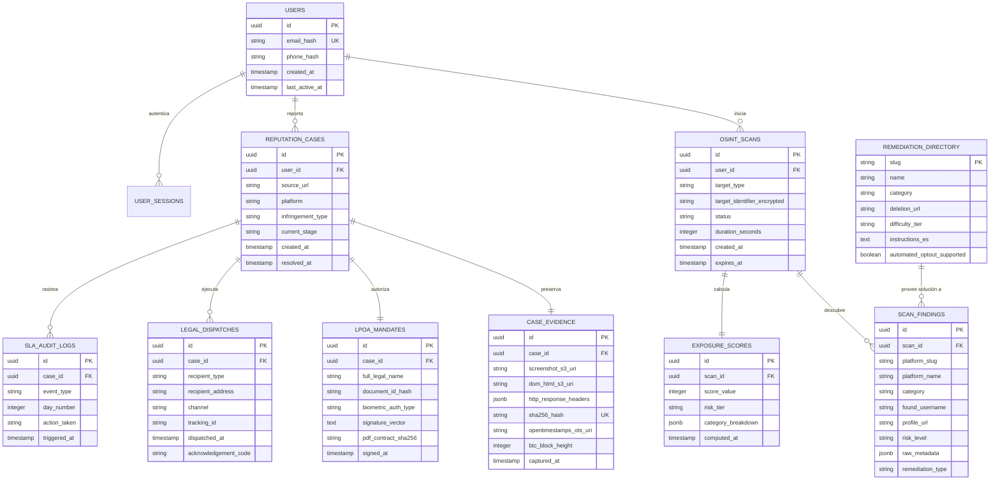

# Modelo de Datos, Diagrama Entidad-Relación (ERD) y Políticas de Privacidad
## Persistencia Relacional y Arquitectura de Datos para PostgreSQL (Supabase)
**Versión:** 1.0.0  
**Motor de Base de Datos:** PostgreSQL 15+ con extensiones `pgcrypto` y `uuid-ossp`  

---

## 1. Diagrama Entidad-Relación (ERD)



---

## 2. Diccionario de Datos de Tablas Principales

### 2.1 Tabla `OSINT_SCANS` (Escaneos Preventivos Osisn't)
Almacena el registro de auditorías de huella digital solicitadas por los usuarios.

| Columna | Tipo | Nulo | Restricción / Default | Descripción |
| :--- | :--- | :--- | :--- | :--- |
| `id` | `UUID` | No | `PRIMARY KEY (uuid_generate_v4())` | Identificador único del escaneo. |
| `user_id` | `UUID` | Sí | `REFERENCES users(id) ON DELETE CASCADE` | Usuario solicitante (puede ser anónimo temporal). |
| `target_type` | `VARCHAR(32)` | No | `CHECK (target_type IN ('email', 'username', 'phone'))` | Tipo de identificador evaluado. |
| `target_identifier_encrypted` | `TEXT` | No | Cifrado AES-GCM-256 | Identificador buscado cifrado en reposo. |
| `status` | `VARCHAR(32)` | No | `DEFAULT 'QUEUED'` | Estado: `QUEUED`, `PROCESSING`, `COMPLETED`, `FAILED`. |
| `duration_seconds` | `INTEGER` | Sí | `duration_seconds >= 0` | Tiempo total de ejecución de los workers. |
| `created_at` | `TIMESTAMPTZ` | No | `DEFAULT NOW()` | Fecha y hora de creación. |
| `expires_at` | `TIMESTAMPTZ` | No | `DEFAULT NOW() + INTERVAL '48 HOURS'` | Fecha programada para auto-purga (privacidad). |

---

### 2.2 Tabla `CASE_EVIDENCE` (Bóveda Forense de Evidencia)
Preserva los activos digitales certificados para reclamos ante Big Tech o juzgados.

| Columna | Tipo | Nulo | Restricción / Default | Descripción |
| :--- | :--- | :--- | :--- | :--- |
| `id` | `UUID` | No | `PRIMARY KEY (uuid_generate_v4())` | Identificador único del registro de evidencia. |
| `case_id` | `UUID` | No | `REFERENCES reputation_cases(id)` | Expediente legal vinculado. |
| `screenshot_s3_uri` | `VARCHAR(512)`| No | URI de almacenamiento privado | Captura completa en alta resolución renderizada. |
| `dom_html_s3_uri` | `VARCHAR(512)`| No | URI de almacenamiento privado | Código fuente HTML completo del post infractor. |
| `http_response_headers` | `JSONB` | No | Cabeceras HTTP | Dictamen de cabeceras de servidor, server timings y cookies. |
| `sha256_hash` | `CHAR(64)` | No | `UNIQUE` | Hash criptográfico unificado de la evidencia digital. |
| `opentimestamps_ots_uri`| `VARCHAR(512)`| No | Recibo OpenTimestamps | Archivo `.ots` para verificar contra la cadena de Bitcoin. |
| `btc_block_height` | `INTEGER` | Sí | Altura de bloque | Bloque de Bitcoin donde quedó anclada la raíz del árbol Merkle. |
| `captured_at` | `TIMESTAMPTZ` | No | `DEFAULT NOW()` | Marca de tiempo fehaciente del sellado. |

---

## 3. Políticas de Privacidad, Cifrado y Retención Cero (Data Hygiene)

### 3.1 Política de Auto-Purga de 48 Horas (Osisn't Ephemeral Rule)
* Para cumplir con los principios éticos de FEE y minimizar el riesgo de ser un blanco atractivo para atacantes, **los servidores no almacenan bases de datos permanentes con los perfiles descubiertos del usuario**.
* Un worker de PostgreSQL (`pg_cron`) ejecuta cada 6 horas la siguiente consulta de higienización:
  ```sql
  DELETE FROM osint_scans 
  WHERE expires_at <= NOW() 
    AND user_id NOT IN (SELECT user_id FROM retained_audit_consents);
  ```
* Al eliminarse el escaneo, la regla `ON DELETE CASCADE` borra en cascada todas las filas asociadas en `SCAN_FINDINGS` y `EXPOSURE_SCORES`.

### 3.2 Hashing Criptográfico y Cero Almacenamiento de Contenido Explícito
* **Evidencia NCII (Imágenes Íntimas):** Jamás se guardan imágenes de desnudez en ninguna base de datos ni bucket S3. Solo se preserva el hash perceptual `pHash` (64 bits hexadecimal) en `CASE_EVIDENCE`, suficiente para alimentar los protocolos de bloqueo de StopNCII, Meta y Google.
* **Anonimización de Búsquedas:** Los correos y teléfonos se almacenan con salt criptográfico en formato `HMAC-SHA-256` para evitar que un volcado no autorizado exponga la lista de usuarios investigados.
