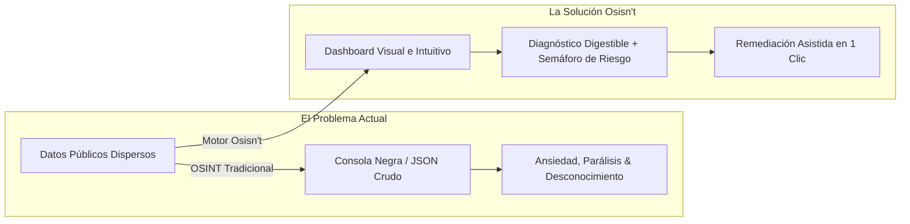
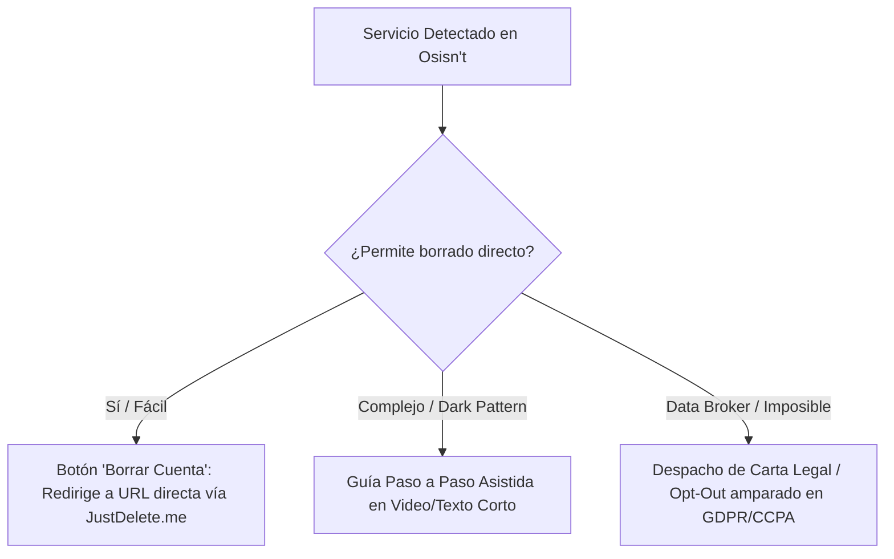
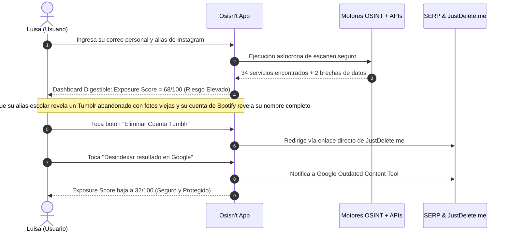

# Osisn't: Interfaz Digestible de Huella Digital y Suite de Remediación

> **"OSINT al servicio del individuo, no en su contra."**  
> **Osisn't** es el módulo de diagnóstico, concientización y remediación preventiva de nuestra suite. Transforma la inteligencia cruda de fuentes abiertas (OSINT)—habitualmente reservada a investigadores o atacantes—en una experiencia visual intuitiva, empática y accionable para cualquier persona, permitiéndole entender y neutralizar su huella digital sin requerir conocimientos técnicos.

---

## 1. El Concepto y la Filosofía de "Osisn't"

### ¿Por qué "Osisn't"?
El nombre es un juego de palabras deliberado:
* **OSINT (*Open Source Intelligence*):** La disciplina de recopilar y correlacionar información pública diseminada por Internet.
* **Isn't (Negación / Desarticulación):** Convertir el rastreo pasivo en su antítesis. Si el OSINT tradicional expone al usuario, **Osisn't** le muestra esa misma radiografía pero le brinda las herramientas inmediatas para que esa exposición *deje de existir* (*"Make your exposed data NOT be there"*).



### El Problema que Resuelve: Superar la Parálisis por Ansiedad
Herramientas open-source como Sherlock, Holehe o Maigret son sumamente potentes, pero padecen de dos graves fallas de cara al ciudadano de a pie:
1. **Inaccesibilidad Técnica:** Corren en terminales de comandos Linux/Python, requieren dependencias complejas, manejo de proxies y lectura de volcados crudos de texto o JSON.
2. **Diagnóstico Sin Solución (Ansiedad Pura):** Le dicen al usuario: *"Tu correo está registrado en 84 plataformas y tu alias aparece en 12 foros"*. El usuario común no sabe qué significa un código `200 OK`, qué información expone cada servicio, si una cuenta vieja de 2012 puede ser explotada o qué pasos exactos debe tomar para borrarla.

**Osisn't** actúa como un **"Traductor Universal y Plan de Acción"**: toma los hallazgos técnicos, los categoriza con claridad semántica, calcula un índice de exposición comprensible y despliega botones de acción inmediata para cerrar o desindexar cada cuenta.

---

## 2. Alineación con FEE y la Universidad de la Libertad

| Principio | Conexión con Osisn't |
| :--- | :--- |
| **Propiedad Privada & Soberanía del Dato (FEE)** | Para defender la propiedad sobre la propia identidad, primero hay que inventariarla. Nadie puede proteger ni custodiar un patrimonio digital que no sabe dónde está depositado. |
| **Reversión de la Asimetría de Información (FEE)** | Las Big Tech y los Data Brokers recopilan y monetizan los hábitos del usuario mientras él permanece a ciegas. Osisn't democratiza el acceso a la misma inteligencia que usan las corporaciones. |
| **Innovación Práctica & Resolución Ejecutiva (UL)** | Reemplaza el lamento pasivo o la queja regulatoria con un producto tecnológico funcional que empodera al individuo para tomar el control de su huella digital en minutos. |
| **Gestión Estratégica del Riesgo Personal (UL)** | Enseña al usuario a pensar como un directivo que audita sus propios pasivos de ciberseguridad, mitigando vectores de extorsión, suplantación o daño reputacional. |

---

## 3. Arquitectura del Sistema: ¿Cómo Funciona Osisn't?

```mermaid
graph TD
    subgraph Capa de Entrada (UX Móvil / Web)
        U[Usuario Ingresa: Alias / Correo / Teléfono]
        KYC[Verificación Zero-Knowledge de Posesión]
    end

    subgraph Motor de Inteligencia (OSINT Engine Core)
        E1[Sherlock Async Engine: Rastreo de Alias]
        E2[Holehe Silent Engine: Endpoints de Recuperación]
        E3[Maigret Analyzer: Parsing de Metadatos Públicos]
        E4[Breach Watchdog: APIs de Fugas Públicas / HIBP]
        E5[Google Outdated Scanner: Snippets y Caché SERP]
    end

    subgraph Capa de Traducción & Normalización
        NORM[Normalizador de Entidades & Categorías]
        SCORE[Calculadora del Exposure Score 0-100]
        AI[Traductor a Lenguaje Humano]
    end

    subgraph Interfaz Digestible Osisn't
        UI1[Grafo Radial de Huella Digital]
        UI2[Semáforo de Criticidad: Alto / Medio / Bajo]
        UI3[Tarjetas Didácticas: ¿Qué significa este hallazgo?]
    end

    subgraph Suite de Remediación Integrada
        ACT1[JustDelete.me: Enlaces Directos de Baja]
        ACT2[Eraser / Legal Out: Envío de Opt-Out a Brokers]
        ACT3[Borrador EXIF Local al Compartir]
        ACT4[Vínculo al Agente Autorizado de Desindexación]
    end

    U --> KYC --> E1 & E2 & E3 & E4 & E5
    E1 & E2 & E3 & E4 & E5 --> NORM --> SCORE & AI
    SCORE & AI --> UI1 & UI2 & UI3
    UI3 --> ACT1 & ACT2 & ACT3 & ACT4
```

---

## 4. Componentes Clave de la Interfaz "Digestible"

### 1. El "Exposure Score" (Índice de Exposición 0 a 100)
En lugar de presentar una lista técnica interminable, la pantalla principal recibe al usuario con un velocímetro claro:
* **0 - 25 (Bajo / Fantasma Digital):** Huella mínima, nula exposición en foros o data brokers, higiene de correos excelente.
* **26 - 55 (Moderado / Usuario Habitual):** Presencia en redes sociales comunes, pero sin filtraciones críticas ni datos sensibles a la vista.
* **56 - 79 (Elevado / Vulnerable):** Reutilización masiva del mismo *handle*, vinculación pública de nombre real y teléfono, o registros en sitios con brechas conocidas.
* **80 - 100 (Crítico / En Peligro Inmediato):** Datos bancarios o de identificación oficial indexados en Google, contraseñas comprometidas en texto plano o cuentas abandonadas fácilmente secuestrables.

### 2. El Grafo Visual de Huella Digital (Bubble / Solar Map)
La interfaz agrupa las plataformas detectadas en **esferas de color según su ámbito**:
* 🔵 **Redes Sociales & Comunicación:** Instagram, X, TikTok, Telegram, WhatsApp.
* 🟢 **Comercio & Finanzas:** MercadoLibre, Amazon, PayPal, billeteras cripto.
* 🟣 **Entretenimiento & Estilo de Vida:** Spotify, Steam, Netflix, Tinder, Chess.com.
* 🟡 **Cuentas Olvidadas / Servicios Inactivos:** Gravatar, foros phpBB antiguos, Ask.fm, Tumblr.
* 🔴 **Brechas y Fugas de Datos:** Sitios hackeados donde el correo del usuario figura en listas de pastebin o data dumps.

Al tocar cualquier esfera, se despliega una **Tarjeta Explicativa en Lenguaje Humano**:
> *"Tienes una cuenta activa en Gravatar vinculada a `tu_correo@gmail.com`. Esta cuenta hace pública tu foto de perfil en cualquier blog donde hayas dejado un comentario desde 2015. Nivel de riesgo: Medio."*

### 3. Matriz de Remediación Guiada en Tres Niveles

Para cada servicio expuesto, Osisn't ofrece tres rutas según la dificultad:



1. **Vía JustDelete.me (1 Clic):** Abre en un navegador integrado la URL exacta del panel de baja de la plataforma, evitando que el usuario navegue por configuraciones confusas.
2. **Vía Plantilla Legal de Opt-Out:** Para servicios que exigen reclamo escrito, Osisn't genera y pre-rellena el correo formal de baja para el Oficial de Privacidad (DPO).
3. **Vía Desindexación Inmediata:** Si el perfil ya no existe pero sigue apareciendo el nombre del usuario en las búsquedas de Google, se envía la URL a la herramienta de *Remove Outdated Content* de Google con un toque.

---

## 5. Herramientas Complementarias que Integran la Suite

Osisn't no es una herramienta aislada; es el punto neurálgico que conecta y potencia las demás utilidades del ecosistema:

| Herramienta Complementaria | Rol en Osisn't | ¿Cómo se integra? |
| :--- | :--- | :--- |
| **Sherlock + Maigret** | Descubrimiento y correlación | Ejecución en worker de backend; extrae handles idénticos y perfiles espejo. |
| **Holehe** | Sondeo silencioso de cuentas | Verifica registros en 120+ plataformas mediante llamadas seguras y sin intrusión. |
| **Have I Been Pwned (HIBP) / DeHashed** | Detector de fugas históricas | Alerta si las cuentas encontradas estuvieron involucradas en brechas masivas de credenciales. |
| **JustDelete.me** | Base de datos de eliminación | Alimenta los enlaces directos de cancelación y el semáforo de dificultad de borrado. |
| **Eraser / Directory DPO** | Borrado masivo en Data Brokers | Genera las solicitudes de eliminación (*opt-out requests*) a corredores de información. |
| **EXIF Cleaner (Local)** | Prevención al compartir multimedia | Módulo nativo del smartphone que purga coordenadas GPS antes de subir fotos. |
| **Módulo Panic Button (Share Sheet)** | Reacción inmediata ante crisis | Si en el diagnóstico se detecta difamación activa o doxxing, deriva el caso directo al módulo legal de desindexación. |

---

## 6. Caso de Uso Práctico: Luisa Alfonsa Castilleja Peugnet

Para aterrizar el valor de Osisn't, examinemos el recorrido de nuestra **Persona definida** ([`persona.md`](./persona.md)):

* **Perfil:** Luisa Alfonsa Castilleja Peugnet, 23 años, secretaria.
* **Situación:** Usuario común que no sabe qué es una terminal de Linux ni qué significa OSINT. Recibe spam incesante en WhatsApp y correos extraños, y le preocupa que una expareja o un desconocido pueda rastrear su dirección o vida privada.



### El Resultado para Luisa:
1. **De la ignorancia al control en 3 minutos:** Supo con exactitud qué plataformas tenían sus datos sin asustarse con tecnicismos.
2. **Eliminación guiada:** Borró 6 cuentas inactivas de su adolescencia que ya no usaba pero que conservaban sus nombres y fotos.
3. **Blindaje preventivo:** Activó el limpiador de metadatos EXIF de la app para que sus próximas publicaciones no delaten su ubicación física.

---

## 7. Próximos Pasos para el Desarrollo de Osisn't

1. **Diseño de Wireframes y Mockups UI/UX:**
   * Diseñar la pantalla de resultados con el grafo interactivo en React Native / Flutter.
   * Diseñar las tarjetas explicativas con lenguaje simple ("En cristiano").
2. **Desarrollo del Backend Normalizador (`osint-aggregator`):**
   * Crear la API en FastAPI que coordine la ejecución en paralelo de Holehe y Sherlock.
   * Almacenar en caché temporal los resultados para evitar peticiones duplicadas y bloqueos por IP.
3. **Integración del Directorio de Remediación:**
   * Consumir la base de datos de JustDelete.me en JSON local para que los enlaces de baja estén siempre disponibles offline.
