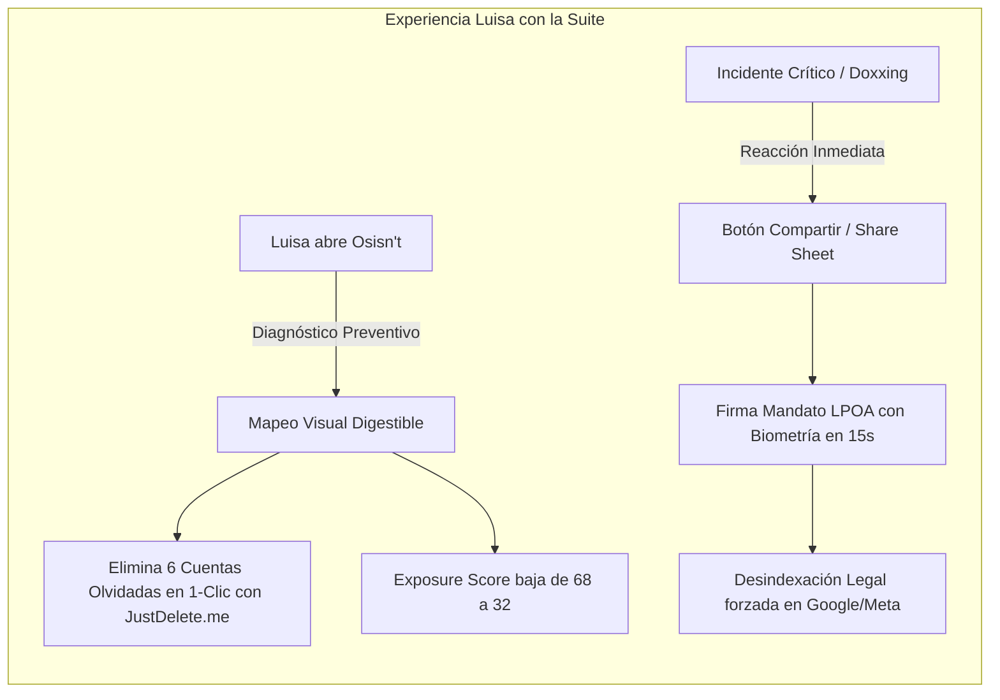

# Definición de Persona / User Persona

## Perfil General

| Atributo | Detalle |
| :--- | :--- |
| **Nombre Completo** | Luisa Alfonsa Castilleja Peugnet |
| **Edad** | 23 años |
| **Ocupación** | Secretaria ejecutiva / Asistente administrativa en despacho contable |
| **Nivel Tecnológico** | Usuario promedio (Digital native en consumo de apps móviles, pero sin conocimientos técnicos de informática ni ciberseguridad) |
| **Dispositivo Principal** | Smartphone (iPhone / Android gama media-alta) utilizado más de 6 horas al día |
| **Ubicación** | Zona urbana (México / Latinoamérica) |

---

## 📱 Contexto y Comportamiento Digital

* **Uso diario de aplicaciones:** Navega activamente en Instagram, TikTok, WhatsApp y X. Realiza compras frecuentes en MercadoLibre y Amazon.
* **Historial de cuentas:** Abrió sus primeras cuentas de redes sociales y foros entre los 11 y 14 años (Ask.fm, Tumblr, Wattpad, Facebook, Spotify, foros juveniles).
* **Hábitos de seguridad:**
  * Reutiliza 2 o 3 contraseñas similares para la mayoría de sus servicios personales.
  * Ha usado el mismo nombre de usuario (*handle*) o variantes directas en múltiples plataformas desde la secundaria.
  * Ocasionalmente publica historias en tiempo real mostrando lugares que frecuenta (cafés, gimnasio, oficina).

---

## ⚠️ Puntos de Dolor y Frustraciones (Pain Points)

1. **Inseguridad y Acoso Digital:** Ha experimentado mensajes no deseados de desconocidos que conocen su nombre completo, escuela donde estudió o amigos cercanos a partir de datos dispersos en la web.
2. **Spam Constante y Llamadas Sospechosas:** Recibe llamadas diarias de telemarketing agresivo, fraudes bancarios por SMS (*smishing*) y correos extraños, sin entender quién vendió o filtró su número telefónico.
3. **Parálisis ante lo Técnico:** Si alguien le habla de "OSINT", "comandos de consola" o "APIs", siente que la ciberseguridad es un terreno ajeno y hostil para ingenieros o hackers.
4. **Laberintos para Borrar Cuentas:** Intentó cerrar un blog viejo con fotos personales de su adolescencia, pero no encontró el botón de baja y desistió frustrada por los menús confusos (*dark patterns*).
5. **Terror a la Exposición Reputacional:** Le aterra que una foto íntima, un comentario sacado de contexto o una difamación en redes arruine su reputación profesional o personal antes de que pueda defenderse.

---

## 💡 Cómo Impacta la Suite en la Vida de Luisa

Nuestra suite aborda los dos grandes momentos de necesidad de Luisa:

### 1. Frente Preventivo con **Osisn't**:
* **Claridad sin Miedo:** Al ingresar su correo o alias en [`Osisn't`](./osisnt-interfaz-huella-digital.md), no ve una pantalla negra con código crudo; ve un **grafo visual con esferas de colores** y un velocímetro comprensible (**Exposure Score: 68/100 - Elevado**).
* **Traducción Empática:** La app le explica en lenguaje sencillo: *"Tienes una cuenta abandonada en Tumblr desde 2016 que expone fotos tuyas y tu correo de la preparatoria"*.
* **Solución en 1 Clic:** Luisa toca el botón verde, la app la lleva al enlace exacto de baja vía JustDelete.me y borra la cuenta en menos de dos minutos.
* **Higiene Activa:** Activa la protección nativa en su celular para purgar automáticamente la ubicación GPS de las fotos que sube a redes sociales.

### 2. Frente Reactivo con el **Escudo de Reputación**:
* Si un usuario malintencionado intenta difamarla o publicar datos personales suyos, Luisa no pierde días buscando formularios ocultos de soporte: toca **"Compartir" -> Icono de la App**, firma en 15 segundos con su huella/Face ID el mandato legal, y el sistema se encarga de forzar la desindexación en Google y Meta.

---

## 🎯 Metas y Resultados Esperados

* **Paz Mental y Control:** Saber con certeza qué información suya está en Internet y reducir drásticamente su superficie de exposición.
* **Autonomía:** Ser capaz de defender su privacidad y reputación sin depender de intermediarios costosos ni trámites engorrosos.
* **Empoderamiento:** Transformar una actitud pasiva frente al entorno digital en un hábito consciente de autocuidado y soberanía sobre sus datos personales.
