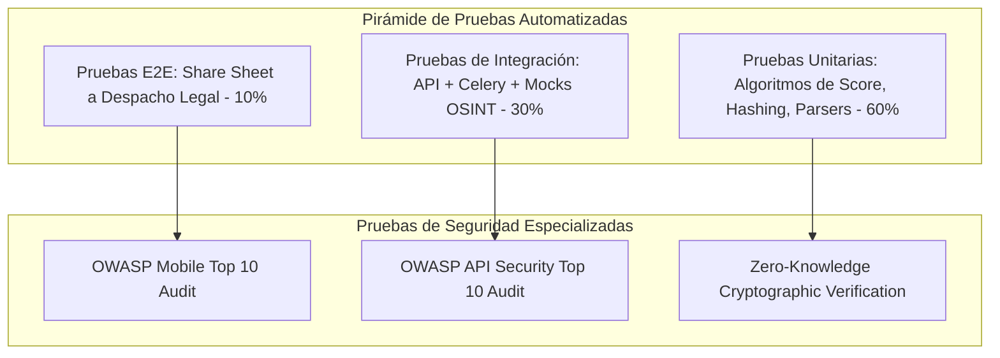

# Plan de Pruebas, Aseguramiento de Calidad (QA) y Seguridad
## Estrategia de Verificación y Validación para la Suite
**Estándar de referencia:** ISO/IEC/IEEE 29119 (Software Testing) / OWASP Mobile & API Security Top 10  
**Versión:** 1.0.0  

---

## 1. Alcance y Estrategia de Pruebas

El objetivo de este plan es garantizar que la suite opere con máxima fiabilidad técnica, blindaje de seguridad zero-knowledge y tolerancia a fallos en entornos de alta latencia externa.

---

## 2. Niveles de Prueba

### 2.1 Pruebas Unitarias (Unit Testing)
* **Objetivo:** Validar la lógica de negocio pura y funciones deterministas sin dependencias de red externa.
* **Módulos bajo prueba:**
  * Algoritmo de cálculo de **Exposure Score (0-100)**: Verificar ponderaciones correctas ante combinaciones de brechas críticas, cuentas inactivas y metadatos expuestos.
  * Parsers de URLs de redes sociales: Regex para extraer slugs e IDs de posts en Instagram (`/p/{id}`, `/reel/{id}`), TikTok (`/@user/video/{id}`) y X (`/status/{id}`).
  * Validador de esquemas RFC 7807 y sanitizadores de entrada para evitar inyección SQL y XSS.
* **Herramientas:** `pytest`, `pytest-cov` (Cobertura mínima objetivo: > 85%).

### 2.2 Pruebas de Integración con Mocks de OSINT
* **Desafío:** Ejecutar herramientas como Sherlock o Holehe contra servidores reales en cada corrida de CI/CD provocaría bloqueos de IP por *rate limiting* o desafíos de Cloudflare.
* **Solución Arquitectónica:** Construcción de un servidor de pruebas simulado (**Mock HTTP Server**) que emula las respuestas HTTP de más de 50 plataformas clave (código `200 OK` con firmas HTML conocidas vs `404 Not Found`).
* **Verificaciones clave:**
  * Despacho y consumo asíncrono en colas Celery/Redis.
  * Manejo correcto de *timeouts* y reintentos exponenciales cuando una plataforma externa no responde.
  * Consistencia relacional y transacciones en PostgreSQL.

### 2.3 Pruebas End-to-End (E2E) y Navegación Headless
* **Módulo Evidence Vault:** Ejecución de Playwright en contenedor headless para renderizar páginas de prueba, verificar la captura completa de pantalla PNG, la extracción íntegra de cabeceras HTTP y el cálculo del hash SHA-256.
* **Módulo OpenTimestamps:** Comprobación de la generación del archivo `.ots` y verificación contra el servidor de calendario de prueba de Bitcoin (Regtest).

---

## 3. Matriz de Seguridad OWASP Aplicada

### 3.1 OWASP API Security Top 10

| Riesgo OWASP | Vector en la Suite | Mitigación Implementada |
| :--- | :--- | :--- |
| **API1: BOLA (Broken Object Level Auth)** | Un usuario intenta ver el caso legal o el escaneo OSINT de otra persona modificando el UUID en `/api/v1/cases/{id}`. | Políticas de Row-Level Security (RLS) en PostgreSQL/Supabase vinculadas al `sub` del token JWT. |
| **API2: Broken Authentication** | Reutilización de credenciales o suplantación de identidad en el reporte. | Verificación de firma biométrica en el cliente y tokens de sesión con expiración corta (15 min) + Refresh Tokens seguros. |
| **API4: Unrestricted Resource Consumption** | Atacante detona 5,000 escaneos masivos de Sherlock para saturar la red o gastar proxies. | Rate limiting adaptativo por IP y cuenta mediante Redis Token Bucket (Máximo 3 escaneos por hora por usuario gratuito). |
| **API8: Security Misconfiguration** | Exposición de trazas de error con datos confidenciales de víctimas en respuestas HTTP. | Middleware global de excepciones que sanitiza errores y responde estrictamente con formato RFC 7807 sin stacktraces. |

### 3.2 OWASP Mobile Top 10

| Riesgo Móvil | Vector en la Suite | Mitigación Implementada |
| :--- | :--- | :--- |
| **M1: Insecure Data Storage** | Caché de imágenes de posts difamatorios o hashes sensibles en el almacenamiento no cifrado del teléfono. | Almacenamiento exclusivo en SQLite cifrado con SQLCipher y uso del Secure Enclave / KeyStore para claves maestras. |
| **M2: Inadequate Supply Chain** | Inclusión de librerías de terceros con rastreadores publicitarios. | Cero SDKs publicitarios (sin Google Analytics comercial ni Facebook Pixel); auditoría estricta de dependencias con `npm audit` y `pip-audit`. |
| **M3: Insecure Authentication** | Bypass de la pantalla de confirmación de firma LPOA. | Invocación forzosa de la API nativa `LocalAuthentication` (Face ID / Huella) antes de sellar el documento legal. |

---

## 4. Criterios de Aceptación para la Demostración del Hackathon (Demo Checklist)

Para certificar el MVP frente al jurado del hackathon, el sistema debe superar el siguiente flujo sin fallos:

- [ ] **Escaneo en Vivo Osisn't (< 45 segundos):** Ingresar un correo de prueba y renderizar el grafo de esferas y el Exposure Score sin latencias perceptibles.
- [ ] **Remediación en 1 Toque:** Tocar un servicio expuesto y demostrar que se abre la URL directa de JustDelete.me en el WebView integrado.
- [ ] **Activación vía Share Sheet (< 5 segundos):** Abrir Instagram en el emulador, presionar compartir hacia la app, y verificar que se ingesta la URL de forma instantánea.
- [ ] **Dictamen Forense Generado:** Descargar el PDF con la captura forense, headers y hash SHA-256 estampado con OpenTimestamps.
- [ ] **Monitoreo de SLAs:** Mostrar el panel de seguimiento visual con los hitos de 7, 14 y 30 días hábiles ante Google Legal.
