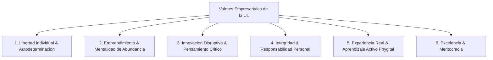

# Investigacion Profunda: Universidad de la Libertad (UL) y sus Valores Empresariales

## 1. Introduccion y Contexto de Fundacion
La **Universidad de la Libertad (UL)** es una institucion de educacion superior mexicana fundada en **2023** por el empresario y visionario **Ricardo Salinas Pliego** (fundador de Grupo Salinas). Nace como una respuesta directa a lo que su fundador y equipo directivo diagnostican como un sistema universitario tradicional caduco, rigido, burocraticamente asfixiante y desconectado de las realidades del mercado moderno.

Ubicada fisicamente en la Ciudad de Mexico y concebida bajo un enfoque arquitectonico e intelectual de vanguardia, la UL busca democratizar y revolucionar el aprendizaje, funcionando no solo como una universidad, sino como un verdadero **"Hub de Emprendimiento e Innovacion"**.

---

## 2. Mision, Vision y Propósito Transformador

### Mision
> *"Formar a la proxima generacion de lideres emprendedores, capaces de pensar de manera critica, cuestionar lo establecido, crear valor economico y social, y construir un futuro de prosperidad en libertad."*

### Vision
Ser la institucion educativa de mayor impacto en la formacion de agentes de cambio en America Latina, reconocida por su modelo disruptivo, su cultura de excelencia y su defensa inflexible de las libertades individuales.

### Propósito Transformador Proposito (Massive Transformative Purpose - MTP)
Promover un **Mexico (y una Region) Mas Prospero, Incluyente y Libre**, demostrando que la combinacion de libertad individual, emprendimiento y mentalidad de abundancia es la formula mas efectiva para erradicar la pobreza y fomentar el desarrollo integral.

---

## 3. Valores Fundamentales de Universidad de la Libertad como Empresa/Institucion

Los valores corporativos de la UL reflejan tanto la filosofia personal de Ricardo Salinas Pliego como los principios de gestion empresarial de alto rendimiento:

### 1. Libertad Individual y Autodeterminacion
* **Definicion:** La conviccion de que el individuo es el unico soberano de su destino y que el aprendizaje autentico solo ocurre en un entorno de eleccion libre y autonomia.
* **Aplicacion Empresarial:** En la UL no existen rutas rigidas obligatorias. Los estudiantes diseñan su propia trayectoria formativa (modelo hiper-personalizado), eligiendo contenidos, ritmos y proyectos segun sus metas individuales.

### 2. Emprendimiento y Creacion de Valor (*Entrepreneurial Mindset*)
* **Definicion:** El emprendimiento no es visto simplemente como abrir una empresa, sino como una actitud vital caracterizada por identificar oportunidades donde otros ven problemas, asumir riesgos calculados y generar riqueza duradera.
* **Aplicacion Empresarial:** La estructura operativa de la universidad funciona con logica *startup*. Los docentes son empresarios en activo (*practitioners*), y el plan de estudios prioriza la monetizacion, el modelo de negocios y la viabilidad comercial de las ideas.

### 3. Innovacion Disruptiva y Cuestionamiento del *Statu Quo*
* **Definicion:** Rechazo al dogma, al conformismo y a la burocracia educativa tradicional. Fomento de la curiosidad insaciable y el pensamiento desde primeros principios (*First Principles Thinking*).
* **Aplicacion Empresarial:** Uso intensivo de tecnologia adaptativa, inteligencia artificial, entornos *phygital* (fusion de espacios fisicos hiper-modernos y herramientas digitales globales) y metodologias de diseno centrado en el usuario.

### 4. Integridad y Responsabilidad Personal
* **Definicion:** La libertad va indisolublemente ligada a la responsabilidad por las propias acciones y sus consecuencias. No hay espacio para la victimizacion ni el paternalismo.
* **Aplicacion Empresarial:** Fomento de la etica empresarial de alto nivel, el cumplimiento de la palabra dada, la transparencia en los negocios y la resiliencia ante el fracaso.

### 5. Aprendizaje Basado en Experiencia Real (*Active & Practical Learning*)
* **Definicion:** La teoria sin practica es esteril. El conocimiento adquiere valor cuando se pone a prueba en el mundo real.
* **Aplicacion Empresarial:** Eliminacion de examenes memoristicos tradicionales; evaluacion mediante proyectos reales, simuladores de negocios, resolucion de crisis organizacionales y pitch de inversion.

### 6. Meritocracia y Competitividad
* **Definicion:** Reconocimiento y recompensa al esfuerzo, el talento, la disciplina y los resultados tangibles, sin distinciones arbitrarias ni privilegios injustificados.
* **Aplicacion Empresarial:** Cultura organizacional de alto rendimiento tanto para el personal docente y administrativo como para los estudiantes.

---

## 4. Modelo Operativo y Cultura Organizacional

* **Modelo "Phygital" e Instalaciones Inteligentes:** El campus universitario en la CDMX esta diseñado fisicamente para incentivar el trabajo colaborativo, la flexibilidad de espacios y la integracion de la mas alta tecnologia de comunicacion y produccion audiovisual.
* **Profesorado Practitioner:** A diferencia de las universidades tradicionales dominadas por academicos teoreticos, la UL recluta como mentores a empresarios, ejecutivos C-level, inversores de riesgo y creativos de renombre.
* **Habilidades de Alto Impacto:** Centrado en competencias clave para el siglo XXI:
  * Pensamiento financiero y asignacion de capital.
  * Comunicacion persuasiva y storytelling.
  * Liderazgo en entornos de incertidumbre y gestion de crisis.
  * Dominio de herramientas tecnologicas de vanguardia.

---

## 5. Conceptos Clave de Universidad de la Libertad para Destacar

1. **Hub de Emprendimiento:** La universidad concebida como aceleradora e incubadora permanente de talento e ideas de negocio.
2. **Hiper-personalizacion Educativa:** Flexibilidad absoluta para que el estudiante adapte su aprendizaje a su perfil unico.
3. **Cultura de Libertad y Prosperidad:** Vinculacion directa entre la libertad individual y el crecimiento economico de un pais.
4. **Resiliencia y Mindset Antifragil:** Ensenanza deliberada del manejo del riesgo, el fracaso iterativo y la adaptacion rapida.
